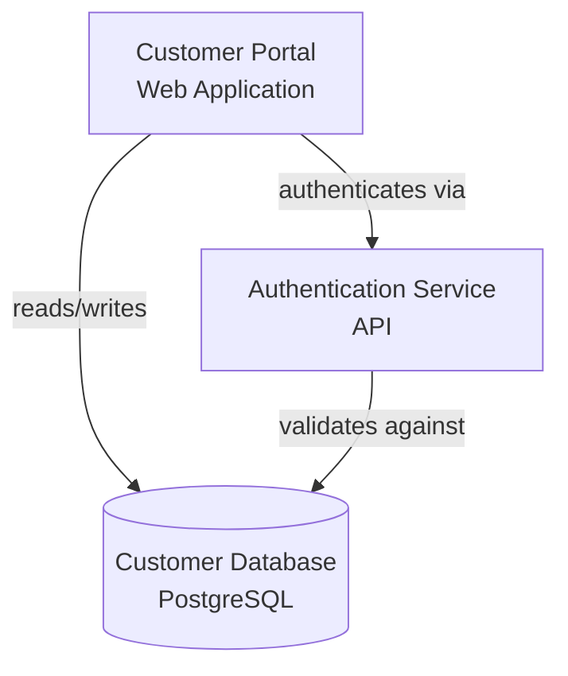

# AI Conversion Guide - Super Relativity Data Formats

**Purpose**: This guide helps AI tools convert existing project documentation to Super Relativity compatible formats.

**Target Audience**: AI assistants, LLMs, and automated conversion tools

---

## Table of Contents

1. [Conversion Workflow](#conversion-workflow)
2. [Input Format Recognition](#input-format-recognition)
3. [Schema Definitions](#schema-definitions)
4. [Transformation Rules](#transformation-rules)
5. [Validation Criteria](#validation-criteria)
6. [Conversion Examples](#conversion-examples)
7. [Error Handling](#error-handling)

---

## Conversion Workflow

### Step-by-Step Process

```
INPUT DOCUMENT
    ↓
[1] ANALYZE & CLASSIFY
    - Identify document type
    - Extract key entities
    - Detect relationships
    ↓
[2] MAP TO SCHEMA
    - Match to target format
    - Apply transformation rules
    - Validate structure
    ↓
[3] TRANSFORM DATA
    - Convert field names
    - Normalize values
    - Generate IDs
    ↓
[4] VALIDATE OUTPUT
    - Check required fields
    - Verify data types
    - Test relationships
    ↓
[5] GENERATE OUTPUT
    - Format as JSON/YAML/CSV
    - Add metadata
    - Create import script
    ↓
OUTPUT (Super Relativity Format)
```

---

## Input Format Recognition

### Document Type Detection

**Instructions for AI**: Analyze the input document and classify it into one of these categories:

| Input Indicators | Target Format | Priority |
|------------------|---------------|----------|
| "application", "system", "service", "microservice" | Application/Component | High |
| "capability", "business process", "value stream" | Business Capability | High |
| "requirement", "user story", "feature request" | Requirement | High |
| "database", "table", "data store", "schema" | Data Object | High |
| "server", "infrastructure", "VM", "container" | Infrastructure/Server | High |
| "change", "migration", "upgrade", "deployment" | Change (App/Infra) | Medium |
| "diagram", "architecture", "flow", "visualization" | Diagram | Medium |
| "repository", "codebase", "source code" | Code Repository | Medium |
| "API", "endpoint", "interface", "contract" | API Definition | Medium |
| "component.yaml", "catalog-info.yaml" | Backstage Catalog | High |
| "prometheus.yml", "metrics" | Prometheus Config | Low |
| ".gitlab-ci.yml", "project metadata" | GitLab Project | Medium |

### Entity Extraction Pattern

```regex
# Application/Service Names
(?:application|service|system|microservice)[\s:]+([A-Za-z0-9-_\s]+)

# IDs
(?:id|identifier|code)[\s:]+([A-Z]+-\d+|[a-z0-9-]+)

# Relationships
([A-Za-z0-9-_]+)\s+(?:depends on|uses|calls|implements|provides|consumes)\s+([A-Za-z0-9-_]+)

# Technical Stack
(?:technology|tech stack|built with|using)[\s:]+([A-Za-z0-9,.\s]+)

# Status/Lifecycle
(?:status|state|lifecycle|phase)[\s:]+([A-Za-z]+)
```

---

## Schema Definitions

### JSON Schema Templates

#### Application Schema

```json
{
  "$schema": "http://json-schema.org/draft-07/schema#",
  "title": "SuperRelativityApplication",
  "type": "object",
  "required": ["id", "name", "type"],
  "properties": {
    "id": {
      "type": "string",
      "pattern": "^APP-[0-9]+$",
      "description": "Unique application identifier (format: APP-###)"
    },
    "name": {
      "type": "string",
      "minLength": 1,
      "maxLength": 200,
      "description": "Application name"
    },
    "type": {
      "type": "string",
      "enum": [
        "Web Application",
        "Mobile Application",
        "API Service",
        "Database",
        "Microservice",
        "Batch Job",
        "Desktop Application",
        "Integration Service"
      ]
    },
    "description": {
      "type": "string",
      "maxLength": 1000
    },
    "status": {
      "type": "string",
      "enum": ["Active", "Development", "Deprecated", "Retired", "Planned"]
    },
    "lifecycle": {
      "type": "string",
      "enum": ["Plan", "Build", "Run", "Retire"]
    },
    "businessValue": {
      "type": "string",
      "enum": ["Critical", "High", "Medium", "Low"]
    },
    "businessCriticality": {
      "type": "string",
      "enum": ["Critical", "High", "Medium", "Low"]
    },
    "techStack": {
      "type": "array",
      "items": {
        "type": "string"
      },
      "description": "Technologies used (e.g., React, Node.js, PostgreSQL)"
    },
    "repositories": {
      "type": "array",
      "items": {
        "type": "string",
        "format": "uri"
      }
    },
    "owner": {
      "type": "string",
      "description": "Team or person responsible"
    },
    "dependencies": {
      "type": "array",
      "items": {
        "type": "string",
        "description": "IDs of dependent applications"
      }
    }
  }
}
```

#### Business Capability Schema

```json
{
  "$schema": "http://json-schema.org/draft-07/schema#",
  "title": "SuperRelativityBusinessCapability",
  "type": "object",
  "required": ["id", "name", "level"],
  "properties": {
    "id": {
      "type": "string",
      "pattern": "^CAP-[0-9]+$"
    },
    "name": {
      "type": "string",
      "minLength": 1,
      "maxLength": 200
    },
    "level": {
      "type": "string",
      "pattern": "^L[0-9]$",
      "description": "Hierarchy level (L0-L5)"
    },
    "description": {
      "type": "string",
      "maxLength": 1000
    },
    "owner": {
      "type": "string"
    },
    "criticality": {
      "type": "string",
      "enum": ["Critical", "High", "Medium", "Low"]
    },
    "maturity": {
      "type": "string",
      "enum": ["Initial", "Defined", "Managed", "Optimized"]
    },
    "parent": {
      "type": "string",
      "description": "Parent capability ID"
    },
    "children": {
      "type": "array",
      "items": {
        "type": "string"
      },
      "description": "Child capability IDs"
    }
  }
}
```

#### Requirement Schema

```json
{
  "$schema": "http://json-schema.org/draft-07/schema#",
  "title": "SuperRelativityRequirement",
  "type": "object",
  "required": ["id", "name", "type", "priority"],
  "properties": {
    "id": {
      "type": "string",
      "pattern": "^REQ-[0-9]+$"
    },
    "name": {
      "type": "string",
      "minLength": 1,
      "maxLength": 200
    },
    "type": {
      "type": "string",
      "enum": [
        "Functional",
        "Non-Functional",
        "Security",
        "Compliance",
        "Performance",
        "Usability",
        "Scalability"
      ]
    },
    "priority": {
      "type": "string",
      "enum": ["Critical", "High", "Medium", "Low"]
    },
    "status": {
      "type": "string",
      "enum": ["Draft", "Approved", "In Progress", "Implemented", "Verified", "Rejected"]
    },
    "description": {
      "type": "string",
      "maxLength": 2000
    },
    "capability": {
      "type": "string",
      "description": "Related business capability ID"
    },
    "application": {
      "type": "string",
      "description": "Implementing application ID"
    },
    "requestedBy": {
      "type": "string"
    },
    "targetDate": {
      "type": "string",
      "format": "date"
    }
  }
}
```

#### Data Object Schema

```json
{
  "$schema": "http://json-schema.org/draft-07/schema#",
  "title": "SuperRelativityDataObject",
  "type": "object",
  "required": ["id", "name", "type"],
  "properties": {
    "id": {
      "type": "string",
      "pattern": "^DATA-[0-9]+$"
    },
    "name": {
      "type": "string",
      "minLength": 1,
      "maxLength": 200
    },
    "type": {
      "type": "string",
      "enum": [
        "Database Table",
        "Collection",
        "File",
        "API Endpoint",
        "Message Queue",
        "Cache",
        "Data Warehouse"
      ]
    },
    "database": {
      "type": "string"
    },
    "schema": {
      "type": "string"
    },
    "sensitivity": {
      "type": "string",
      "enum": ["Public", "Internal", "Confidential", "PII", "Restricted"]
    },
    "columns": {
      "type": "array",
      "items": {
        "type": "string"
      }
    },
    "recordCount": {
      "type": "integer",
      "minimum": 0
    },
    "growthRate": {
      "type": "string"
    },
    "application": {
      "type": "string",
      "description": "Owning application ID"
    }
  }
}
```

#### Infrastructure/Server Schema

```json
{
  "$schema": "http://json-schema.org/draft-07/schema#",
  "title": "SuperRelativityInfrastructure",
  "type": "object",
  "required": ["id", "name", "type", "environment"],
  "properties": {
    "id": {
      "type": "string",
      "pattern": "^SRV-[0-9]+$"
    },
    "name": {
      "type": "string",
      "minLength": 1,
      "maxLength": 200
    },
    "type": {
      "type": "string",
      "enum": [
        "Application Server",
        "Database Server",
        "Web Server",
        "Container",
        "VM",
        "Load Balancer",
        "Storage",
        "Network Device"
      ]
    },
    "environment": {
      "type": "string",
      "enum": ["Production", "Staging", "Development", "QA", "UAT", "DR"]
    },
    "status": {
      "type": "string",
      "enum": ["Active", "Inactive", "Maintenance", "Decommissioned"]
    },
    "location": {
      "type": "string"
    },
    "os": {
      "type": "string"
    },
    "cpu": {
      "type": "string"
    },
    "memory": {
      "type": "string"
    },
    "applications": {
      "type": "array",
      "items": {
        "type": "string"
      },
      "description": "IDs of applications deployed on this server"
    },
    "ipAddress": {
      "type": "string",
      "format": "ipv4"
    }
  }
}
```

#### Backstage Component Schema (YAML)

```yaml
# JSON Schema representation for AI parsing
{
  "$schema": "http://json-schema.org/draft-07/schema#",
  "title": "BackstageComponent",
  "type": "object",
  "required": ["apiVersion", "kind", "metadata", "spec"],
  "properties": {
    "apiVersion": {
      "type": "string",
      "enum": ["backstage.io/v1alpha1"]
    },
    "kind": {
      "type": "string",
      "enum": ["Component", "System", "Domain", "Resource", "API"]
    },
    "metadata": {
      "type": "object",
      "required": ["name"],
      "properties": {
        "name": {
          "type": "string",
          "pattern": "^[a-z0-9-]+$"
        },
        "title": {
          "type": "string"
        },
        "description": {
          "type": "string"
        },
        "tags": {
          "type": "array",
          "items": {
            "type": "string"
          }
        },
        "annotations": {
          "type": "object"
        }
      }
    },
    "spec": {
      "type": "object",
      "required": ["type", "lifecycle", "owner"],
      "properties": {
        "type": {
          "type": "string",
          "enum": ["service", "website", "library"]
        },
        "lifecycle": {
          "type": "string",
          "enum": ["production", "experimental", "deprecated"]
        },
        "owner": {
          "type": "string"
        },
        "system": {
          "type": "string"
        },
        "providesApis": {
          "type": "array",
          "items": {
            "type": "string"
          }
        },
        "consumesApis": {
          "type": "array",
          "items": {
            "type": "string"
          }
        },
        "dependsOn": {
          "type": "array",
          "items": {
            "type": "string"
          }
        }
      }
    }
  }
}
```

---

## Transformation Rules

### Rule-Based Conversion Instructions

**For AI Tools**: Apply these rules in order when converting documents:

#### Rule 1: ID Generation

```
IF input has ID field:
    IF ID matches pattern (APP-###, CAP-###, etc.):
        USE existing ID
    ELSE:
        GENERATE new ID with format: {TYPE}-{AUTO_INCREMENT}
ELSE:
    GENERATE new ID based on entity type:
        - Application → APP-###
        - Capability → CAP-###
        - Requirement → REQ-###
        - Data Object → DATA-###
        - Server → SRV-###
        - Component → COMP-###
        - Change → ACH-### or ICH-###
```

#### Rule 2: Field Mapping

```javascript
// Common field transformations
{
  // Name variations
  "application name" → "name",
  "app name" → "name",
  "service name" → "name",
  "system name" → "name",

  // Type variations
  "application type" → "type",
  "kind" → "type",
  "category" → "type",

  // Status variations
  "state" → "status",
  "current status" → "status",
  "lifecycle stage" → "lifecycle",

  // Priority/Criticality
  "business importance" → "businessCriticality",
  "importance" → "businessCriticality",
  "priority" → "priority",

  // Tech stack variations
  "technologies" → "techStack",
  "technology stack" → "techStack",
  "built with" → "techStack",

  // Repository variations
  "repo" → "repositories",
  "source code" → "repositories",
  "git repo" → "repositories"
}
```

#### Rule 3: Enum Value Normalization

```javascript
// Normalize to standard enums
{
  // Business Criticality/Value
  "very high" → "Critical",
  "essential" → "Critical",
  "important" → "High",
  "normal" → "Medium",
  "minor" → "Low",

  // Status
  "live" → "Active",
  "in production" → "Active",
  "prod" → "Active",
  "dev" → "Development",
  "end of life" → "Deprecated",
  "decommissioned" → "Retired",

  // Lifecycle
  "planning" → "Plan",
  "building" → "Build",
  "development" → "Build",
  "running" → "Run",
  "production" → "Run",
  "retiring" → "Retire"
}
```

#### Rule 4: Relationship Extraction

```
SCAN for relationship indicators:
    - "depends on" → DEPENDS_ON relationship
    - "uses" → USES relationship
    - "implements" → IMPLEMENTED_BY relationship (reversed)
    - "provides" → PROVIDES relationship
    - "consumes" → CONSUMES relationship
    - "deployed on" → DEPLOYED_ON relationship
    - "stored in" → STORED_IN relationship
    - "part of" → PART_OF relationship
    - "calls" → CALLS relationship

FORMAT as:
{
  "from": "<source_entity_id>",
  "to": "<target_entity_id>",
  "type": "<RELATIONSHIP_TYPE>",
  "confidence": 1.0,
  "source": "document_conversion"
}
```

#### Rule 5: Array Field Handling

```
IF field contains comma-separated values:
    SPLIT by comma
    TRIM whitespace
    CONVERT to array

IF field contains bullet points or line breaks:
    SPLIT by newline or bullet marker
    TRIM whitespace
    CONVERT to array

Examples:
    "React, Node.js, PostgreSQL" → ["React", "Node.js", "PostgreSQL"]
    "- React\n- Node.js\n- PostgreSQL" → ["React", "Node.js", "PostgreSQL"]
```

#### Rule 6: Missing Required Fields

```
IF required field is missing:
    TRY to infer from context
    IF cannot infer:
        IF field is "type":
            USE "Unknown" or most likely type based on other fields
        IF field is "status":
            USE "Active" as default
        IF field is "priority":
            USE "Medium" as default
        IF field is "id":
            GENERATE using auto-increment
        ELSE:
            LOG warning and use null or empty value
```

---

## Validation Criteria

### Automated Validation Checks

**Instructions for AI**: Run these validations on converted output:

#### Level 1: Schema Validation

```javascript
function validateSchema(entity, schema) {
    // Check required fields
    for (const field of schema.required) {
        if (!entity[field]) {
            return {valid: false, error: `Missing required field: ${field}`};
        }
    }

    // Check data types
    for (const [field, definition] of Object.entries(schema.properties)) {
        if (entity[field] && typeof entity[field] !== definition.type) {
            return {valid: false, error: `Invalid type for ${field}`};
        }
    }

    // Check enum values
    for (const [field, definition] of Object.entries(schema.properties)) {
        if (definition.enum && entity[field]) {
            if (!definition.enum.includes(entity[field])) {
                return {valid: false, error: `Invalid enum value for ${field}`};
            }
        }
    }

    return {valid: true};
}
```

#### Level 2: Business Logic Validation

```
CHECK business rules:
    ✓ Application ID must be unique across all applications
    ✓ Parent-child capability relationships must form valid hierarchy
    ✓ Requirement must link to either capability OR application
    ✓ Data object must have at least one owning application
    ✓ Server must have at least one deployed application
    ✓ Tech stack should not be empty for applications
    ✓ Repository URLs must be valid URIs
    ✓ Dates must be in ISO 8601 format
    ✓ Priority levels must be consistent (Critical > High > Medium > Low)
```

#### Level 3: Relationship Validation

```
CHECK relationship integrity:
    ✓ Source and target entities must exist
    ✓ Relationship types must be valid (see relationship mapping table)
    ✓ No circular dependencies (A → B → A)
    ✓ Bidirectional relationships must be consistent
    ✓ Multiplicity constraints respected
```

---

## Conversion Examples

### Example 1: Free-Text Application Description → JSON

**Input** (unstructured text):
```
Customer Portal Application

This is our main customer-facing web application. It's built with React
and Node.js, using PostgreSQL as the database. The application is
currently in production and is considered business-critical.

The system depends on the Authentication Service and the Payment Gateway.
It's hosted on our production servers (SRV-001 and SRV-002).

Repository: https://github.com/myorg/customer-portal
Owner: Customer Experience Team
Status: Active
```

**AI Conversion Process**:

```javascript
// Step 1: Extract entities
const extracted = {
    name: "Customer Portal Application",
    type: "Web Application",  // inferred from "web application"
    techStack: ["React", "Node.js", "PostgreSQL"],  // extracted from text
    status: "Active",  // explicit
    businessCriticality: "Critical",  // mapped from "business-critical"
    lifecycle: "Run",  // inferred from "in production"
    repositories: ["https://github.com/myorg/customer-portal"],
    owner: "Customer Experience Team",
    dependencies: ["Authentication Service", "Payment Gateway"],  // extracted from "depends on"
    servers: ["SRV-001", "SRV-002"]  // extracted from "hosted on"
};

// Step 2: Generate ID
const id = "APP-" + getNextId("application");

// Step 3: Build output
const output = {
    id: id,
    name: "Customer Portal Application",
    type: "Web Application",
    description: "Main customer-facing web application",
    status: "Active",
    lifecycle: "Run",
    businessValue: "Critical",
    businessCriticality: "Critical",
    techStack: ["React", "Node.js", "PostgreSQL"],
    repositories: ["https://github.com/myorg/customer-portal"],
    owner: "Customer Experience Team"
};
```

**Output** (Super Relativity format):
```json
{
  "id": "APP-124",
  "name": "Customer Portal Application",
  "type": "Web Application",
  "description": "Main customer-facing web application",
  "status": "Active",
  "lifecycle": "Run",
  "businessValue": "Critical",
  "businessCriticality": "Critical",
  "techStack": ["React", "Node.js", "PostgreSQL"],
  "repositories": ["https://github.com/myorg/customer-portal"],
  "owner": "Customer Experience Team"
}
```

**Relationships to generate**:
```json
[
  {
    "from": "APP-124",
    "to": "AUTH-SERVICE-ID",
    "type": "DEPENDS_ON",
    "confidence": 0.9,
    "source": "document_conversion"
  },
  {
    "from": "APP-124",
    "to": "PAYMENT-GATEWAY-ID",
    "type": "DEPENDS_ON",
    "confidence": 0.9,
    "source": "document_conversion"
  },
  {
    "from": "APP-124",
    "to": "SRV-001",
    "type": "DEPLOYED_ON",
    "confidence": 1.0,
    "source": "document_conversion"
  },
  {
    "from": "APP-124",
    "to": "SRV-002",
    "type": "DEPLOYED_ON",
    "confidence": 1.0,
    "source": "document_conversion"
  }
]
```

---

### Example 2: Excel/CSV → Super Relativity JSON

**Input** (CSV format):
```csv
App Name,Type,Status,Tech Stack,Owner,Business Criticality
Customer Portal,Web App,Production,"React, Node.js",CX Team,High
Order Processing,API,Production,"Java, Spring Boot",Backend Team,Critical
Analytics Dashboard,Web App,Development,"Angular, Python",Analytics Team,Medium
```

**AI Conversion Instructions**:

```python
import csv
import json

def convert_csv_to_sr_format(csv_content):
    results = []
    reader = csv.DictReader(csv_content.splitlines())

    app_counter = 125  # Starting ID

    for row in reader:
        # Map CSV columns to schema fields
        app = {
            "id": f"APP-{app_counter}",
            "name": row["App Name"],
            "type": normalize_type(row["Type"]),
            "status": normalize_status(row["Status"]),
            "lifecycle": infer_lifecycle(row["Status"]),
            "techStack": parse_array(row["Tech Stack"]),
            "owner": row["Owner"],
            "businessCriticality": normalize_criticality(row["Business Criticality"]),
            "businessValue": normalize_criticality(row["Business Criticality"])
        }

        results.append(app)
        app_counter += 1

    return results

def normalize_type(type_str):
    mapping = {
        "Web App": "Web Application",
        "API": "API Service",
        "Mobile": "Mobile Application"
    }
    return mapping.get(type_str, type_str)

def normalize_status(status_str):
    mapping = {
        "Production": "Active",
        "Prod": "Active",
        "Dev": "Development",
        "Development": "Development"
    }
    return mapping.get(status_str, status_str)

def infer_lifecycle(status_str):
    if status_str in ["Production", "Prod"]:
        return "Run"
    elif status_str in ["Development", "Dev"]:
        return "Build"
    return "Plan"

def normalize_criticality(crit_str):
    mapping = {
        "Very High": "Critical",
        "High": "High",
        "Medium": "Medium",
        "Low": "Low"
    }
    return mapping.get(crit_str, "Medium")

def parse_array(value):
    if "," in value:
        return [item.strip() for item in value.split(",")]
    return [value]
```

**Output**:
```json
[
  {
    "id": "APP-125",
    "name": "Customer Portal",
    "type": "Web Application",
    "status": "Active",
    "lifecycle": "Run",
    "techStack": ["React", "Node.js"],
    "owner": "CX Team",
    "businessCriticality": "High",
    "businessValue": "High"
  },
  {
    "id": "APP-126",
    "name": "Order Processing",
    "type": "API Service",
    "status": "Active",
    "lifecycle": "Run",
    "techStack": ["Java", "Spring Boot"],
    "owner": "Backend Team",
    "businessCriticality": "Critical",
    "businessValue": "Critical"
  },
  {
    "id": "APP-127",
    "name": "Analytics Dashboard",
    "type": "Web Application",
    "status": "Development",
    "lifecycle": "Build",
    "techStack": ["Angular", "Python"],
    "owner": "Analytics Team",
    "businessCriticality": "Medium",
    "businessValue": "Medium"
  }
]
```

---

### Example 3: Architecture Diagram (Mermaid) → Super Relativity

**Input** (Mermaid diagram):


**AI Conversion Process**:

```javascript
// Step 1: Parse diagram
const entities = [
    {
        id: "CustomerPortal",
        label: "Customer Portal",
        type: "Web Application"
    },
    {
        id: "AuthService",
        label: "Authentication Service",
        type: "API"
    },
    {
        id: "Database",
        label: "Customer Database",
        type: "PostgreSQL"
    }
];

const relationships = [
    {
        from: "CustomerPortal",
        to: "AuthService",
        label: "authenticates via"
    },
    {
        from: "CustomerPortal",
        to: "Database",
        label: "reads/writes"
    },
    {
        from: "AuthService",
        to: "Database",
        label: "validates against"
    }
];

// Step 2: Convert to Super Relativity format
const applications = [];
const dataObjects = [];
const srRelationships = [];

for (const entity of entities) {
    if (entity.type.includes("Application") || entity.type === "API") {
        applications.push({
            id: generateId("APP"),
            name: entity.label,
            type: mapType(entity.type),
            source: "diagram_conversion"
        });
    } else if (entity.type.includes("Database")) {
        dataObjects.push({
            id: generateId("DATA"),
            name: entity.label,
            type: "Database Table",
            database: entity.type,
            source: "diagram_conversion"
        });
    }
}

for (const rel of relationships) {
    const relType = inferRelationType(rel.label);
    srRelationships.push({
        from: findEntityId(rel.from),
        to: findEntityId(rel.to),
        type: relType,
        confidence: 0.8,
        source: "diagram_conversion"
    });
}

function inferRelationType(label) {
    if (label.includes("authenticates") || label.includes("auth")) return "USES";
    if (label.includes("reads") || label.includes("writes")) return "USES";
    if (label.includes("validates")) return "USES";
    return "CONNECTED_TO";
}
```

**Output**:
```json
{
  "applications": [
    {
      "id": "APP-128",
      "name": "Customer Portal",
      "type": "Web Application",
      "source": "diagram_conversion"
    },
    {
      "id": "APP-129",
      "name": "Authentication Service",
      "type": "API Service",
      "source": "diagram_conversion"
    }
  ],
  "dataObjects": [
    {
      "id": "DATA-001",
      "name": "Customer Database",
      "type": "Database Table",
      "database": "PostgreSQL",
      "source": "diagram_conversion"
    }
  ],
  "relationships": [
    {
      "from": "APP-128",
      "to": "APP-129",
      "type": "USES",
      "confidence": 0.8,
      "source": "diagram_conversion"
    },
    {
      "from": "APP-128",
      "to": "DATA-001",
      "type": "USES",
      "confidence": 0.8,
      "source": "diagram_conversion"
    },
    {
      "from": "APP-129",
      "to": "DATA-001",
      "type": "USES",
      "confidence": 0.8,
      "source": "diagram_conversion"
    }
  ]
}
```

---

### Example 4: Backstage Catalog → Super Relativity

**Input** (Backstage YAML):
```yaml
apiVersion: backstage.io/v1alpha1
kind: Component
metadata:
  name: customer-service
  title: Customer Service
  description: Handles customer data and operations
  tags:
    - java
    - spring-boot
    - microservice
spec:
  type: service
  lifecycle: production
  owner: team-backend
  system: ecommerce
  providesApis:
    - customer-api
  consumesApis:
    - auth-api
  dependsOn:
    - resource:customer-db
```

**AI Conversion Process**:

```yaml
# Mapping rules
metadata.name → id (with prefix)
metadata.title → name
metadata.description → description
metadata.tags → techStack
spec.type → type (mapped)
spec.lifecycle → status + lifecycle
spec.owner → owner
spec.system → parent system
spec.providesApis → PROVIDES relationships
spec.consumesApis → CONSUMES relationships
spec.dependsOn → DEPENDS_ON relationships
```

**Output**:
```json
{
  "component": {
    "id": "COMP-001",
    "name": "Customer Service",
    "type": "Microservice",
    "description": "Handles customer data and operations",
    "status": "Active",
    "lifecycle": "Run",
    "techStack": ["java", "spring-boot", "microservice"],
    "owner": "team-backend",
    "system": "ecommerce",
    "source": "backstage"
  },
  "relationships": [
    {
      "from": "COMP-001",
      "to": "API-customer-api",
      "type": "PROVIDES",
      "source": "backstage"
    },
    {
      "from": "COMP-001",
      "to": "API-auth-api",
      "type": "CONSUMES",
      "source": "backstage"
    },
    {
      "from": "COMP-001",
      "to": "RESOURCE-customer-db",
      "type": "DEPENDS_ON",
      "source": "backstage"
    },
    {
      "from": "COMP-001",
      "to": "SYSTEM-ecommerce",
      "type": "PART_OF",
      "source": "backstage"
    }
  ]
}
```

---

## Error Handling

### Common Conversion Issues and Solutions

#### Issue 1: Ambiguous Entity Type

**Problem**: Cannot determine if entity is Application, Component, or Service

**AI Solution**:
```
IF entity has deployment information:
    CLASSIFY as Application
ELIF entity has code-level details (functions, classes):
    CLASSIFY as Component
ELIF entity has API endpoints:
    CLASSIFY as API Service
ELSE:
    DEFAULT to Application
    LOG warning for manual review
```

#### Issue 2: Missing Required Fields

**Problem**: Input lacks required schema fields

**AI Solution**:
```
FOR each missing required field:
    IF field is "id":
        GENERATE auto-increment ID
    IF field is "type":
        INFER from context keywords
    IF field is "status":
        DEFAULT to "Active"
    IF field is "priority":
        DEFAULT to "Medium"
    ELSE:
        ADD to validation warnings
        INCLUDE null value with note
```

#### Issue 3: Invalid Enum Values

**Problem**: Input value doesn't match schema enum

**AI Solution**:
```
TRY fuzzy matching against valid enum values
IF match confidence > 80%:
    USE matched enum value
    LOG mapping for user review
ELSE:
    USE closest valid enum value as default
    LOG warning with original and mapped values
```

#### Issue 4: Relationship Ambiguity

**Problem**: Cannot determine correct relationship type

**AI Solution**:
```
CHECK relationship keywords:
    "uses", "calls", "queries" → USES
    "implements", "fulfills" → IMPLEMENTED_BY
    "depends", "requires" → DEPENDS_ON
    "provides", "exposes" → PROVIDES
    "deployed", "hosted" → DEPLOYED_ON

IF no keyword match:
    USE generic "RELATED_TO" relationship
    SET confidence to 0.5
    LOG for manual review
```

---

## Output Format Options

### Option 1: Bulk JSON Import

**Use when**: Converting many entities at once

```json
{
  "metadata": {
    "source": "conversion",
    "timestamp": "2025-12-29T10:00:00Z",
    "convertor": "AI Assistant",
    "version": "1.0"
  },
  "entities": {
    "applications": [ /* array of application objects */ ],
    "capabilities": [ /* array of capability objects */ ],
    "requirements": [ /* array of requirement objects */ ],
    "dataObjects": [ /* array of data object objects */ ],
    "servers": [ /* array of server objects */ ]
  },
  "relationships": [ /* array of relationship objects */ ]
}
```

### Option 2: Individual Cypher Scripts

**Use when**: Direct Neo4j import

```cypher
// Application
MERGE (a:Application {id: 'APP-130'})
SET a.name = 'Customer Portal',
    a.type = 'Web Application',
    a.status = 'Active',
    a.lifecycle = 'Run',
    a.techStack = ['React', 'Node.js'],
    a.businessCriticality = 'High',
    a.lastSyncedAt = datetime();

// Relationships
MATCH (from:Application {id: 'APP-130'})
MATCH (to:Application {id: 'APP-129'})
MERGE (from)-[:DEPENDS_ON]->(to);
```

### Option 3: CSV Bulk Load

**Use when**: Large volume conversion

```csv
entity_type,id,name,type,status,lifecycle,techStack,businessCriticality
Application,APP-130,Customer Portal,Web Application,Active,Run,"React,Node.js",High
Application,APP-131,Order Service,API Service,Active,Run,"Java,Spring",Critical
```

---

## AI Assistant Prompt Templates

### Template 1: Document Classification

```
Analyze the following document and classify it:

[DOCUMENT CONTENT]

Instructions:
1. Identify the primary entity types (Application, Capability, Requirement, etc.)
2. Extract all entities and their attributes
3. Identify relationships between entities
4. Map to Super Relativity schema
5. Generate JSON output following the schema definitions above

Output format: JSON with entities and relationships arrays
```

### Template 2: Field Mapping

```
Convert the following data to Super Relativity Application format:

[INPUT DATA]

Required mappings:
- Extract or generate ID (APP-###)
- Map name, type, status fields
- Normalize enum values (status, lifecycle, criticality)
- Parse arrays (techStack, repositories)
- Extract dependencies

Refer to Application Schema section for validation.
Output as valid JSON.
```

### Template 3: Relationship Extraction

```
Extract relationships from the following text:

[TEXT CONTENT]

Instructions:
1. Identify source and target entities
2. Determine relationship type (USES, DEPENDS_ON, etc.)
3. Assign confidence score (0.0-1.0)
4. Generate relationship JSON array

Follow the Relationship Extraction pattern in the Transformation Rules section.
```

---

## Validation Checklist

**For AI**: Run this checklist after conversion:

```
□ All required fields present
□ Data types match schema definitions
□ Enum values are valid
□ IDs follow correct pattern (TYPE-###)
□ Arrays are properly formatted
□ Relationships have valid source and target
□ No duplicate IDs
□ Dates in ISO 8601 format
□ URLs are valid
□ Confidence scores between 0.0 and 1.0
□ All entities referenced in relationships exist
□ No circular dependencies detected
```

---

## Quick Reference: Common Mappings

### Status/Lifecycle Mappings

| Input | Super Relativity Status | Super Relativity Lifecycle |
|-------|------------------------|---------------------------|
| Production, Live, Prod | Active | Run |
| Development, Dev | Development | Build |
| Planning, Planned | Planned | Plan |
| Deprecated, EOL | Deprecated | Retire |
| Retired, Decommissioned | Retired | Retire |

### Type Mappings

| Input | Super Relativity Type |
|-------|----------------------|
| Web App, Website, Portal | Web Application |
| Mobile App, iOS, Android | Mobile Application |
| API, REST API, Service | API Service |
| Microservice, MS | Microservice |
| DB, Database | Database |
| Batch, Job, Cron | Batch Job |

### Criticality Mappings

| Input | Super Relativity Criticality |
|-------|----------------------------|
| Very High, Essential, Mission Critical | Critical |
| High, Important | High |
| Normal, Standard, Medium | Medium |
| Low, Minor | Low |

---

**Document Version**: 1.0
**Last Updated**: 2025-12-29
**Purpose**: AI-friendly conversion guide for automated data transformation
