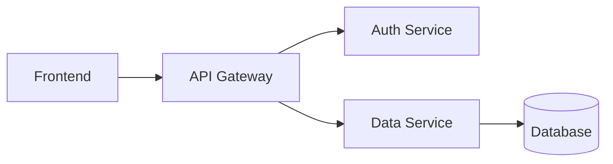

# AI Tools Usage Guide - Cross-Platform Data Conversion

**Purpose**: How to use Super Relativity format documentation with different AI tools across various computers and platforms.

---

## Overview

The Super Relativity documentation is now **AI-optimized** for automated data conversion. You can use these documents with any AI tool (Claude, ChatGPT, Copilot, etc.) on any computer to convert your existing project specs into Super Relativity compatible format.

---

## Quick Start

### What You Need

1. **Your existing project documentation** (any format: Word, Excel, PDF, diagrams, etc.)
2. **An AI assistant** (Claude, ChatGPT, GitHub Copilot, or any LLM)
3. **Super Relativity format docs** (this repository)

### Simple Process

```
YOUR DOCUMENT + AI TOOL + FORMAT GUIDE = SUPER RELATIVITY JSON
```

---

## Using Different AI Tools

### Option 1: Claude (Web or Desktop)

**Step 1**: Upload format documentation
```
Upload these files to Claude:
- AI_CONVERSION_GUIDE.md
- QUICK_CONVERSION_REFERENCE.md
- schemas/application.schema.json (for the entity type you're converting)
```

**Step 2**: Provide your source data
```
Prompt: "I have the following application documentation. Please convert it
to Super Relativity Application format using the AI_CONVERSION_GUIDE.md:

[Paste your documentation here]
"
```

**Step 3**: Validate and refine
```
Prompt: "Please validate this output against the application.schema.json
and fix any errors."
```

**Example Session**:
```
You: [Upload AI_CONVERSION_GUIDE.md]

You: Convert this to Super Relativity format:
"Customer Portal - A web application built with React and Node.js.
Currently in production. Maintained by CX Team. Critical for business."

Claude: Here's the converted format:
{
  "id": "APP-001",
  "name": "Customer Portal",
  "type": "Web Application",
  "status": "Active",
  "lifecycle": "Run",
  "techStack": ["React", "Node.js"],
  "owner": "CX Team",
  "businessCriticality": "Critical"
}

You: Add this to a bulk import JSON with proper metadata

Claude: [Provides complete import structure]
```

---

### Option 2: ChatGPT (Web or Desktop)

**Step 1**: Share context
```
Copy and paste the AI_CONVERSION_GUIDE.md content into ChatGPT, or:

Prompt: "I need to convert project documentation to Super Relativity format.
The conversion rules are at: [provide GitHub link to AI_CONVERSION_GUIDE.md]

Please read and understand the format."
```

**Step 2**: Batch conversion
```
Prompt: "Convert these 10 applications to Super Relativity Application format:

1. App Name: Customer Portal, Type: Web, Status: Production, Tech: React/Node
2. App Name: Order API, Type: API, Status: Production, Tech: Java/Spring
[... continue ...]

Output as JSON array."
```

**Step 3**: Get validation script
```
Prompt: "Generate a Python script to validate these against
schemas/application.schema.json"
```

---

### Option 3: GitHub Copilot (VS Code)

**Step 1**: Open files in workspace
```
1. Open VS Code
2. Add to workspace:
   - Your source data file (CSV, JSON, etc.)
   - schemas/application.schema.json
   - AI_CONVERSION_GUIDE.md
```

**Step 2**: Use inline chat
```python
# In a Python file, write:
# Convert applications.csv to Super Relativity format using schemas/application.schema.json

# Copilot will suggest conversion code
```

**Step 3**: Use Copilot Chat
```
@workspace Convert the data in applications.csv to Super Relativity format
following the schema in schemas/application.schema.json. Generate the
transformation code.
```

---

### Option 4: Cursor AI

**Step 1**: Add docs to project
```bash
git clone https://github.com/your-org/super-relativity.git
# Open in Cursor
```

**Step 2**: Use Cursor Chat
```
Prompt: "Look at AI_CONVERSION_GUIDE.md and convert my-apps.xlsx to
Super Relativity format. Save as super-relativity-apps.json"
```

**Step 3**: Validate
```
Prompt: "Validate super-relativity-apps.json against
schemas/application.schema.json and fix errors"
```

---

### Option 5: Any Other AI Tool

**Universal Approach**:

1. **Provide Context**:
   ```
   "I'm converting data to Super Relativity format. Here are the rules:
   [Copy/paste AI_CONVERSION_GUIDE.md relevant sections]"
   ```

2. **Show Examples**:
   ```
   "Here's an example conversion from the guide:
   [Copy/paste one example from AI_CONVERSION_GUIDE.md]"
   ```

3. **Request Conversion**:
   ```
   "Convert my data following these rules:
   [Provide your data]"
   ```

---

## Common Conversion Scenarios

### Scenario 1: Excel/CSV to JSON

**Input**: `applications.csv`
```csv
Name,Type,Status,Tech,Owner,Criticality
Customer Portal,Web,Prod,React;Node,CX Team,High
Order API,API,Prod,Java;Spring,Backend,Critical
```

**AI Prompt**:
```
Using AI_CONVERSION_GUIDE.md Example 2, convert this CSV to Super Relativity
Application JSON format. Apply enum normalization for Type, Status, and
Criticality fields.
```

**Expected Output**: `applications.json`
```json
[
  {
    "id": "APP-001",
    "name": "Customer Portal",
    "type": "Web Application",
    "status": "Active",
    "lifecycle": "Run",
    "techStack": ["React", "Node"],
    "owner": "CX Team",
    "businessCriticality": "High"
  },
  {
    "id": "APP-002",
    "name": "Order API",
    "type": "API Service",
    "status": "Active",
    "lifecycle": "Run",
    "techStack": ["Java", "Spring"],
    "owner": "Backend",
    "businessCriticality": "Critical"
  }
]
```

---

### Scenario 2: Architecture Diagram to Entities

**Input**: Mermaid diagram file


**AI Prompt**:
```
Using AI_CONVERSION_GUIDE.md Example 3, parse this Mermaid diagram and:
1. Create Application entities for each service
2. Create DataObject for the database
3. Generate relationships with USES or CALLS types
```

**Expected Output**: Entities + Relationships JSON

---

### Scenario 3: Word Document to Requirements

**Input**: `requirements.docx`
```
REQ-001: Multi-Factor Authentication
Type: Security
Priority: High
Status: Approved
Description: Implement MFA for all user logins to enhance security

REQ-002: GDPR Compliance
Type: Compliance
Priority: Critical
Status: In Progress
...
```

**AI Prompt**:
```
Extract requirements from this document and convert to Super Relativity
Requirement format using schemas/requirement.schema.json. Ensure all
required fields are present and enum values are valid.
```

---

### Scenario 4: Confluence Page to Multiple Entity Types

**Input**: Confluence architecture page (copy/paste content)

**AI Prompt**:
```
This Confluence page describes our system. Extract and convert:
1. Applications (use schemas/application.schema.json)
2. Business Capabilities (use schemas/capability.schema.json)
3. Requirements (use schemas/requirement.schema.json)
4. Relationships between them

Output as bulk import JSON with separate arrays for each entity type.
```

---

## Validation on Different Platforms

### Python

```python
import json
import jsonschema

# Load schema
with open('schemas/application.schema.json') as f:
    schema = json.load(f)

# Load your data
with open('converted-apps.json') as f:
    data = json.load(f)

# Validate
for app in data:
    try:
        jsonschema.validate(instance=app, schema=schema)
        print(f"✓ {app['name']} is valid")
    except jsonschema.ValidationError as e:
        print(f"✗ {app['name']}: {e.message}")
```

### Node.js

```javascript
const Ajv = require('ajv');
const schema = require('./schemas/application.schema.json');
const data = require('./converted-apps.json');

const ajv = new Ajv();
const validate = ajv.compile(schema);

data.forEach(app => {
    const valid = validate(app);
    if (valid) {
        console.log(`✓ ${app.name} is valid`);
    } else {
        console.log(`✗ ${app.name}:`, validate.errors);
    }
});
```

### Command Line (AJV)

```bash
# Install AJV CLI
npm install -g ajv-cli

# Validate single file
ajv validate -s schemas/application.schema.json -d converted-apps.json

# Validate multiple files
ajv validate -s schemas/application.schema.json -d "data/*.json"

# Validate with detailed errors
ajv validate -s schemas/application.schema.json -d converted-apps.json --verbose
```

### Java

```java
import com.networknt.schema.JsonSchema;
import com.networknt.schema.JsonSchemaFactory;
import com.fasterxml.jackson.databind.ObjectMapper;

JsonSchemaFactory factory = JsonSchemaFactory.getInstance();
JsonSchema schema = factory.getSchema(
    new File("schemas/application.schema.json")
);

ObjectMapper mapper = new ObjectMapper();
JsonNode data = mapper.readTree(new File("converted-apps.json"));

Set<ValidationMessage> errors = schema.validate(data);
if (errors.isEmpty()) {
    System.out.println("✓ Valid");
} else {
    errors.forEach(System.out::println);
}
```

---

## Tips for Cross-Platform Usage

### Tip 1: Keep Docs Local
```bash
# Clone or download format docs to all computers
git clone https://github.com/your-org/super-relativity.git

# Or download as ZIP and extract
```

### Tip 2: Use Cloud AI Tools
```
Access these AI tools from any computer:
- Claude.ai (web)
- ChatGPT (web)
- Microsoft Copilot (web)
- Google Gemini (web)
```

### Tip 3: Portable Validation
```bash
# Create standalone validation script
python validate.py --schema schemas/application.schema.json --data apps.json

# Works on Windows, Mac, Linux
```

### Tip 4: Use Universal Formats
```
- JSON (works everywhere)
- CSV (easy to edit, convert)
- YAML (human-readable)

Avoid:
- Proprietary formats requiring special software
```

### Tip 5: Batch Processing
```
Convert multiple files at once:

Prompt to AI: "Convert all files in this folder to Super Relativity format:
- apps.csv → applications
- requirements.docx → requirements
- servers.xlsx → infrastructure"
```

---

## Advanced Workflows

### Workflow 1: Excel → AI → Neo4j

```
1. Export Excel to CSV
2. Use AI to convert CSV to JSON (with validation)
3. Generate Cypher import script
4. Import to Neo4j

AI Prompt for Step 3:
"Generate Neo4j Cypher import script for this JSON data following
the pattern in AI_CONVERSION_GUIDE.md"
```

### Workflow 2: Confluence → AI → Bulk Import

```
1. Copy Confluence page content
2. Use AI to extract entities
3. Validate against schemas
4. Generate bulk import JSON
5. Import via GraphQL API

AI Prompt:
"Extract all entities from this Confluence page and create a bulk import
JSON with metadata as shown in AI_CONVERSION_GUIDE.md"
```

### Workflow 3: Diagrams → AI → Relationships

```
1. Export diagram as Mermaid or PlantUML
2. Use AI to parse and convert
3. Generate both entities AND relationships
4. Validate relationship integrity

AI Prompt:
"Parse this diagram following AI_CONVERSION_GUIDE.md Example 3.
Generate entities, relationships, and validate that all relationship
targets exist."
```

---

## Troubleshooting

### Problem: AI doesn't understand the format

**Solution**: Be more explicit
```
Instead of: "Convert this to Super Relativity format"

Use: "Convert this to Super Relativity Application format following
the JSON schema at schemas/application.schema.json. Required fields
are: id (pattern APP-###), name, and type (must be one of:
Web Application, API Service, Microservice, etc.)"
```

### Problem: Validation fails with enum errors

**Solution**: Use QUICK_CONVERSION_REFERENCE.md
```
Prompt: "Check QUICK_CONVERSION_REFERENCE.md for valid enum values
and fix these errors in my JSON"
```

### Problem: Missing required fields

**Solution**: Ask AI to apply defaults
```
Prompt: "Apply default values from AI_CONVERSION_GUIDE.md for any
missing required fields. Use 'Active' for status, 'Run' for lifecycle,
'Medium' for priority."
```

### Problem: Invalid ID patterns

**Solution**: Ask for ID generation
```
Prompt: "Generate valid IDs following the pattern in
QUICK_CONVERSION_REFERENCE.md. Applications should be APP-###,
starting from APP-001"
```

---

## Best Practices

### ✅ Do This

1. **Provide complete context** - Upload all relevant schema files
2. **Show examples** - Reference examples from AI_CONVERSION_GUIDE.md
3. **Validate incrementally** - Validate after each conversion batch
4. **Use consistent prompts** - Develop prompt templates for your org
5. **Version your data** - Keep original and converted files

### ❌ Avoid This

1. **Don't skip validation** - Always validate before import
2. **Don't mix formats** - Use consistent enum values across conversions
3. **Don't ignore errors** - Fix validation errors before proceeding
4. **Don't generate duplicate IDs** - Track ID sequences
5. **Don't forget relationships** - Convert both entities AND relationships

---

## Sample Prompts Library

### For Applications

```
"Convert this application list to Super Relativity format using
schemas/application.schema.json. Generate sequential IDs starting
from APP-001. Normalize all status values to valid enums."
```

### For Requirements

```
"Extract requirements from this document following
AI_CONVERSION_GUIDE.md. Map priority levels to Critical/High/Medium/Low.
Link to applications where mentioned."
```

### For Relationships

```
"Analyze this text and extract all relationships. Use DEPENDS_ON for
dependencies, USES for data access, DEPLOYED_ON for infrastructure.
Set confidence scores based on how explicit the relationship is."
```

### For Validation

```
"Validate this JSON against schemas/application.schema.json.
Fix all errors including: invalid enum values, missing required fields,
incorrect ID patterns, and invalid array formats."
```

### For Bulk Operations

```
"Convert all entities in this document to Super Relativity bulk import
format. Create separate arrays for applications, requirements, and
relationships. Include metadata with timestamp and source."
```

---

## Platform-Specific Notes

### Windows
```powershell
# Install Node.js and AJV for validation
choco install nodejs
npm install -g ajv-cli

# Validate
ajv validate -s schemas\application.schema.json -d data.json
```

### macOS
```bash
# Install via Homebrew
brew install node
npm install -g ajv-cli

# Validate
ajv validate -s schemas/application.schema.json -d data.json
```

### Linux
```bash
# Install via package manager
sudo apt install nodejs npm  # Debian/Ubuntu
sudo yum install nodejs npm  # RHEL/CentOS

npm install -g ajv-cli

# Validate
ajv validate -s schemas/application.schema.json -d data.json
```

---

## Getting Help

### Resources

1. **Documentation**:
   - `AI_CONVERSION_GUIDE.md` - Comprehensive guide
   - `QUICK_CONVERSION_REFERENCE.md` - Fast lookups
   - `schemas/README.md` - Schema usage
   - `DATA_SOURCES_AND_FORMATS.md` - Complete reference

2. **Examples**:
   - AI_CONVERSION_GUIDE.md has 4 detailed examples
   - Each schema file has examples in the description

3. **Validation**:
   - JSON Schema validators (AJV, jsonschema)
   - Example scripts in schemas/README.md

### Common Questions

**Q: Which AI tool is best for conversion?**
A: All work well. Claude and ChatGPT handle complex documents best. Copilot is great for code-adjacent tasks.

**Q: Can I use this offline?**
A: Download the docs and schemas. Use local AI models or validation scripts offline.

**Q: How do I handle large datasets?**
A: Batch into smaller chunks (100-500 items), convert separately, then merge.

**Q: What if my data doesn't fit the schema?**
A: Extend the schema or use custom fields. Validate core required fields first.

---

**Version**: 1.0
**Last Updated**: 2025-12-29
**Maintained By**: Super Relativity Team
