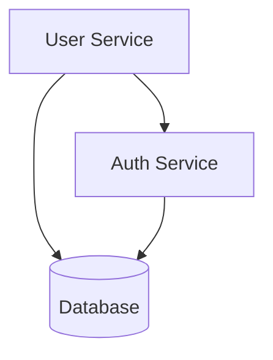

# Data Sources and Synchronization - Format Reference

**Super Relativity POC Option 1**
*Last Updated: 2025-12-29*

---

## Table of Contents
1. [Overview](#overview)
2. [External Data Sources](#external-data-sources)
3. [Internal Data Stores](#internal-data-stores)
4. [Data Synchronization Services](#data-synchronization-services)
5. [Data Format Templates](#data-format-templates)
6. [Relationship Mappings](#relationship-mappings)

---

## Overview

Super Relativity integrates data from multiple sources into a unified knowledge graph stored in Neo4j. The system synchronizes data from:

**Primary Data Sources:**
- **LeanIX API** (Enterprise Architecture)
- **Code Repositories** (Source Code Analysis)
- **Architecture Diagrams** (Mermaid/PlantUML)
- **Backstage Catalog** (Service Catalog - POC 4)
- **GitLab** (Source Control, CI/CD, Projects - POC 5)

**Configuration & Reference Data:**
- **CSV Files** (Manifests, Reference Tables, Team Configuration)
- **Database Initialization Scripts** (Cypher, SQL)
- **YAML Configuration** (Backstage, Prometheus, Kiali)

**Observability Data:**
- **Prometheus** (Metrics & Monitoring)
- **Grafana** (Analytics & Dashboards)
- **Jaeger** (Distributed Tracing)
- **Kiali** (Service Mesh Observability)

**Data Flow**: External Sources → Sync Services → Neo4j (Primary) + PostgreSQL (Metadata) + Redis (Cache)

---

## External Data Sources

### 1. LeanIX API (Mock Implementation)

**Service**: `/poc-services/mock-leanix/server.js`
**Endpoint**: `http://mock-leanix:8080`
**Port**: 8080

#### Available Endpoints

```
GET  /applications              List all applications
GET  /applications/:id          Get single application
GET  /components                List components (filter: ?application)
GET  /requirements              List requirements
GET  /data-objects              List data objects
GET  /capabilities              List business capabilities
GET  /servers                   List servers (filter: ?environment, ?status)
GET  /app-changes               List application changes
GET  /infra-changes             List infrastructure changes
GET  /relationships             List relationships (filter: ?from, ?to, ?type)
GET  /diagrams                  List context diagrams
GET  /impact/:entityId          Impact analysis for entity
GET  /sync/all                  Bulk export all data + statistics
POST /graphql                   GraphQL endpoint
```

#### Data Categories & Volume

| Category | Sample Count | ID Pattern |
|----------|--------------|------------|
| Business Capabilities | 8 | CAP-001 to CAP-008 |
| Applications | 10 | APP-012, APP-123, etc. |
| Components | 8 | COMP-001 to COMP-008 |
| Requirements | 3+ | REQ-001, REQ-002, REQ-003 |
| Data Objects | 10 | DATA-012, DATA-123, etc. |
| Servers | 15+ | SRV-001 to SRV-015 |
| Application Changes | 6 | ACH-001 to ACH-006 |
| Infrastructure Changes | 5 | ICH-001 to ICH-005 |
| Relationships | 100+ | Various types |

---

### 2. Code Repositories

**Service**: `/poc-services/code-parser/server.js`
**Port**: 3002

#### Supported File Types
- JavaScript (`.js`)
- TypeScript (`.ts`)
- JSX (`.jsx`)
- TSX (`.tsx`)

#### Parser Technology
- **Babel AST Parser** for code analysis
- Extracts: functions, imports, module dependencies

#### API Endpoints

```
POST /api/parse/repository      Parse code repository
     Body: { "repositoryPath": "/path/to/repo", "repositoryName": "repo-name" }

GET  /api/parse/jobs            Get parsing job history
```

---

### 3. Architecture Diagrams

**Service**: `/poc-services/diagram-parser/server.js`
**Port**: 3003

#### Supported Formats
- **Mermaid** (`.mmd`, `.mermaid`)
- **PlantUML** (`.puml`, `.plantuml`)

#### API Endpoints

```
POST /api/parse/diagram         Parse single diagram file
     Body: { "filePath": "/path/to/diagram.mmd" }

POST /api/parse/directory       Parse all diagrams in directory
     Body: { "directoryPath": "/path/to/diagrams" }
```

---

### 4. Backstage Catalog (POC Option 4)

**Service**: Developer Portal service catalog
**Port**: 3000 (Backstage UI)
**Format**: YAML

#### Data Location
- `/poc-data/backstage-catalog/catalog-info.yaml` - Root catalog
- `/poc-data/backstage-catalog/components/*.yaml` - Service definitions
- `/poc-data/backstage-catalog/systems/*.yaml` - System groupings
- `/poc-data/backstage-catalog/domains/*.yaml` - Domain definitions

#### Catalog Entities
- **Components** - Microservices, libraries, websites
- **Systems** - Collections of related components
- **Domains** - Business domains
- **APIs** - API definitions (OpenAPI, AsyncAPI)
- **Resources** - Infrastructure resources

#### Sync Mechanism
**Catalog Sync Service** syncs Backstage catalog → Neo4j

---

### 5. GitLab (POC Option 5)

**Service**: Source control, CI/CD, project management
**Port**: 8080
**Type**: Self-hosted GitLab instance

#### Data Extracted
- **Repositories** - Git repositories and branches
- **Projects** - Project metadata and settings
- **CI/CD Pipelines** - Pipeline definitions and runs
- **Issues** - Issue tracking data
- **Merge Requests** - Code review data
- **Commits** - Commit history

#### Sync Mechanism
**Context Enrichment Service** syncs GitLab + Istio + Neo4j

---

### 6. CSV Reference Files

**Location**: `/_bmad/` directory
**Count**: 28 files

#### Categories

**System Manifests:**
- `_bmad/_config/workflow-manifest.csv` - Workflow catalog
- `_bmad/_config/agent-manifest.csv` - Agent definitions
- `_bmad/_config/task-manifest.csv` - Task registry
- `_bmad/_config/tool-manifest.csv` - Tool configurations
- `_bmad/_config/files-manifest.csv` - File registry

**Workflow Reference Data:**
- `cis/workflows/design-thinking/design-methods.csv` - Design methodologies
- `cis/workflows/innovation-strategy/innovation-frameworks.csv` - Innovation patterns
- `cis/workflows/problem-solving/solving-methods.csv` - Problem-solving techniques
- `cis/workflows/storytelling/story-types.csv` - Narrative frameworks

**Project Classification:**
- `bmm/workflows/2-plan-workflows/prd/domain-complexity.csv` - Complexity metrics
- `bmm/workflows/2-plan-workflows/prd/project-types.csv` - Project categorization

**Team Configuration:**
- `bmm/teams/default-party.csv` - Team member roles
- `cis/teams/default-party.csv` - Creative team structure

---

### 7. Observability & Metrics

#### Prometheus (Metrics Database)
**Port**: 9090
**Type**: Time-series metrics database
**Config**: `/poc-config/prometheus.yml`

**Scrape Targets:**
- Neo4j metrics (port 2004)
- GraphQL API metrics
- Sync service metrics
- Code parser metrics
- Diagram parser metrics

#### Grafana (Visualization)
**Port**: 3100
**Type**: Analytics & dashboards
**Config**: `/poc-config/grafana-datasources.yml`

**Data Sources:**
- Prometheus (metrics)
- Neo4j (graph queries)

#### Jaeger (Distributed Tracing)
**Port**: 16686
**Type**: Distributed tracing system
**Use Case**: Track request flows across microservices

#### Kiali (Service Mesh Observability)
**Port**: 20001
**Type**: Service mesh visualization
**Config**: `/poc-config/kiali-config.yaml`

**External Services:**
- Prometheus (metrics source)
- Grafana (dashboard link)
- Jaeger (tracing link)

---

### 8. Database Initialization Scripts

#### Neo4j Cypher Scripts
**Location**: `/poc-data/neo4j-init/`

**Files:**
- `01-create-schema.cypher` - Constraints, indexes, sample data
- `02-import-leanix-data.cypher` - Business data import
- `03-demo-queries.cypher` - Example queries

**Purpose**: Initial schema and data seeding

#### PostgreSQL SQL Scripts
**Location**: `/poc-data/postgres-init/`

**Purpose**: Metadata table initialization (currently empty, tables created by services)

---

## Internal Data Stores

### 1. Neo4j Graph Database

**Container**: `super-relativity-neo4j`
**Ports**: 7474 (HTTP), 7687 (Bolt)
**Credentials**: `neo4j / super-relativity-2025`

#### Node Types

```
Requirement
Application
CodeComponent
DataObject
Infrastructure
BusinessCapability
Component
Server
AppChange
InfraChange
Diagram
DiagramEntity
Repository
CodeFile
Function
Module
```

#### Relationship Types

```
IMPLEMENTED_BY       Requirements → Applications
CONTAINS             Applications → Components
USES                 Components → Data Objects
DEPLOYED_ON          Applications → Infrastructure
STORED_IN            Data Objects → Infrastructure
SUPPORTS             Requirements → Business Capabilities
HAS_COMPONENT        Applications → Components
MODIFIES             Components → Data Objects
READS                Components → Data Objects
CREATES              Components → Data Objects
UPDATES              Components → Data Objects
HAS_CHILD_CAPABILITY Capabilities → Capabilities (hierarchy)
IMPACTS              Changes → Components/Capabilities
ENABLES              Requirements → Capabilities
ENHANCES             Changes → Applications
MIGRATES             Changes → Infrastructure
INSTALLED_ON         Components → Servers
```

---

### 2. PostgreSQL

**Container**: `super-relativity-postgres`
**Port**: 5432
**Database**: `super_relativity`
**Credentials**: `sr_user / sr_password_2025`

#### Tables

**sync_jobs**
```sql
CREATE TABLE sync_jobs (
    job_id VARCHAR(255) PRIMARY KEY,
    status VARCHAR(50),
    started_at TIMESTAMP,
    completed_at TIMESTAMP,
    records_synced INTEGER,
    error_message TEXT
);
```

**parse_jobs**
```sql
CREATE TABLE parse_jobs (
    job_id VARCHAR(255) PRIMARY KEY,
    repository_name VARCHAR(255),
    status VARCHAR(50),
    files_processed INTEGER,
    functions_found INTEGER,
    imports_found INTEGER,
    started_at TIMESTAMP,
    completed_at TIMESTAMP,
    duration_ms INTEGER
);
```

---

### 3. Redis Cache

**Container**: `super-relativity-redis`
**Port**: 6379
**Password**: `sr_redis_2025`

#### Cached Data

| Key Pattern | Data | TTL |
|-------------|------|-----|
| `last-sync` | Latest sync metadata | 1 hour |
| `rate-limit:*` | API rate limiting counters | Varies |
| `job-queue:*` | Temporary job data | Varies |

---

## Data Synchronization Services

### Sync Service

**Service**: `/poc-services/sync-service/server.js`
**Port**: 3001
**Interval**: Every 5 minutes (configurable)

#### Sync Process

1. **Fetch** from Mock LeanIX API endpoints
2. **Transform** to Neo4j node/relationship format
3. **Merge** into Neo4j using Cypher MERGE statements
4. **Record** job status in PostgreSQL
5. **Cache** last-sync result in Redis

#### API Endpoints

```
GET  /health                Health check
GET  /api/sync/status       Get last 10 sync jobs
POST /api/sync/trigger      Manual sync trigger
```

---

## Data Format Templates

### 1. Backstage Catalog Component (YAML)

**File Location**: `/poc-data/backstage-catalog/components/customer-service.yaml`

**YAML Format**:
```yaml
apiVersion: backstage.io/v1alpha1
kind: Component
metadata:
  name: customer-service
  title: Customer Service
  description: Microservice handling customer data and operations
  annotations:
    github.com/project-slug: myorg/customer-service
    backstage.io/techdocs-ref: dir:.
  tags:
    - microservice
    - java
    - spring-boot
  links:
    - url: https://dashboard.example.com
      title: Service Dashboard
      icon: dashboard
spec:
  type: service
  lifecycle: production
  owner: team-backend
  system: ecommerce-system
  providesApis:
    - customer-api
  consumesApis:
    - auth-api
  dependsOn:
    - resource:customer-database
    - component:notification-service
```

**Neo4j Transformation**:
```cypher
// Component Node
MERGE (c:Component {id: 'customer-service'})
SET c.name = 'Customer Service',
    c.type = 'service',
    c.lifecycle = 'production',
    c.owner = 'team-backend',
    c.system = 'ecommerce-system',
    c.description = 'Microservice handling customer data and operations',
    c.tags = ['microservice', 'java', 'spring-boot'],
    c.source = 'backstage',
    c.lastSyncedAt = datetime()

// System Relationship
MATCH (s:System {id: 'ecommerce-system'})
MERGE (c)-[:PART_OF]->(s)

// API Relationships
MATCH (api:API {id: 'customer-api'})
MERGE (c)-[:PROVIDES]->(api)

MATCH (auth:API {id: 'auth-api'})
MERGE (c)-[:CONSUMES]->(auth)

// Dependencies
MATCH (db:Resource {id: 'customer-database'})
MERGE (c)-[:DEPENDS_ON]->(db)

MATCH (notif:Component {id: 'notification-service'})
MERGE (c)-[:DEPENDS_ON]->(notif)
```

---

### 2. CSV Manifest Format

**File Location**: `/_bmad/_config/workflow-manifest.csv`

**CSV Structure**:
```csv
workflow_id,workflow_name,category,description,status,owner,last_updated
wf-001,Design Thinking,CIS,Human-centered design process,active,cis-team,2025-01-15
wf-002,Innovation Strategy,CIS,Business model innovation,active,cis-team,2025-01-15
wf-003,Problem Solving,CIS,Systematic problem resolution,active,cis-team,2025-01-12
wf-004,Code Review,BMM,ADVERSARIAL code review process,active,bmm-team,2025-01-18
wf-005,Create PRD,BMM,Product requirements documentation,active,bmm-team,2025-01-20
```

**Usage**: Reference data for workflow orchestration and metadata

---

### 3. Prometheus Metrics Format

**Config**: `/poc-config/prometheus.yml`

**Configuration Example**:
```yaml
global:
  scrape_interval: 15s
  evaluation_interval: 15s

scrape_configs:
  - job_name: 'neo4j'
    static_configs:
      - targets: ['neo4j:2004']
    metrics_path: '/metrics'

  - job_name: 'graphql-api'
    static_configs:
      - targets: ['graphql-api:4000']
    metrics_path: '/metrics'

  - job_name: 'sync-service'
    static_configs:
      - targets: ['sync-service:3001']
```

**Sample Metrics** (Prometheus Query Format):
```promql
# Request rate
rate(http_requests_total[5m])

# Error rate
rate(http_requests_errors_total[5m])

# Neo4j query duration
neo4j_query_duration_seconds{quantile="0.99"}

# Sync job success rate
sync_jobs_success_total / sync_jobs_total * 100
```

---

### 4. GitLab Project Data (JSON API Response)

**API Endpoint**: `GET /api/v4/projects/:id`

**Response Format**:
```json
{
  "id": 123,
  "name": "customer-portal",
  "path": "customer-portal",
  "description": "Main customer-facing web application",
  "visibility": "private",
  "ssh_url_to_repo": "git@gitlab.example.com:myorg/customer-portal.git",
  "http_url_to_repo": "https://gitlab.example.com/myorg/customer-portal.git",
  "web_url": "https://gitlab.example.com/myorg/customer-portal",
  "default_branch": "main",
  "tag_list": ["frontend", "react", "production"],
  "star_count": 42,
  "forks_count": 5,
  "created_at": "2024-06-15T10:30:00Z",
  "last_activity_at": "2025-01-15T14:22:00Z",
  "namespace": {
    "id": 10,
    "name": "myorg",
    "path": "myorg",
    "kind": "group"
  }
}
```

**Neo4j Transformation**:
```cypher
MERGE (p:Project {id: 123})
SET p.name = 'customer-portal',
    p.path = 'customer-portal',
    p.description = 'Main customer-facing web application',
    p.visibility = 'private',
    p.webUrl = 'https://gitlab.example.com/myorg/customer-portal',
    p.defaultBranch = 'main',
    p.tags = ['frontend', 'react', 'production'],
    p.starCount = 42,
    p.forksCount = 5,
    p.createdAt = datetime('2024-06-15T10:30:00Z'),
    p.lastActivity = datetime('2025-01-15T14:22:00Z'),
    p.source = 'gitlab',
    p.lastSyncedAt = datetime()

MERGE (ns:Namespace {id: 10})
SET ns.name = 'myorg',
    ns.kind = 'group'

MERGE (p)-[:BELONGS_TO]->(ns)
```

---

### 5. Jaeger Trace Format (JSON)

**Trace Example**:
```json
{
  "traceID": "abc123def456",
  "spans": [
    {
      "traceID": "abc123def456",
      "spanID": "span001",
      "operationName": "HTTP GET /api/customers",
      "startTime": 1705324800000000,
      "duration": 125000,
      "tags": [
        {"key": "http.method", "type": "string", "value": "GET"},
        {"key": "http.url", "type": "string", "value": "/api/customers"},
        {"key": "http.status_code", "type": "int64", "value": 200}
      ],
      "process": {
        "serviceName": "customer-service",
        "tags": [
          {"key": "hostname", "type": "string", "value": "customer-svc-01"}
        ]
      }
    }
  ]
}
```

**Use Case**: Track request flows, identify bottlenecks, analyze latency

---

### 6. Kiali Service Graph (JSON)

**API Response**: `GET /api/namespaces/graph`

**Response Format**:
```json
{
  "timestamp": 1705324800,
  "duration": 600,
  "graphType": "versionedApp",
  "elements": {
    "nodes": [
      {
        "data": {
          "id": "customer-service",
          "nodeType": "app",
          "namespace": "default",
          "app": "customer-service",
          "version": "v1.2.0",
          "traffic": {
            "rates": {
              "httpIn": "5.2",
              "httpOut": "3.1"
            }
          }
        }
      }
    ],
    "edges": [
      {
        "data": {
          "id": "edge-1",
          "source": "customer-service",
          "target": "database",
          "traffic": {
            "rates": {
              "http": "3.1",
              "httpPercentReq": "100"
            },
            "responses": {
              "200": "98.5",
              "500": "1.5"
            }
          }
        }
      }
    ]
  }
}
```

**Use Case**: Visualize service mesh traffic, error rates, latency

---

### 7. Application (LeanIX Source)

**API Response Format**:
```json
{
  "id": "APP-123",
  "name": "Customer Portal",
  "type": "Web Application",
  "businessValue": "High",
  "lifecycle": "Active",
  "techStack": ["React", "Node.js", "PostgreSQL"],
  "repositories": ["github.com/org/customer-portal-frontend"],
  "description": "Main customer-facing portal for account management",
  "status": "Production",
  "businessCriticality": "Critical"
}
```

**Neo4j Node Format**:
```cypher
MERGE (a:Application {id: 'APP-123'})
SET a.name = 'Customer Portal',
    a.type = 'Web Application',
    a.businessValue = 'High',
    a.lifecycle = 'Active',
    a.techStack = ['React', 'Node.js', 'PostgreSQL'],
    a.repositories = ['github.com/org/customer-portal-frontend'],
    a.description = 'Main customer-facing portal for account management',
    a.status = 'Production',
    a.businessCriticality = 'Critical',
    a.lastSyncedAt = datetime()
```

**GraphQL Query**:
```graphql
query {
  application(id: "APP-123") {
    id
    name
    type
    businessValue
    lifecycle
    techStack
    repositories
    description
    status
    businessCriticality
    dependencies {
      id
      name
    }
  }
}
```

---

### 8. Business Capability (LeanIX Source)

**API Response Format**:
```json
{
  "id": "CAP-001",
  "name": "Customer Onboarding",
  "level": "L1",
  "description": "Acquire and onboard new customers",
  "owner": "Chief Customer Officer",
  "criticality": "Critical",
  "maturity": "Defined",
  "application": "APP-123",
  "source": "leanix"
}
```

**Neo4j Node Format**:
```cypher
MERGE (c:BusinessCapability {id: 'CAP-001'})
SET c.name = 'Customer Onboarding',
    c.level = 'L1',
    c.description = 'Acquire and onboard new customers',
    c.owner = 'Chief Customer Officer',
    c.criticality = 'Critical',
    c.maturity = 'Defined',
    c.application = 'APP-123',
    c.source = 'leanix',
    c.lastSyncedAt = datetime()
```

**Hierarchical Relationship**:
```cypher
MATCH (parent:BusinessCapability {id: 'CAP-001'})
MATCH (child:BusinessCapability {id: 'CAP-002'})
MERGE (parent)-[:HAS_CHILD_CAPABILITY]->(child)
```

---

### 9. Data Object (LeanIX Source)

**API Response Format**:
```json
{
  "id": "DATA-789",
  "name": "CustomerTable",
  "type": "Database Table",
  "database": "customer_db",
  "schema": "public",
  "sensitivity": "PII",
  "columns": ["id", "name", "email", "phone", "address"],
  "recordCount": 1500000,
  "growthRate": "10% annually",
  "application": "APP-123"
}
```

**Neo4j Node Format**:
```cypher
MERGE (d:DataObject {id: 'DATA-789'})
SET d.name = 'CustomerTable',
    d.type = 'Database Table',
    d.database = 'customer_db',
    d.schema = 'public',
    d.sensitivity = 'PII',
    d.columns = ['id', 'name', 'email', 'phone', 'address'],
    d.recordCount = 1500000,
    d.growthRate = '10% annually',
    d.application = 'APP-123',
    d.lastSyncedAt = datetime()
```

---

### 10. Requirement (LeanIX Source)

**API Response Format**:
```json
{
  "id": "REQ-001",
  "name": "Multi-Factor Authentication",
  "type": "Security",
  "priority": "High",
  "status": "Approved",
  "description": "Implement MFA for all user logins",
  "capability": "CAP-004",
  "application": "APP-123",
  "requestedBy": "Security Team",
  "targetDate": "2025-Q2"
}
```

**Neo4j Node Format**:
```cypher
MERGE (r:Requirement {id: 'REQ-001'})
SET r.name = 'Multi-Factor Authentication',
    r.type = 'Security',
    r.priority = 'High',
    r.status = 'Approved',
    r.description = 'Implement MFA for all user logins',
    r.capability = 'CAP-004',
    r.application = 'APP-123',
    r.requestedBy = 'Security Team',
    r.targetDate = '2025-Q2',
    r.lastSyncedAt = datetime()
```

---

### 11. Infrastructure/Server (LeanIX Source)

**API Response Format**:
```json
{
  "id": "SRV-001",
  "name": "web-server-prod-01",
  "type": "Application Server",
  "environment": "Production",
  "status": "Active",
  "location": "AWS us-east-1",
  "os": "Ubuntu 22.04",
  "cpu": "8 cores",
  "memory": "32GB",
  "applications": ["APP-123", "APP-456"],
  "ipAddress": "10.0.1.15"
}
```

**Neo4j Node Format**:
```cypher
MERGE (s:Server {id: 'SRV-001'})
SET s.name = 'web-server-prod-01',
    s.type = 'Application Server',
    s.environment = 'Production',
    s.status = 'Active',
    s.location = 'AWS us-east-1',
    s.os = 'Ubuntu 22.04',
    s.cpu = '8 cores',
    s.memory = '32GB',
    s.applications = ['APP-123', 'APP-456'],
    s.ipAddress = '10.0.1.15',
    s.lastSyncedAt = datetime()
```

---

### 12. Application Change (LeanIX Source)

**API Response Format**:
```json
{
  "id": "ACH-001",
  "name": "Migrate to React 18",
  "type": "Technology Upgrade",
  "status": "In Progress",
  "priority": "Medium",
  "application": "APP-123",
  "impactLevel": "Medium",
  "plannedStart": "2025-01-15",
  "estimatedCompletion": "2025-02-28",
  "assignedTo": "Frontend Team",
  "description": "Upgrade React framework from v17 to v18"
}
```

**Neo4j Node Format**:
```cypher
MERGE (ac:AppChange {id: 'ACH-001'})
SET ac.name = 'Migrate to React 18',
    ac.type = 'Technology Upgrade',
    ac.status = 'In Progress',
    ac.priority = 'Medium',
    ac.application = 'APP-123',
    ac.impactLevel = 'Medium',
    ac.plannedStart = date('2025-01-15'),
    ac.estimatedCompletion = date('2025-02-28'),
    ac.assignedTo = 'Frontend Team',
    ac.description = 'Upgrade React framework from v17 to v18',
    ac.lastSyncedAt = datetime()
```

---

### 13. Infrastructure Change (LeanIX Source)

**API Response Format**:
```json
{
  "id": "ICH-001",
  "name": "Database Migration to Aurora",
  "type": "Migration",
  "status": "Planned",
  "priority": "High",
  "infrastructure": ["SRV-005", "SRV-006"],
  "impactLevel": "High",
  "downtime": "2 hours",
  "rollbackPlan": "Snapshot restore available",
  "scheduledDate": "2025-02-01"
}
```

**Neo4j Node Format**:
```cypher
MERGE (ic:InfraChange {id: 'ICH-001'})
SET ic.name = 'Database Migration to Aurora',
    ic.type = 'Migration',
    ic.status = 'Planned',
    ic.priority = 'High',
    ic.infrastructure = ['SRV-005', 'SRV-006'],
    ic.impactLevel = 'High',
    ic.downtime = '2 hours',
    ic.rollbackPlan = 'Snapshot restore available',
    ic.scheduledDate = date('2025-02-01'),
    ic.lastSyncedAt = datetime()
```

---

### 14. Code File (Code Parser Source)

**Parser Output Format**:
```json
{
  "path": "/src/services/auth.js",
  "name": "auth.js",
  "extension": ".js",
  "repository": "customer-portal-api",
  "functions": [
    {
      "name": "authenticateUser",
      "lineNumber": 15
    },
    {
      "name": "validateToken",
      "lineNumber": 42
    }
  ],
  "imports": [
    "jsonwebtoken",
    "bcrypt",
    "./config/database"
  ]
}
```

**Neo4j Nodes Format**:
```cypher
// Repository
MERGE (repo:Repository {name: 'customer-portal-api'})
SET repo.path = '/path/to/repo'

// Code File
MERGE (file:CodeFile {path: '/src/services/auth.js'})
SET file.name = 'auth.js',
    file.extension = '.js',
    file.repository = 'customer-portal-api'

// Functions
MERGE (f1:Function {name: 'authenticateUser', filePath: '/src/services/auth.js'})
SET f1.lineNumber = 15

MERGE (f2:Function {name: 'validateToken', filePath: '/src/services/auth.js'})
SET f2.lineNumber = 42

// Imports (Modules)
MERGE (m1:Module {name: 'jsonwebtoken'})
MERGE (m2:Module {name: 'bcrypt'})
MERGE (m3:Module {name: './config/database'})

// Relationships
MERGE (repo)-[:CONTAINS]->(file)
MERGE (file)-[:CONTAINS]->(f1)
MERGE (file)-[:CONTAINS]->(f2)
MERGE (file)-[:IMPORTS]->(m1)
MERGE (file)-[:IMPORTS]->(m2)
MERGE (file)-[:IMPORTS]->(m3)
```

---

### 15. Diagram (Diagram Parser Source)

**Mermaid Input Example**:


**Parser Output Format**:
```json
{
  "fileName": "architecture.mmd",
  "diagramType": "mermaid",
  "entities": [
    { "id": "UserService", "label": "User Service", "type": "DiagramEntity" },
    { "id": "AuthService", "label": "Auth Service", "type": "DiagramEntity" },
    { "id": "Database", "label": "Database", "type": "DiagramEntity" }
  ],
  "relationships": [
    { "from": "UserService", "to": "AuthService", "type": "CONNECTED_TO" },
    { "from": "UserService", "to": "Database", "type": "CONNECTED_TO" },
    { "from": "AuthService", "to": "Database", "type": "CONNECTED_TO" }
  ]
}
```

**Neo4j Nodes Format**:
```cypher
// Diagram
MERGE (diagram:Diagram {fileName: 'architecture.mmd'})
SET diagram.type = 'mermaid',
    diagram.entityCount = 3,
    diagram.relationshipCount = 3

// Entities
MERGE (e1:DiagramEntity {id: 'UserService', diagramFile: 'architecture.mmd'})
SET e1.label = 'User Service'

MERGE (e2:DiagramEntity {id: 'AuthService', diagramFile: 'architecture.mmd'})
SET e2.label = 'Auth Service'

MERGE (e3:DiagramEntity {id: 'Database', diagramFile: 'architecture.mmd'})
SET e3.label = 'Database'

// Relationships
MERGE (e1)-[:CONNECTED_TO]->(e2)
MERGE (e1)-[:CONNECTED_TO]->(e3)
MERGE (e2)-[:CONNECTED_TO]->(e3)

// Link to Diagram
MERGE (diagram)-[:CONTAINS]->(e1)
MERGE (diagram)-[:CONTAINS]->(e2)
MERGE (diagram)-[:CONTAINS]->(e3)
```

---

### 16. Relationship (LeanIX Source)

**API Response Format**:
```json
{
  "from": "REQ-001",
  "to": "APP-123",
  "type": "IMPLEMENTED_BY",
  "confidence": 1.0,
  "source": "leanix",
  "createdAt": "2025-01-10T10:00:00Z"
}
```

**Neo4j Relationship Format**:
```cypher
MATCH (from {id: 'REQ-001'})
MATCH (to {id: 'APP-123'})
MERGE (from)-[r:IMPLEMENTED_BY]->(to)
SET r.confidence = 1.0,
    r.source = 'leanix',
    r.createdAt = datetime('2025-01-10T10:00:00Z')
```

**Common Relationship Examples**:
```cypher
// Application uses Data Object
(app:Application)-[:USES]->(data:DataObject)

// Component deployed on Server
(comp:Component)-[:DEPLOYED_ON]->(srv:Server)

// Requirement supports Capability
(req:Requirement)-[:SUPPORTS]->(cap:BusinessCapability)

// Change impacts Application
(change:AppChange)-[:IMPACTS]->(app:Application)

// Function modifies Data
(func:Function)-[:MODIFIES]->(data:DataObject)
```

---

## Relationship Mappings

### Complete Relationship Type Reference

| Source Node | Relationship | Target Node | Description |
|-------------|--------------|-------------|-------------|
| Requirement | IMPLEMENTED_BY | Application | Requirement is implemented by application |
| Requirement | SUPPORTS | BusinessCapability | Requirement supports business capability |
| Application | CONTAINS | Component | Application contains components |
| Application | USES | DataObject | Application uses data objects |
| Application | DEPLOYED_ON | Server | Application deployed on infrastructure |
| Component | USES | DataObject | Component uses data objects |
| Component | MODIFIES | DataObject | Component modifies data (write) |
| Component | READS | DataObject | Component reads data |
| Component | CREATES | DataObject | Component creates data |
| Component | UPDATES | DataObject | Component updates data |
| Component | INSTALLED_ON | Server | Component installed on server |
| DataObject | STORED_IN | Server | Data stored on infrastructure |
| BusinessCapability | HAS_CHILD_CAPABILITY | BusinessCapability | Capability hierarchy |
| AppChange | IMPACTS | Application | Change impacts application |
| AppChange | ENHANCES | Application | Change enhances application |
| InfraChange | IMPACTS | Server | Change impacts infrastructure |
| InfraChange | MIGRATES | Server | Change migrates infrastructure |
| Repository | CONTAINS | CodeFile | Repo contains code files |
| CodeFile | CONTAINS | Function | File contains functions |
| CodeFile | IMPORTS | Module | File imports modules |
| Diagram | CONTAINS | DiagramEntity | Diagram contains entities |
| DiagramEntity | CONNECTED_TO | DiagramEntity | Entities connected in diagram |
| Component | PART_OF | System | Backstage component part of system |
| Component | PROVIDES | API | Component provides API |
| Component | CONSUMES | API | Component consumes API |
| Component | DEPENDS_ON | Resource | Component depends on resource |
| Component | DEPENDS_ON | Component | Component depends on component |
| Project | BELONGS_TO | Namespace | GitLab project in namespace |
| Service | CALLS | Service | Service-to-service communication |

---

## Sync Job Status Format

### PostgreSQL sync_jobs Table

**Record Example**:
```json
{
  "jobId": "sync-1703494800123",
  "status": "completed",
  "startedAt": "2025-01-15T10:00:00Z",
  "completedAt": "2025-01-15T10:02:30Z",
  "recordsSynced": 47,
  "errorMessage": null
}
```

**Status Values**: `running`, `completed`, `failed`

### Redis Cache Format

**Key**: `last-sync`

**Value**:
```json
{
  "timestamp": "2025-01-15T10:02:30Z",
  "recordsSynced": 47,
  "duration": 150000,
  "status": "completed"
}
```

**TTL**: 3600 seconds (1 hour)

---

## GraphQL Schema Examples

### Query Structure

```graphql
type Query {
  # Applications
  applications: [Application!]!
  application(id: ID!): Application
  searchApplications(query: String!): [Application!]!
  findRelatedApplications(applicationId: ID!, depth: Int): [Application!]!

  # Code Analysis
  repositories: [Repository!]!
  codeFiles(limit: Int): [CodeFile!]!

  # Diagrams
  diagrams: [Diagram!]!
  diagram(fileName: String!): Diagram

  # Jobs & Status
  syncJobs: [SyncJob!]!

  # Change Management
  appChanges(status: String): [AppChange!]!
  infraChanges(status: String): [InfraChange!]!

  # Graph Visualization
  hierarchicalGraph(rootName: String!, rootType: String!): Graph!
  customCypherGraph(cypherQuery: String!): Graph!
}

type Mutation {
  triggerSync: SyncJob!
}
```

### Example Query

```graphql
query GetApplicationDetails {
  application(id: "APP-123") {
    id
    name
    type
    businessValue
    lifecycle
    techStack
    dependencies {
      id
      name
      type
    }
  }

  appChanges(status: "In Progress") {
    id
    name
    priority
    impactLevel
    application
  }

  syncJobs {
    jobId
    status
    recordsSynced
    startedAt
    completedAt
  }
}
```

---

## Configuration Reference

### Environment Variables

```bash
# Neo4j
NEO4J_URI=bolt://neo4j:7687
NEO4J_USER=neo4j
NEO4J_PASSWORD=super-relativity-2025

# PostgreSQL
POSTGRES_HOST=postgres
POSTGRES_PORT=5432
POSTGRES_DB=super_relativity
POSTGRES_USER=sr_user
POSTGRES_PASSWORD=sr_password_2025

# Redis
REDIS_HOST=redis
REDIS_PORT=6379
REDIS_PASSWORD=sr_redis_2025

# Services
LEANIX_API_URL=http://mock-leanix:8080
SYNC_INTERVAL_MINUTES=5
CODE_PARSER_PORT=3002
DIAGRAM_PARSER_PORT=3003
GRAPHQL_PORT=4000

# Frontend
REACT_APP_GRAPHQL_URL=http://localhost:4000/graphql
```

### Docker Services Ports

| Service | Internal Port | External Port | Protocol |
|---------|---------------|---------------|----------|
| Neo4j Browser | 7474 | 7474 | HTTP |
| Neo4j Bolt | 7687 | 7687 | Bolt |
| PostgreSQL | 5432 | 5432 | PostgreSQL |
| Redis | 6379 | 6379 | Redis |
| Mock LeanIX | 8080 | 8080 | HTTP |
| Sync Service | 3001 | 3001 | HTTP |
| Code Parser | 3002 | 3002 | HTTP |
| Diagram Parser | 3003 | 3003 | HTTP |
| GraphQL API | 4000 | 4000 | HTTP |
| Frontend (React) | 3000 | 3000 | HTTP |
| Prometheus | 9090 | 9090 | HTTP |
| Grafana | 3100 | 3100 | HTTP |
| Backstage (POC 4) | 3000 | 3000 | HTTP |
| Kiali (POC 4/5) | 20001 | 20001 | HTTP |
| Jaeger (POC 4/5) | 16686 | 16686 | HTTP |
| GitLab (POC 5) | 8080 | 8080 | HTTP |

---

## Sample Data Locations

| Data Type | Location | Format |
|-----------|----------|--------|
| Neo4j Init Scripts | `/poc-data/neo4j-init/` | Cypher (`.cypher`) |
| LeanIX Sample Data | `/poc-services/mock-leanix/server.js` | In-memory (hardcoded) |
| Sample Code | `/poc-data/sample-code/` | JavaScript/TypeScript |
| Sample Diagrams | `/poc-data/sample-diagrams/` | Mermaid/PlantUML |
| CSV Manifests | `/_bmad/_config/` | CSV |
| Workflow Reference | `/_bmad/cis/workflows/` | CSV |
| Team Configuration | `/_bmad/bmm/teams/` | CSV |
| Backstage Catalog | `/poc-data/backstage-catalog/` | YAML |
| Prometheus Config | `/poc-config/prometheus.yml` | YAML |
| Grafana Config | `/poc-config/grafana-datasources.yml` | YAML |
| Kiali Config | `/poc-config/kiali-config.yaml` | YAML |

---

## Bulk Export Format

### LeanIX Bulk Export (`/sync/all`)

**Response Structure**:
```json
{
  "timestamp": "2025-01-15T10:00:00Z",
  "statistics": {
    "totalApplications": 10,
    "totalCapabilities": 8,
    "totalRequirements": 3,
    "totalDataObjects": 10,
    "totalComponents": 8,
    "totalServers": 15,
    "totalAppChanges": 6,
    "totalInfraChanges": 5,
    "totalRelationships": 100
  },
  "data": {
    "applications": [ /* array of application objects */ ],
    "capabilities": [ /* array of capability objects */ ],
    "requirements": [ /* array of requirement objects */ ],
    "dataObjects": [ /* array of data object objects */ ],
    "components": [ /* array of component objects */ ],
    "servers": [ /* array of server objects */ ],
    "appChanges": [ /* array of app change objects */ ],
    "infraChanges": [ /* array of infra change objects */ ],
    "relationships": [ /* array of relationship objects */ ]
  }
}
```

---

## Error Formats

### API Error Response

```json
{
  "error": {
    "code": "SYNC_ERROR",
    "message": "Failed to sync data from LeanIX API",
    "details": "Connection timeout after 30000ms",
    "timestamp": "2025-01-15T10:05:00Z"
  }
}
```

### Sync Job Error

```json
{
  "jobId": "sync-1703494800999",
  "status": "failed",
  "startedAt": "2025-01-15T10:00:00Z",
  "completedAt": "2025-01-15T10:00:30Z",
  "recordsSynced": 0,
  "errorMessage": "Neo4j connection refused: ECONNREFUSED"
}
```

---

## Appendix: Quick Reference

### Data Flow Summary

```
┌──────────────┐  ┌──────────────┐  ┌──────────────┐  ┌──────────────┐
│  LeanIX API  │  │ Code Repos   │  │   Diagrams   │  │  Backstage   │
└──────┬───────┘  └──────┬───────┘  └──────┬───────┘  └──────┬───────┘
       │                 │                 │                 │
       └─────────────────┴─────────────────┴─────────────────┘
                                 │
                    ┌────────────▼────────────┐
                    │   Sync Services Layer   │
                    │  (Parsers, Importers)   │
                    └────────────┬────────────┘
                                 │
       ┌─────────────────────────┼─────────────────────────┐
       │                         │                         │
       ▼                         ▼                         ▼
┌──────────────┐         ┌──────────────┐         ┌──────────────┐
│  PostgreSQL  │         │    Neo4j     │         │    Redis     │
│  (Metadata)  │         │ (Knowledge   │         │   (Cache)    │
└──────────────┘         │   Graph)     │         └──────────────┘
                         └──────┬───────┘
                                │
                    ┌───────────┴───────────┐
                    │                       │
                    ▼                       ▼
          ┌──────────────────┐    ┌──────────────────┐
          │   GraphQL API    │    │  Observability   │
          │  (Query Layer)   │    │  (Prometheus,    │
          └─────────┬────────┘    │ Grafana, Jaeger) │
                    │             └──────────────────┘
                    ▼
          ┌──────────────────┐
          │  React Frontend  │
          │ (Visualization)  │
          └──────────────────┘

External Data Sources (POC 4/5):
┌──────────────┐  ┌──────────────┐  ┌──────────────┐
│    GitLab    │  │    Istio     │  │    Kiali     │
│ (Source Ctrl)│  │(Service Mesh)│  │ (Mesh Viz)   │
└──────────────┘  └──────────────┘  └──────────────┘
```

### Common Operations

**Trigger Manual Sync**:
```bash
curl -X POST http://localhost:3001/api/sync/trigger
```

**Check Sync Status**:
```bash
curl http://localhost:3001/api/sync/status
```

**Parse Code Repository**:
```bash
curl -X POST http://localhost:3002/api/parse/repository \
  -H "Content-Type: application/json" \
  -d '{"repositoryPath": "/path/to/repo", "repositoryName": "my-repo"}'
```

**Parse Diagram**:
```bash
curl -X POST http://localhost:3003/api/parse/diagram \
  -H "Content-Type: application/json" \
  -d '{"filePath": "/path/to/diagram.mmd"}'
```

**GraphQL Query**:
```bash
curl -X POST http://localhost:4000/graphql \
  -H "Content-Type: application/json" \
  -d '{"query": "{ applications { id name } }"}'
```

**Query Prometheus Metrics**:
```bash
curl 'http://localhost:9090/api/v1/query?query=rate(http_requests_total[5m])'
```

**Query Grafana Dashboard**:
```bash
curl http://localhost:3100/api/dashboards/uid/neo4j-overview
```

**GitLab API Query**:
```bash
curl --header "PRIVATE-TOKEN: <token>" http://localhost:8080/api/v4/projects
```

---

## Summary of All Data Sources

| Category | Source | Format | Sync Method | POC Version |
|----------|--------|--------|-------------|-------------|
| Enterprise Architecture | LeanIX API | JSON/GraphQL | Sync Service | 1, 2, 3 |
| Source Code | Code Repositories | JS/TS Files | Code Parser | 1, 2, 3 |
| Architecture | Diagrams | Mermaid/PlantUML | Diagram Parser | 1, 2, 3 |
| Service Catalog | Backstage | YAML | Catalog Sync | 4 |
| Source Control | GitLab | JSON API | Context Enrichment | 5 |
| Metrics | Prometheus | Time-Series | Direct Query | 1, 4, 5 |
| Analytics | Grafana | Dashboards | Visualization | 1, 4, 5 |
| Tracing | Jaeger | JSON Traces | Trace Collector | 4, 5 |
| Service Mesh | Kiali/Istio | JSON API | Direct Query | 4, 5 |
| Configuration | CSV Files | CSV | File Read | All |
| Reference Data | YAML Config | YAML | File Read | All |
| Initialization | Cypher Scripts | Cypher | Neo4j Init | All |

---

**Document Version**: 2.0
**Last Updated**: 2025-12-29
**Maintainer**: Super Relativity Team
