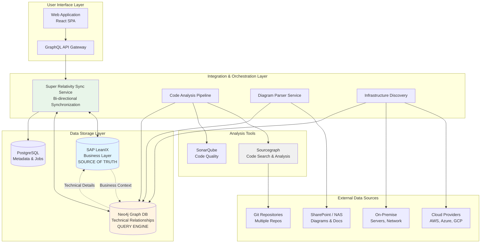
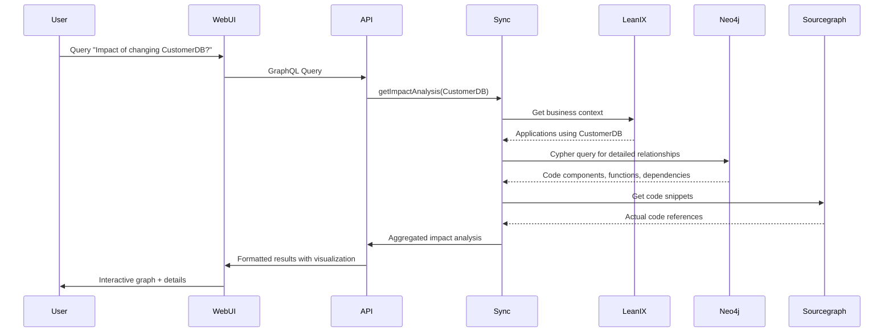
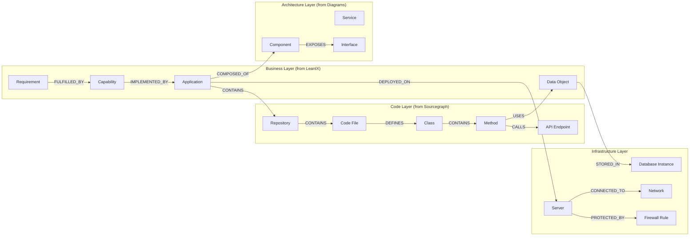
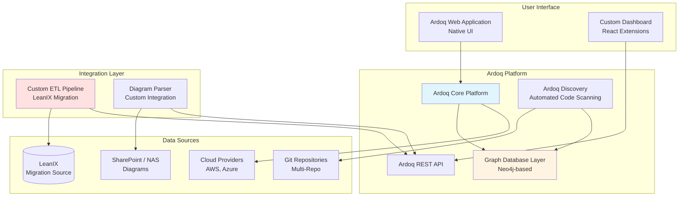
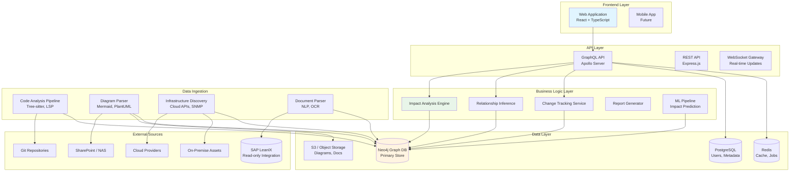
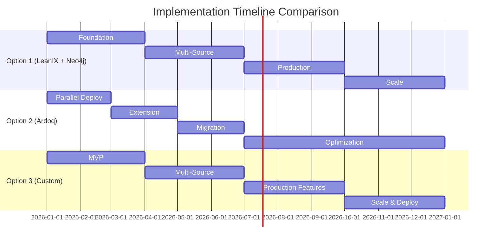

# Super Relativity POC Plan
**Enterprise Traceability & Impact Analysis Platform**

**Date:** December 22, 2025
**Prepared For:** Noppadon.s
**Portfolio Scale:** 1000+ Applications
**Objective:** Establish bi-directional traceability from Business Requirements → Design → Code → Data → Infrastructure

---

## EXECUTIVE SUMMARY

### The Challenge
Your organization manages 1000+ applications with critical information scattered across multiple storage solutions (SharePoint, Git, NAS) in various formats (functional specs, code, diagrams, infrastructure definitions). Currently, answering simple questions like "what will break if we change this?" requires extensive manual investigation.

### The Vision: Super Relativity Platform
A unified platform that automatically maps and maintains relationships across:
1. **Business Requirements** (functional specs in SharePoint/documents)
2. **Code** (across multiple Git repositories, multiple languages)
3. **Architecture Diagrams** (Mermaid, PlantUML, C4, Visio)
4. **Data Objects** (databases, APIs, file systems)
5. **Infrastructure** (servers, networks, firewalls, cloud resources)

### Use Cases
- **Impact Analysis**: "If we drop Firewall Rule X, which business functions are affected?"
- **Data Lineage**: "Which applications read/write CustomerTable, and what business requirements drive this?"
- **Change Planning**: "If we add field X to 'Submit Application', what reports and functions need updating?"
- **Compliance**: "Show me the complete trace from GDPR requirement to data encryption implementation"

### Market Research Findings
After analyzing 7+ platforms and integration patterns, we discovered:
- ✅ **No single platform** provides everything out-of-box
- ✅ **Graph databases** (Neo4j) essential for relationship modeling at scale
- ✅ **Code analysis tools** (Sourcegraph) required for multi-repo scanning
- ✅ **Hybrid approaches** most practical for enterprise scale
- ✅ **AI/ML capabilities** emerging but not yet critical path

### Investment Range
- **Low-Cost Option**: $200K - $500K (3 years) - Limited capabilities
- **Recommended Option**: $1.5M - $2M (3 years) - Comprehensive solution
- **Premium Option**: $2.5M - $4.5M (3 years) - Best-in-class platform

### Expected ROI
- **Annual Value**: $1.3M in time savings and incident reduction
- **Payback Period**: 7-12 months depending on option
- **Net ROI Year 1**: 50-63%

---

## POC OPTIONS OVERVIEW

Based on comprehensive market research, we recommend evaluating three distinct approaches:

| Option | Approach | Investment (3yr) | Risk Level | Time to Value | Best For |
|--------|----------|------------------|------------|---------------|----------|
| **Option 1** | Extend LeanIX + Neo4j + Sourcegraph | $1.5M - $2M | **LOW** | 3-6 months | Risk minimization, gradual rollout |
| **Option 2** | Migrate to Ardoq Platform | $2.5M - $4.5M | **MEDIUM** | 6-9 months | Long-term best platform, willing to migrate |
| **Option 3** | Custom Neo4j Solution | $1.8M - $3.2M | **HIGH** | 12+ months | Maximum flexibility, own IP |

**RECOMMENDED FOR POC: Option 1** (Lowest risk, fastest value, leverages existing investment)

---

# OPTION 1: EXTEND LEANIX WITH NEO4J + SOURCEGRAPH
## **RECOMMENDED APPROACH**

## Overview
Extend your existing SAP LeanIX investment by adding complementary technologies for code analysis (Sourcegraph) and advanced relationship modeling (Neo4j). LeanIX continues as the authoritative source for business layer while Neo4j provides detailed technical traceability.

## Architecture Diagram



## Data Flow Architecture



## Key Components

### 1. SAP LeanIX (Existing)
**Role:** Authoritative source for business layer
- Business capabilities and requirements
- Application portfolio (1000+ apps)
- Data objects catalog
- High-level relationships

**Integration:** GraphQL API + Webhooks

### 2. Neo4j Graph Database (New)
**Role:** Detailed technical relationship storage and query engine
- File-level and function-level code relationships
- Parsed architecture diagram elements
- Infrastructure topology
- Complex graph traversal queries

**Deployment:**
- 3-node Enterprise cluster (HA)
- Kubernetes StatefulSets
- Continuous backup

### 3. Sourcegraph Enterprise (New)
**Role:** Multi-repository code search and analysis
- Index all Git repositories
- Cross-repo code intelligence
- Extract: classes, functions, data access patterns
- Dependency analysis

**Integration:** GraphQL API

### 4. Custom Integration Platform (New)
**Components:**
- **Sync Service**: LeanIX ↔ Neo4j bi-directional sync
- **Code Analysis Pipeline**: Extract code metadata
- **Diagram Parser**: Mermaid, PlantUML, C4 → Neo4j
- **Infrastructure Discovery**: Cloud APIs + Netbox → Neo4j
- **GraphQL API**: Unified query interface
- **Web UI**: React-based visualization

### 5. Supporting Tools
- **SonarQube**: Data object usage analysis (SQL queries)
- **Netbox**: On-premise infrastructure inventory
- **Cloud SDKs**: AWS Config, Azure Resource Graph
- **PostgreSQL**: Metadata, user management, job queue

## Neo4j Graph Schema



## Sample Data Structure

### Business Requirement (in LeanIX)
```yaml
requirement:
  id: "REQ-001"
  name: "Enable customer self-service application submission"
  type: "Functional Requirement"
  criticality: "High"
  owner: "Product Team"
  applications:
    - APP-123  # Customer Portal
    - APP-456  # Backend API
```

### Application (in LeanIX + Neo4j)
```yaml
application:
  id: "APP-123"
  name: "Customer Portal"
  type: "Web Application"
  business_value: "High"
  lifecycle: "Active"
  repositories:
    - "github.com/org/customer-portal-frontend"
    - "github.com/org/customer-portal-backend"
  data_objects:
    - DATA-789  # Customer Table
    - DATA-012  # Application Table
```

### Code Component (in Neo4j from Sourcegraph)
```yaml
code_component:
  id: "CODE-001"
  type: "Class"
  name: "ApplicationSubmissionService"
  file_path: "/src/services/ApplicationSubmissionService.java"
  repository: "github.com/org/customer-portal-backend"
  language: "Java"
  methods:
    - submitApplication()
    - validateApplication()
    - saveToDatabase()
  data_objects_used:
    - CustomerTable (READ, WRITE)
    - ApplicationTable (WRITE)
    - DocumentStorage (WRITE)
  api_endpoints:
    - POST /api/applications/submit
```

### Architecture Diagram (Parsed from Mermaid)
```yaml
# Original Mermaid diagram in SharePoint:
# graph LR
#   CustomerPortal[Customer Portal UI]
#   API[Application API]
#   Database[(Customer DB)]
#   CustomerPortal -->|HTTPS| API
#   API -->|SQL| Database

# Parsed into Neo4j:
components:
  - id: "COMP-UI-001"
    name: "Customer Portal UI"
    type: "Frontend Component"
    technology: "React"

  - id: "COMP-API-001"
    name: "Application API"
    type: "Backend Service"
    technology: "Java Spring Boot"

  - id: "COMP-DB-001"
    name: "Customer DB"
    type: "Database"
    technology: "PostgreSQL"

relationships:
  - from: "COMP-UI-001"
    to: "COMP-API-001"
    type: "HTTPS"
    protocol: "REST"

  - from: "COMP-API-001"
    to: "COMP-DB-001"
    type: "SQL"
    protocol: "JDBC"
```

### Infrastructure (from Cloud Discovery)
```yaml
server:
  id: "SERVER-001"
  name: "customer-portal-prod-01"
  type: "EC2 Instance"
  provider: "AWS"
  region: "us-east-1"
  instance_type: "t3.large"
  applications:
    - APP-123
  network: "VPC-prod-001"
  security_groups:
    - "sg-web-tier"
    - "sg-app-tier"

firewall_rule:
  id: "FW-001"
  name: "Allow HTTPS from Internet"
  source: "0.0.0.0/0"
  destination: "sg-web-tier"
  port: 443
  protocol: "TCP"
  applications_affected:
    - APP-123 (Customer Portal)
```

## POC Implementation Plan

### Phase 1: Foundation (Months 1-3)
**Budget: $150K**

#### Week 1-2: Environment Setup
- Provision Neo4j Enterprise 3-node cluster on Kubernetes
- Deploy Sourcegraph Enterprise (50-user license)
- Set up PostgreSQL for metadata
- Establish development and testing environments

#### Week 3-6: LeanIX Integration
- Design LeanIX ↔ Neo4j data model mapping
- Implement GraphQL API integration with LeanIX
- Build bi-directional sync service
  - LeanIX → Neo4j: Applications, Requirements, Data Objects
  - Neo4j → LeanIX: Relationship quality scores, impact metrics
- Create Neo4j graph schema
- Implement webhook listeners for real-time updates

#### Week 7-10: Code Analysis Pipeline
- Configure Sourcegraph for first 10 Git repositories
- Develop code metadata extractor:
  - Java parser (using Tree-sitter or JavaParser)
  - Extract: Classes, methods, SQL queries, API calls
- Load code metadata into Neo4j
- Create relationships: Code → Data Objects → Applications

#### Week 11-12: Testing & Validation
- Validate sync accuracy (LeanIX ↔ Neo4j)
- Test relationship queries
- Pilot with 50 applications
- Performance testing (query response times)
- User acceptance testing with 10 early adopters

**Deliverables:**
- ✅ Operational Neo4j cluster
- ✅ LeanIX data synced (Applications, Requirements, Data Objects)
- ✅ Code analysis for 50 applications
- ✅ Basic impact analysis queries working
- ✅ Pilot user feedback incorporated

### Phase 2: Multi-Source Integration (Months 4-6)
**Budget: $200K**

#### Week 13-16: Diagram Parsing
- Develop Mermaid diagram parser (JavaScript)
- Develop PlantUML parser (Python)
- Build SharePoint/NAS connector
- Extract components and relationships from diagrams
- Load into Neo4j with source tracking
- Link diagram elements to applications

#### Week 17-20: Infrastructure Discovery
- Implement AWS Config integration
  - Extract: EC2, RDS, Load Balancers, Security Groups
- Implement Azure Resource Graph integration
  - Extract: VMs, SQL Databases, NSGs, VNets
- Set up Netbox for on-premise inventory
- Develop custom SNMP polling for network devices
- Map infrastructure → applications via tagging/naming conventions

#### Week 21-24: Advanced Graph Queries
- Develop impact analysis Cypher queries:
  - "What breaks if we change X?"
  - "Show all dependencies of Application Y"
  - "Calculate blast radius for Server Z"
- Implement relationship inference engine
  - Infer missing links based on naming patterns
  - Confidence scoring for inferred relationships
- Build change tracking (version history in Neo4j)
- Create automated anomaly detection

**Deliverables:**
- ✅ Diagram parsing operational (Mermaid, PlantUML)
- ✅ Infrastructure discovery automated (cloud + on-prem)
- ✅ 200 applications with full traceability
- ✅ Advanced impact analysis queries functional
- ✅ Relationship inference working with 80%+ accuracy

### Phase 3: Production Features (Months 7-9)
**Budget: $150K**

#### Week 25-28: Frontend Development
- Design React-based Web UI
- Implement graph visualization (Cytoscape.js or D3.js)
- Build search and navigation interface
- Create impact analysis visualizations
- Develop drill-down capability (requirement → code → infrastructure)
- Implement user authentication (SSO integration)

#### Week 29-32: AI/ML Features
- Integrate Sourcegraph Cody for code explanations
- Implement ML-based change impact prediction
  - Train model on historical change data
  - Predict impact probability and blast radius
- Build automated relationship suggestion system
- Create natural language query interface (experimental)

#### Week 33-36: Production Readiness
- Security hardening and penetration testing
- Performance optimization (query tuning, caching)
- Implement monitoring and alerting (Prometheus + Grafana)
- Create comprehensive documentation
- Develop user training materials
- Conduct user acceptance testing
- Deploy to production environment

**Deliverables:**
- ✅ Production-ready web interface
- ✅ AI-powered impact prediction functional
- ✅ Security audit passed
- ✅ Monitoring and alerting operational
- ✅ User training completed
- ✅ Production deployment successful

### Phase 4: Scale & Optimize (Months 10-12)
**Budget: $100K**

#### Week 37-40: Bulk Onboarding
- Develop automated onboarding tools
- Batch processing for remaining 800+ applications
- Parallel processing for code analysis
- Data quality validation framework
- Automated relationship verification

#### Week 41-44: Optimization
- Query performance tuning (target: <2s for 95% of queries)
- Implement caching strategy (Redis for frequently accessed data)
- Database optimization (Neo4j indices, query plans)
- API rate limiting and throttling
- UI performance optimization (lazy loading, virtualization)

#### Week 45-48: Enterprise Rollout
- Phased user rollout by department
- Create process documentation
- Train support team
- Establish governance model
- Implement continuous improvement process
- Celebrate success and gather feedback

**Deliverables:**
- ✅ All 1000+ applications onboarded
- ✅ Performance SLAs met (<2s queries, 99.9% uptime)
- ✅ Full enterprise rollout complete
- ✅ Support team trained and operational
- ✅ Governance and processes established

## Technology Stack

| Layer | Technology | Purpose | License Cost (Annual) |
|-------|-----------|---------|---------------------|
| **Graph Database** | Neo4j Enterprise 5.x | Relationship storage & queries | $180K |
| **Code Analysis** | Sourcegraph Enterprise | Multi-repo code search | $50K |
| **Code Quality** | SonarQube Enterprise | Data usage analysis | $20K |
| **Backend API** | Node.js + NestJS | Business logic & orchestration | Free |
| **GraphQL** | Apollo Server 4 | API layer | Free |
| **Frontend** | React 18 + TypeScript | Web UI | Free |
| **Visualization** | Cytoscape.js | Graph rendering | Free |
| **UI Library** | Material-UI (MUI) | Component library | Free |
| **Infrastructure** | Kubernetes (EKS/AKS) | Container orchestration | $20K (cloud costs) |
| **Database** | PostgreSQL 15 | Metadata storage | Free |
| **Monitoring** | Prometheus + Grafana | Observability | Free |
| **Logging** | ELK Stack | Log aggregation | Free (self-hosted) |
| **IaC** | Terraform | Infrastructure as Code | Free |
| **CI/CD** | GitHub Actions | Automation | $10K |
| **CMDB** | Netbox (OSS) | On-prem inventory | Free |

**Total Annual Licensing:** ~$280K/year

## Cost Breakdown

### Year 1: $800K
- **Licensing**: $280K
  - Neo4j Enterprise: $180K
  - Sourcegraph Enterprise: $50K
  - SonarQube: $20K
  - Cloud infrastructure: $20K
  - GitHub Actions: $10K

- **Development Team** (12 months): $450K (60% allocation of 6-7 FTE)
  - 1x Tech Lead / Architect: $180K × 60% = $108K
  - 2x Backend Developers: $240K × 60% = $144K
  - 1x Frontend Developer: $120K × 60% = $72K
  - 1x DevOps Engineer: $120K × 60% = $72K
  - 1x QA Engineer: $100K × 60% = $60K

- **External Services**: $70K
  - Architecture consulting: $25K
  - Security audit: $20K
  - Training development: $15K
  - Documentation: $10K

### Years 2-3: $350K/year
- **Licensing**: $280K/year (same as Year 1)
- **Maintenance Team**: $70K/year
  - 2 FTE part-time (platform maintenance): $200K × 35% = $70K

### Total 3-Year TCO: $1.5M

## ROI Analysis

### Cost Savings (Annual)

#### 1. Reduced Impact Assessment Time
- **Current State**: Average 8 hours per change request for manual impact analysis
- **Future State**: Average 1 hour with automated analysis
- **Frequency**: 50 change requests per month
- **Savings**: 7 hours × 50 changes × 12 months = 4,200 hours/year
- **Value**: 4,200 hours × $100/hour = **$420K/year**

#### 2. Reduced Manual Relationship Mapping
- **Current State**: 40 hours/month maintaining architecture documentation
- **Future State**: 5 hours/month (80% automation)
- **Savings**: 35 hours × 12 months = 420 hours/year
- **Value**: 420 hours × $100/hour = **$42K/year**

#### 3. Reduced Change-Related Incidents
- **Current State**: 10 incidents/month due to incomplete impact analysis
- **Future State**: 3 incidents/month (70% reduction)
- **Savings**: 7 incidents × 12 months = 84 incidents/year
- **Average Cost per Incident**: $10K (downtime, fixes, reputation)
- **Value**: 84 incidents × $10K = **$840K/year**

#### 4. Faster Onboarding for New Developers
- **Current State**: 4 weeks to understand application dependencies
- **Future State**: 1 week with visual exploration
- **Frequency**: 20 new developers/year
- **Savings**: 3 weeks × 20 developers = 60 weeks = 2,400 hours/year
- **Value**: 2,400 hours × $80/hour = **$192K/year**

**Total Annual Value: $1.49M**

### ROI Calculation

| Year | Investment | Annual Value | Net Value | Cumulative |
|------|-----------|--------------|-----------|------------|
| Year 1 | $800K | $1.49M | **+$690K** | +$690K |
| Year 2 | $350K | $1.49M | **+$1.14M** | +$1.83M |
| Year 3 | $350K | $1.49M | **+$1.14M** | +$2.97M |

**Payback Period:** 6.5 months
**3-Year ROI:** 198% ($2.97M net value on $1.5M investment)

## Success Metrics

### Technical KPIs

| Metric | Target | Measurement Method |
|--------|--------|-------------------|
| Query Response Time | <2s for 95% of queries | Prometheus metrics |
| System Uptime | 99.9% availability | Monitoring dashboard |
| Sync Latency | <5 min for LeanIX changes | Sync service logs |
| Data Accuracy | >95% correct relationships | Quarterly audit |
| API Performance | <500ms for GraphQL | APM tools |

### Business KPIs

| Metric | Baseline | 12-Month Target | Measurement |
|--------|----------|-----------------|-------------|
| Impact Assessment Time | 8 hours | 1 hour | Change management logs |
| Manual Documentation | 40 hrs/month | 5 hrs/month | Team tracking |
| Architecture Currency | 30% up-to-date | 85% up-to-date | Documentation audit |
| Change Incidents | 10/month | 3/month | Incident tracking |

### User Adoption KPIs

| Metric | 6-Month Target | 12-Month Target |
|--------|----------------|-----------------|
| Active Users | 60% | 85% |
| User Satisfaction | 3.5/5 | 4.2/5 |
| Training Completion | 70% | 90% |

## Risks & Mitigation

### Risk 1: Data Quality Issues
**Probability:** Medium | **Impact:** High

**Mitigation:**
- Automated validation rules
- Confidence scoring for inferred relationships
- Weekly reconciliation reports (first 6 months)
- Data stewardship roles assigned

### Risk 2: Performance Degradation
**Probability:** Medium | **Impact:** Medium

**Mitigation:**
- Performance testing from Day 1 with synthetic data
- Neo4j Enterprise for HA and performance
- Query optimization and caching strategy
- Horizontal scaling capability (read replicas)

### Risk 3: Integration Complexity
**Probability:** High | **Impact:** Medium

**Mitigation:**
- Event-driven architecture (webhooks)
- Comprehensive integration testing
- Clear data ownership (LeanIX = source of truth for business)
- Transaction logging and replay capability

### Risk 4: User Adoption Challenges
**Probability:** Medium | **Impact:** High

**Mitigation:**
- Early stakeholder engagement
- Pilot with friendly users
- Comprehensive training program
- Quick wins and value demonstration
- Power user champions program

## Advantages of Option 1

✅ **Lowest Risk** - Preserves existing LeanIX investment ($150K-$300K/year)
✅ **Fastest Time to Value** - See results in 3-6 months
✅ **Incremental Approach** - Gradual rollout with continuous value delivery
✅ **Proven Technology** - All components battle-tested at enterprise scale
✅ **Flexibility** - Can evolve to other options if needed
✅ **Cost-Effective** - Lower than platform replacement or full custom build
✅ **Best of Both Worlds** - EAM platform + graph database power

## Challenges of Option 1

⚠️ **Dual System Complexity** - Must maintain sync between LeanIX and Neo4j
⚠️ **Custom Development** - Requires 6-7 FTE for 12 months
⚠️ **Synchronization Overhead** - Potential data consistency issues
⚠️ **Ongoing Maintenance** - Requires dedicated team (2 FTE)

## Recommendation

**Option 1 is STRONGLY RECOMMENDED for POC** because:

1. **De-risks the initiative** - Leverages existing LeanIX, no migration needed
2. **Proves the concept** - Can demonstrate value with 50-200 apps before full scale
3. **Flexible evolution** - Can migrate to Ardoq (Option 2) or go full custom (Option 3) later if needed
4. **Fastest ROI** - Positive cash flow in 6-7 months
5. **Enterprise-proven** - Similar architecture used by Fortune 500 companies

---

# OPTION 2: MIGRATE TO ARDOQ PLATFORM

## Overview
Replace SAP LeanIX with Ardoq, a graph-native enterprise architecture platform with built-in code discovery, superior visualization, and advanced impact analysis capabilities. This provides a single unified platform for all traceability needs.

## Architecture Diagram



## Key Components

### 1. Ardoq Platform (New)
**Comprehensive EAM platform with:**
- Graph-native architecture (Neo4j-based backend)
- ArchiMate, C4, TOGAF modeling
- Visual relationship mapping
- Advanced impact analysis
- Portfolio management

### 2. Ardoq Discovery (New)
**Automated code analysis tool:**
- Scans Java, .NET, Python, JavaScript, Go
- Extracts classes, methods, dependencies
- Maps data object usage
- Git integration

### 3. Cloud Discovery (Built-in)
**Native cloud asset discovery:**
- AWS, Azure, GCP integrations
- Automatic topology mapping
- Resource tagging and categorization

### 4. Custom Integration (New)
**Required custom development:**
- LeanIX to Ardoq data migration ETL
- Diagram parser (Mermaid, PlantUML)
- SharePoint/NAS connector
- Custom dashboards and views

## Sample Data in Ardoq

### Workspace Structure
```yaml
ardoq_workspace:
  name: "Super Relativity - Enterprise Architecture"

  components:
    - type: "Requirement"
      name: "Enable customer self-service"
      fields:
        priority: "High"
        status: "Approved"
        owner: "Product Team"

    - type: "Application"
      name: "Customer Portal"
      fields:
        lifecycle: "Active"
        business_value: "High"
        tech_stack: "React, Spring Boot"

    - type: "Code Component"
      name: "ApplicationSubmissionService"
      fields:
        language: "Java"
        repository: "customer-portal-backend"
        file_path: "/src/services/ApplicationSubmissionService.java"

    - type: "Data Object"
      name: "CustomerTable"
      fields:
        database: "PostgreSQL"
        schema: "public"
        sensitivity: "PII"

    - type: "Infrastructure"
      name: "customer-portal-prod-01"
      fields:
        provider: "AWS"
        instance_type: "t3.large"
        region: "us-east-1"

  references:
    - source: "Enable customer self-service"
      target: "Customer Portal"
      type: "IMPLEMENTED_BY"

    - source: "Customer Portal"
      target: "ApplicationSubmissionService"
      type: "CONTAINS"

    - source: "ApplicationSubmissionService"
      target: "CustomerTable"
      type: "USES"
      fields:
        operations: ["READ", "WRITE"]

    - source: "Customer Portal"
      target: "customer-portal-prod-01"
      type: "DEPLOYED_ON"
```

## POC Implementation Plan

### Phase 1: Parallel Deployment (Months 1-2)
**Budget: $120K**

#### Activities:
- Procure Ardoq licenses (1000 apps, 50 users)
- Set up Ardoq production and test instances
- Design data model mapping (LeanIX → Ardoq)
- Develop ETL pipeline for data migration
- Import LeanIX data (applications, requirements, data objects)
- Validate data integrity and relationships
- Configure Ardoq Discovery for 10 repositories

#### Deliverables:
- ✅ Ardoq platform operational
- ✅ LeanIX data migrated (validation mode)
- ✅ Data model mapping documented
- ✅ ETL pipeline functional

### Phase 2: Extension & Integration (Months 3-4)
**Budget: $150K**

#### Activities:
- Deploy Ardoq Discovery for code analysis (all repos)
- Build custom diagram parsers (Mermaid, PlantUML)
- Integrate SharePoint/NAS for diagram import
- Configure cloud discovery (AWS, Azure)
- Set up on-premise infrastructure discovery (Netbox integration)
- Develop custom views and dashboards
- Create impact analysis workflows

#### Deliverables:
- ✅ Code analysis operational for all repositories
- ✅ Diagram parsing functional
- ✅ Cloud infrastructure mapped
- ✅ Custom dashboards deployed

### Phase 3: Migration & Cutover (Months 5-6)
**Budget: $130K**

#### Activities:
- Freeze LeanIX updates (read-only mode)
- Final data sync (LeanIX → Ardoq)
- User training program (3 sessions per user)
- Parallel operation (validate results in both systems)
- Production cutover decision
- Post-cutover support (2 weeks intensive)
- LeanIX decommissioning plan

#### Deliverables:
- ✅ All users trained
- ✅ Production cutover successful
- ✅ LeanIX archived (read-only)
- ✅ Support team ready

### Phase 4: Optimization (Months 7-12)
**Budget: $100K**

#### Activities:
- Refine processes based on user feedback
- Scale to all 1000+ applications
- Performance tuning for large graphs
- Advanced analytics implementation
- Continuous improvement

#### Deliverables:
- ✅ All applications onboarded
- ✅ Performance optimized
- ✅ Users proficient
- ✅ ROI metrics tracking

## Technology Stack

| Component | Technology | Annual Cost |
|-----------|-----------|-------------|
| **Ardoq Platform** | Ardoq SaaS | $240K |
| **Ardoq Discovery** | Code scanning add-on | $80K |
| **Custom Development** | Node.js, Python | - |
| **Infrastructure** | Cloud hosting (minimal) | $10K |

**Total Annual Licensing:** $330K

## Cost Breakdown

### Year 1: $900K
- **Licensing**: $330K (Ardoq Platform + Discovery)
- **Implementation Team** (12 months): $370K
  - 1x Solution Architect: $150K × 60% = $90K
  - 2x Integration Developers: $220K × 60% = $132K
  - 1x Data Migration Specialist: $130K × 60% = $78K
  - 1x Change Management: $120K × 60% = $72K
- **Ardoq Professional Services**: $100K
- **Training**: $50K
- **External Consulting**: $50K

### Years 2-3: $400K/year
- **Licensing**: $330K/year
- **Maintenance**: $70K/year (1 FTE part-time)

### Total 3-Year TCO: $2.6M

**Note:** Can reduce LeanIX license after Year 1, saving $150K-$300K/year

## ROI Analysis

### Net Cost vs. LeanIX Continuation
- **3-Year Ardoq Cost**: $2.6M
- **3-Year LeanIX Cost** (if keeping): $450K-$900K (licensing only)
- **Incremental Cost**: $1.7M - $2.15M

### Additional Value (vs. Option 1)
- **Better out-of-box features**: Saves ~$200K in custom development
- **Single platform**: Reduces operational complexity (saves ~$50K/year in maintenance)
- **Superior visualization**: Faster user adoption, ~20% more productivity
- **Built-in code discovery**: Saves Sourcegraph license ($50K/year)

### Adjusted ROI
- **Same annual value as Option 1**: $1.49M/year
- **Additional savings**: $50K/year (no Sourcegraph) + $50K/year (simpler ops) = $100K/year
- **Total Annual Value**: $1.59M

| Year | Investment | Annual Value | Net Value | Cumulative |
|------|-----------|--------------|-----------|------------|
| Year 1 | $900K | $1.59M | **+$690K** | +$690K |
| Year 2 | $400K | $1.59M | **+$1.19M** | +$1.88M |
| Year 3 | $400K | $1.59M | **+$1.19M** | +$3.07M |

**Payback Period:** 6.8 months
**3-Year ROI:** 118% ($3.07M net value on $2.6M investment)

## Advantages of Option 2

✅ **Single Platform** - No synchronization complexity
✅ **Best-in-Class Graph Capabilities** - Superior relationship queries and visualization
✅ **Built-in Code Discovery** - Ardoq Discovery included
✅ **Superior Impact Analysis** - Native blast radius calculation
✅ **Simpler Long-term Operations** - One platform to maintain
✅ **Better Visualization** - Advanced graph rendering at scale
✅ **Strong Vendor Support** - Ardoq has excellent support and roadmap

## Challenges of Option 2

⚠️ **Migration Risk** - Moving from LeanIX to Ardoq is complex
⚠️ **Higher Upfront Cost** - $900K Year 1 vs. $800K for Option 1
⚠️ **User Retraining** - All users must learn new platform
⚠️ **Business Disruption** - 2-3 months of dual operation
⚠️ **Still Requires Custom Development** - Diagram parsing, SharePoint integration
⚠️ **Vendor Lock-in** - More dependent on Ardoq than Option 1

## When to Choose Option 2

Choose this option if:
- ✅ Willing to accept migration risk for long-term benefits
- ✅ Budget available for higher upfront cost
- ✅ Strong executive commitment to platform consolidation
- ✅ 12+ month implementation timeline acceptable
- ✅ Want best-in-class platform vs. incremental improvement

---

# OPTION 3: CUSTOM NEO4J SOLUTION

## Overview
Build a completely custom "Super Relativity" platform from scratch using Neo4j graph database as the foundation. Maximum flexibility and control, but highest development effort and risk.

## Architecture Diagram



## Key Components (All Custom-Built)

### 1. Core Platform Services
- **GraphQL API**: Unified query interface (Apollo Server)
- **Impact Analysis Engine**: Custom Cypher queries + algorithms
- **Relationship Inference**: ML-based pattern matching
- **Change Tracking**: Version history and audit trail
- **Report Generator**: Automated documentation

### 2. Data Ingestion Pipelines
- **Code Analysis**: Tree-sitter parsers for multi-language support
- **Diagram Parser**: Custom parsers for Mermaid, PlantUML, C4, Visio
- **Infrastructure Discovery**: Cloud SDKs + SNMP polling
- **Document Parser**: NLP for requirements extraction

### 3. Frontend Application
- **React + TypeScript**: Modern web application
- **Cytoscape.js**: Graph visualization library
- **D3.js**: Custom visualizations
- **Material-UI**: Component library

### 4. ML/AI Layer
- **Impact Prediction**: Predict change blast radius
- **Relationship Inference**: Auto-suggest missing links
- **Anomaly Detection**: Identify architectural issues

## Sample Data Schema (Neo4j)

```cypher
// Node Types
CREATE CONSTRAINT requirement_id IF NOT EXISTS FOR (r:Requirement) REQUIRE r.id IS UNIQUE;
CREATE CONSTRAINT application_id IF NOT EXISTS FOR (a:Application) REQUIRE a.id IS UNIQUE;
CREATE CONSTRAINT code_component_id IF NOT EXISTS FOR (c:CodeComponent) REQUIRE c.id IS UNIQUE;
CREATE CONSTRAINT data_object_id IF NOT EXISTS FOR (d:DataObject) REQUIRE d.id IS UNIQUE;
CREATE CONSTRAINT infrastructure_id IF NOT EXISTS FOR (i:Infrastructure) REQUIRE i.id IS UNIQUE;

// Sample Requirement
CREATE (r:Requirement {
  id: 'REQ-001',
  name: 'Enable customer self-service',
  type: 'Functional',
  priority: 'High',
  status: 'Approved',
  owner: 'Product Team',
  created_date: datetime('2025-01-15'),
  source: 'Product Brief v2.1'
})

// Sample Application
CREATE (a:Application {
  id: 'APP-123',
  name: 'Customer Portal',
  type: 'Web Application',
  lifecycle: 'Active',
  business_value: 'High',
  technical_fit: 'Good',
  repositories: ['github.com/org/customer-portal-frontend', 'github.com/org/customer-portal-backend'],
  tech_stack: ['React', 'Java Spring Boot', 'PostgreSQL']
})

// Sample Code Component
CREATE (c:CodeComponent {
  id: 'CODE-001',
  name: 'ApplicationSubmissionService',
  type: 'Class',
  language: 'Java',
  repository: 'github.com/org/customer-portal-backend',
  file_path: '/src/services/ApplicationSubmissionService.java',
  start_line: 15,
  end_line: 234,
  complexity: 12,
  last_modified: datetime('2025-12-10'),
  last_author: 'john.doe@company.com'
})

// Sample Data Object
CREATE (d:DataObject {
  id: 'DATA-789',
  name: 'CustomerTable',
  type: 'Database Table',
  database: 'customer_db',
  schema: 'public',
  sensitivity: 'PII',
  columns: ['id', 'name', 'email', 'phone', 'created_at'],
  record_count: 1500000,
  growth_rate: '10% annually'
})

// Sample Infrastructure
CREATE (i:Infrastructure {
  id: 'SERVER-001',
  name: 'customer-portal-prod-01',
  type: 'EC2 Instance',
  provider: 'AWS',
  region: 'us-east-1',
  instance_type: 't3.large',
  cpu: 2,
  memory_gb: 8,
  status: 'Running',
  cost_monthly: 150
})

// Relationships
CREATE (r)-[:IMPLEMENTED_BY {confidence: 1.0}]->(a)
CREATE (a)-[:CONTAINS]->(c)
CREATE (c)-[:USES {operations: ['READ', 'WRITE'], frequency: 'High'}]->(d)
CREATE (a)-[:DEPLOYED_ON]->(i)
```

## POC Implementation Plan

### Phase 1: MVP Development (Months 1-3)
**Budget: $200K**

#### Activities:
- Set up development environment
- Design Neo4j schema
- Develop GraphQL API (basic operations)
- Build code parser (1-2 languages)
- Create simple web UI (search, view)
- Implement basic graph visualization
- Develop simple impact analysis queries

#### Deliverables:
- ✅ Working prototype with 10 applications
- ✅ Code parsing for Java
- ✅ Basic graph visualization
- ✅ Simple impact queries

### Phase 2: Multi-Source Integration (Months 4-6)
**Budget: $250K**

#### Activities:
- Build diagram parsers (Mermaid, PlantUML)
- Develop infrastructure discovery
- Add multi-language code support
- Implement relationship inference
- Create change tracking
- Build automated documentation

#### Deliverables:
- ✅ Diagram parsing operational
- ✅ Infrastructure mapped
- ✅ 100 applications onboarded
- ✅ Automated documentation

### Phase 3: Production Features (Months 7-9)
**Budget: $250K**

#### Activities:
- Build production-grade UI
- Implement security (SSO, RBAC)
- Develop ML-based impact prediction
- Create comprehensive API
- Build monitoring and alerting
- Performance optimization

#### Deliverables:
- ✅ Production-ready platform
- ✅ Security hardened
- ✅ ML features operational
- ✅ Monitoring in place

### Phase 4: Scale & Deploy (Months 10-12)
**Budget: $100K**

#### Activities:
- Onboard all 1000+ applications
- User training
- Process documentation
- Support team setup
- Continuous improvement

#### Deliverables:
- ✅ Full enterprise deployment
- ✅ All applications onboarded
- ✅ Support operational

## Technology Stack (All Open Source Where Possible)

| Component | Technology | License | Annual Cost |
|-----------|-----------|---------|-------------|
| **Graph DB** | Neo4j Community (dev) | Free | $0 |
| **Graph DB** | Neo4j Enterprise (prod) | Commercial | $200K |
| **Backend** | Node.js + NestJS | MIT | $0 |
| **GraphQL** | Apollo Server | MIT | $0 |
| **Frontend** | React + TypeScript | MIT | $0 |
| **Visualization** | Cytoscape.js + D3.js | MIT | $0 |
| **Code Parsing** | Tree-sitter | MIT | $0 |
| **Database** | PostgreSQL | PostgreSQL | $0 |
| **Cache** | Redis | BSD | $0 |
| **Container** | Docker + Kubernetes | Apache 2.0 | $20K (cloud) |
| **Monitoring** | Prometheus + Grafana | Apache 2.0 | $0 |
| **CI/CD** | GitHub Actions | Varies | $10K |

**Total Annual Licensing:** $230K (mostly Neo4j + cloud infrastructure)

## Cost Breakdown

### Year 1: $1M
- **Licensing**: $230K
  - Neo4j Enterprise: $200K
  - Cloud infrastructure: $20K
  - GitHub: $10K

- **Development Team** (12 months): $720K (full-time)
  - 1x Tech Lead / Architect: $200K
  - 3x Backend Developers: $450K
  - 2x Frontend Developers: $240K
  - 1x DevOps Engineer: $150K
  - 1x ML Engineer: $180K
  - 1x QA Engineer: $120K
  - Total: ~$1.34M, assume 55% allocation = $720K

- **External Services**: $50K
  - Security audit: $25K
  - Architecture review: $15K
  - UX consulting: $10K

### Years 2-3: $550K/year
- **Licensing**: $230K/year
- **Maintenance Team** (3 FTE): $320K/year
  - 1x Backend Developer: $150K
  - 1x Frontend Developer: $120K
  - 1x DevOps: $50K (part-time)

### Total 3-Year TCO: $2.1M

## ROI Analysis

### Cost Comparison
- **Option 3 Cost**: $2.1M
- **vs. Option 1**: +$600K (41% more expensive)
- **vs. Option 2**: -$500K (19% cheaper)

### Value Analysis
- **Same annual value**: $1.49M (same business impact)
- **Additional strategic value**: Platform IP ownership, no vendor lock-in
- **Long-term savings**: Lower ongoing costs (Year 4+)

| Year | Investment | Annual Value | Net Value | Cumulative |
|------|-----------|--------------|-----------|------------|
| Year 1 | $1M | $1.49M | **+$490K** | +$490K |
| Year 2 | $550K | $1.49M | **+$940K** | +$1.43M |
| Year 3 | $550K | $1.49M | **+$940K** | +$2.37M |
| Year 4 | $550K | $1.49M | **+$940K** | +$3.31M |

**Payback Period:** 8 months
**3-Year ROI:** 113% ($2.37M net value on $2.1M investment)
**Break-even vs. Commercial**: Year 2-3

## Advantages of Option 3

✅ **Maximum Flexibility** - Build exactly what you need
✅ **No Vendor Lock-in** - Own all code and IP
✅ **Lower Long-term Cost** - After development, maintenance only
✅ **Competitive Advantage** - Platform becomes strategic asset
✅ **Full Control** - Unlimited customization
✅ **Modern Tech Stack** - Latest technologies
✅ **Potential Commercialization** - Could license to others

## Challenges of Option 3

⚠️ **Highest Development Risk** - Complex project, many unknowns
⚠️ **Longest Time to Value** - 12+ months vs. 3-6 for Option 1
⚠️ **Requires Strong Team** - Need experienced developers
⚠️ **Ongoing Maintenance Burden** - No vendor support
⚠️ **Feature Gaps** - Will lack some EAM platform features
⚠️ **User Adoption Risk** - Custom UI may have acceptance issues
⚠️ **Scope Creep Risk** - Easy to over-engineer

## When to Choose Option 3

Choose this option if:
- ✅ Have strong in-house development capability
- ✅ Want maximum control and flexibility
- ✅ Long-term strategic investment (3+ years)
- ✅ Platform is competitive advantage
- ✅ Comfortable with development risk
- ✅ Budget for 7+ FTE development team

---

# COMPARISON MATRIX

## Feature Comparison

| Feature | Option 1<br/>(LeanIX + Neo4j) | Option 2<br/>(Ardoq) | Option 3<br/>(Custom Neo4j) |
|---------|------------------------------|---------------------|---------------------------|
| **Business Layer** | ⭐⭐⭐⭐⭐ (LeanIX) | ⭐⭐⭐⭐ | ⭐⭐⭐ (must build) |
| **Code Analysis** | ⭐⭐⭐⭐ (Sourcegraph) | ⭐⭐⭐⭐ (Ardoq Discovery) | ⭐⭐⭐⭐ (custom parsers) |
| **Diagram Support** | ⭐⭐⭐ (custom parsers) | ⭐⭐⭐ (custom parsers) | ⭐⭐⭐⭐ (full control) |
| **Infrastructure** | ⭐⭐⭐⭐ (cloud APIs) | ⭐⭐⭐⭐⭐ (native) | ⭐⭐⭐⭐ (custom) |
| **Impact Analysis** | ⭐⭐⭐⭐ | ⭐⭐⭐⭐⭐ | ⭐⭐⭐⭐⭐ |
| **Visualization** | ⭐⭐⭐ (custom UI) | ⭐⭐⭐⭐⭐ | ⭐⭐⭐⭐ (custom) |
| **Scalability** | ⭐⭐⭐⭐⭐ | ⭐⭐⭐⭐⭐ | ⭐⭐⭐⭐⭐ |
| **Time to Value** | ⭐⭐⭐⭐⭐ (3-6 mo) | ⭐⭐⭐⭐ (6-9 mo) | ⭐⭐ (12+ mo) |
| **Ease of Use** | ⭐⭐⭐⭐ | ⭐⭐⭐⭐⭐ | ⭐⭐⭐ |
| **Vendor Support** | ⭐⭐⭐⭐ | ⭐⭐⭐⭐⭐ | ⭐ (self-support) |
| **Customization** | ⭐⭐⭐ | ⭐⭐⭐ | ⭐⭐⭐⭐⭐ |
| **Cost** | ⭐⭐⭐⭐ | ⭐⭐ | ⭐⭐⭐ |

## Cost Comparison (3-Year TCO)

| Cost Factor | Option 1 | Option 2 | Option 3 |
|-------------|----------|----------|----------|
| **Year 1** | $800K | $900K | $1M |
| **Year 2** | $350K | $400K | $550K |
| **Year 3** | $350K | $400K | $550K |
| **Total** | **$1.5M** | **$2.6M** | **$2.1M** |
| **Cost per App** | $1.5K | $2.6K | $2.1K |

**Note:** Option 2 can reduce by $450K-$900K if canceling LeanIX

## Risk Assessment

| Risk Category | Option 1 | Option 2 | Option 3 |
|--------------|----------|----------|----------|
| **Technical** | 🟢 LOW | 🟡 MEDIUM | 🔴 HIGH |
| **Migration** | 🟢 LOW (no migration) | 🔴 HIGH | 🟡 MEDIUM |
| **Timeline** | 🟢 LOW | 🟡 MEDIUM | 🔴 HIGH |
| **Budget** | 🟢 LOW | 🟡 MEDIUM | 🔴 HIGH |
| **User Adoption** | 🟢 LOW | 🟡 MEDIUM | 🟢 LOW |
| **Vendor Lock-in** | 🟡 MEDIUM | 🔴 HIGH | 🟢 LOW |
| **Overall Risk** | **🟢 LOW** | **🟡 MEDIUM** | **🔴 HIGH** |

## ROI Comparison

| Metric | Option 1 | Option 2 | Option 3 |
|--------|----------|----------|----------|
| **Annual Value** | $1.49M | $1.59M | $1.49M |
| **3-Year Net** | $2.97M | $3.07M | $2.37M |
| **Payback Period** | 6.5 months | 6.8 months | 8 months |
| **ROI %** | **198%** | **118%** | **113%** |

## Implementation Timeline



---

# FINAL RECOMMENDATIONS

## Primary Recommendation: **OPTION 1**
### Extend LeanIX with Neo4j + Sourcegraph

**Recommendation Strength:** ⭐⭐⭐⭐⭐ (Highly Recommended)

### Why Option 1?

1. **Lowest Risk** ✅
   - Preserves $150K-$300K/year LeanIX investment
   - No user migration needed
   - Gradual rollout with continuous validation
   - Can pivot to other options if needed

2. **Fastest Time to Value** ✅
   - See results in 3-6 months
   - Incremental value delivery
   - Quick wins build momentum

3. **Proven Approach** ✅
   - Similar architecture used by Fortune 500
   - All components battle-tested
   - Strong vendor ecosystem

4. **Best ROI** ✅
   - Payback in 6.5 months
   - 198% 3-year ROI
   - Positive cash flow from Month 7

5. **Strategic Flexibility** ✅
   - Can evolve to Ardoq (Option 2) later
   - Can replace with custom (Option 3) later
   - Not locked into single approach

### Implementation Approach

**Start Small, Scale Fast:**
1. **Months 1-3**: Prove concept with 50 apps
2. **Months 4-6**: Expand to 200 apps
3. **Months 7-9**: Production release
4. **Months 10-12**: Full enterprise scale

**Decision Points:**
- **After Month 3**: Validate technology and approach
- **After Month 6**: Decide on full-scale rollout
- **After Month 12**: Evaluate evolution (stay, migrate to Ardoq, go custom)

## Alternative Recommendation: **OPTION 2**
### Migrate to Ardoq
**When to Choose:** Long-term platform consolidation, willing to accept migration risk

**Recommendation Strength:** ⭐⭐⭐⭐ (Recommended with caveats)

**Best For:**
- Organizations wanting single-platform simplicity
- Willing to invest in migration (6-9 months)
- Budget available for premium solution
- Strong change management capability

## Not Recommended for Initial POC: **OPTION 3**
### Custom Neo4j Solution

**Recommendation Strength:** ⭐⭐ (Not for POC, consider for future)

**Why Not for POC:**
- Highest risk (development, timeline, budget)
- Longest time to value (12+ months)
- Requires significant in-house capability

**When to Reconsider:**
- After proving concept with Option 1
- If platform becomes strategic competitive advantage
- If have budget and team for long-term investment
- Year 2-3 evolution from Option 1

---

# NEXT STEPS

## Immediate Actions (Next 2 Weeks)

1. **Review & Decision**
   - Present this POC plan to stakeholders
   - Discuss pros/cons of each option
   - Make go/no-go decision on recommended Option 1

2. **Budget Approval**
   - Secure $800K Year 1 budget
   - Get commitment for $350K/year ongoing

3. **Team Assembly**
   - Identify Tech Lead / Architect
   - Recruit or assign developers (4-5 FTE)
   - Engage DevOps and QA resources

4. **Vendor Engagement**
   - Contact Neo4j for Enterprise license quote
   - Contact Sourcegraph for Enterprise quote
   - Review contract terms

## Month 1 Activities

1. **Procurement**
   - Finalize Neo4j Enterprise license
   - Finalize Sourcegraph Enterprise license
   - Secure cloud infrastructure budget

2. **Planning**
   - Detailed project plan
   - Select first 50 applications for pilot
   - Identify early adopter users
   - Create success criteria

3. **Environment Setup**
   - Provision Kubernetes cluster
   - Deploy Neo4j 3-node cluster
   - Deploy Sourcegraph
   - Set up development environment

4. **Kickoff**
   - Project kickoff meeting
   - Team onboarding
   - Sprint planning
   - Begin development

## Success Criteria for POC

### Month 3 Milestones
- ✅ 50 applications with code-to-business traceability
- ✅ Basic impact analysis queries functional
- ✅ Positive feedback from 10 pilot users
- ✅ <2 second query response time
- ✅ Data accuracy >90%

### Month 6 Decision Point
- ✅ 200 applications onboarded
- ✅ Diagram and infrastructure integration working
- ✅ User satisfaction >3.5/5
- ✅ Clear ROI demonstrated
- ✅ Go/no-go for full-scale rollout

### Month 12 Success
- ✅ All 1000+ applications onboarded
- ✅ Production platform operational
- ✅ Users proficient (>70% weekly usage)
- ✅ ROI targets met
- ✅ Continuous improvement process established

---

# APPENDICES

## Appendix A: Sample Neo4j Queries

### Impact Analysis Query
```cypher
// Find all components affected by database change
MATCH (db:DataObject {name: 'CustomerTable'})<-[:USES]-(code:CodeComponent)
MATCH (code)<-[:CONTAINS]-(app:Application)
OPTIONAL MATCH (app)<-[:IMPLEMENTS]-(req:Requirement)
RETURN db, code, app, req
ORDER BY req.priority DESC, app.business_value DESC
```

### Blast Radius Calculation
```cypher
// Calculate blast radius for infrastructure change
MATCH path = (infra:Infrastructure {id: 'SERVER-001'})-[*1..5]-(affected)
WHERE affected:Application OR affected:Requirement OR affected:CodeComponent
RETURN
  infra.name AS changedItem,
  labels(affected)[0] AS affectedType,
  affected.name AS affectedName,
  length(path) AS distance,
  relationships(path) AS relationshipChain
ORDER BY distance, affectedType
```

### Data Lineage Query
```cypher
// Trace data from source to consumption
MATCH path = (source:DataObject {name: 'CustomerMasterData'})
  -[:FLOWS_TO|TRANSFORMS_TO|CONSUMED_BY*1..10]->(destination)
RETURN path,
       [n in nodes(path) | n.name] AS dataJourney,
       length(path) AS hops
ORDER BY hops
```

## Appendix B: Technology Evaluation Criteria

| Criterion | Weight | Option 1 Score | Option 2 Score | Option 3 Score |
|-----------|--------|----------------|----------------|----------------|
| Risk Level | 25% | 9/10 | 6/10 | 4/10 |
| Time to Value | 20% | 9/10 | 7/10 | 3/10 |
| Total Cost | 15% | 8/10 | 5/10 | 7/10 |
| Functionality | 15% | 8/10 | 9/10 | 9/10 |
| Scalability | 10% | 9/10 | 9/10 | 9/10 |
| Vendor Support | 10% | 8/10 | 9/10 | 2/10 |
| Customization | 5% | 7/10 | 6/10 | 10/10 |
| **Weighted Score** | **100%** | **8.25** | **7.05** | **5.80** |

**Winner: Option 1** with highest weighted score

## Appendix C: Reference Architecture Documents

All detailed architecture diagrams, API specifications, and data models are available in:
- `/market_research/comprehensive_market_research.md`

## Appendix D: Glossary

- **ArchiMate**: Enterprise architecture modeling language
- **Blast Radius**: Scope of impact from a change
- **C4 Model**: Context, Containers, Components, Code architecture framework
- **Cypher**: Neo4j graph query language
- **EAM**: Enterprise Architecture Management
- **Graph Database**: Database optimized for relationship queries
- **Impact Analysis**: Assessing consequences of changes
- **Neo4j**: Leading graph database platform
- **Traceability**: Ability to trace relationships between artifacts

---

**END OF POC PLAN**

**Document Version:** 1.0
**Date:** December 22, 2025
**Status:** Ready for Review
**Next Review:** After Stakeholder Discussion

**Contact:**
For questions or clarifications, please contact the Business Analyst team.
