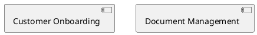
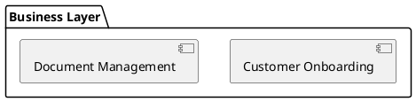
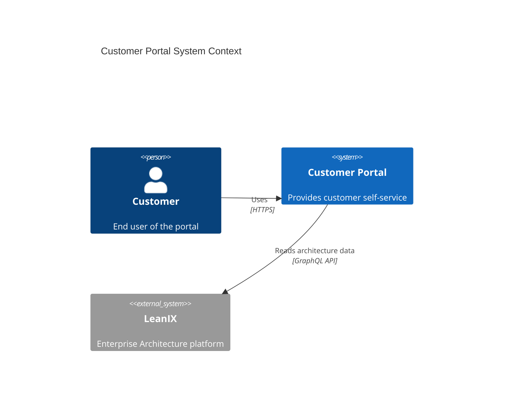
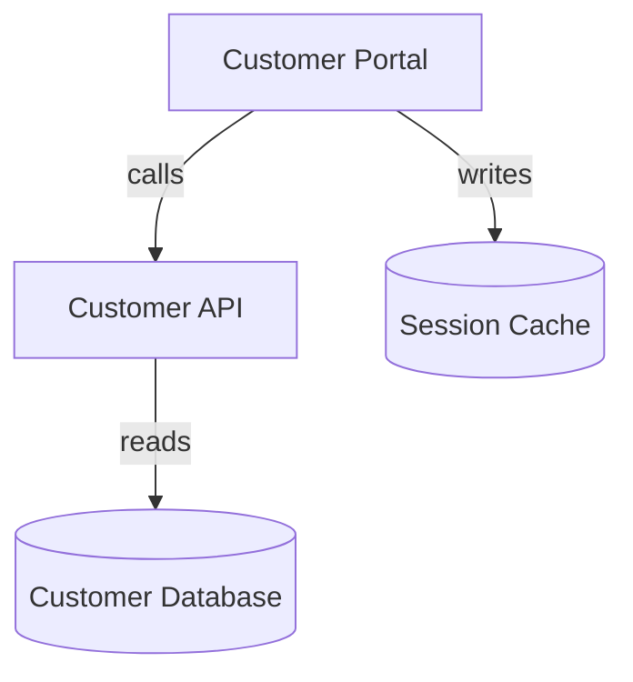

# Data Format Examples: Mock vs. Real Data

**Purpose:** Show concrete examples of expected data format differences between mock/POC data and real production data sources.

**Audience:** AI tools and developers adapting the POC for production use.

---

## Table of Contents

1. [LeanIX Data Formats](#leanix-data-formats)
2. [PlantUML Diagram Formats](#plantuml-diagram-formats)
3. [Mermaid Diagram Formats](#mermaid-diagram-formats)
4. [Entity ID Formats](#entity-id-formats)
5. [Relationship Format Variations](#relationship-format-variations)
6. [Common Adaptation Patterns](#common-adaptation-patterns)

---

## LeanIX Data Formats

### Application Entity

#### Mock Format (Current POC)

```json
{
  "id": "APP-123",
  "name": "Customer Portal",
  "type": "Application",
  "description": "Customer-facing web portal",
  "owner": "Digital Team",
  "status": "active"
}
```

#### Real LeanIX GraphQL Response

```json
{
  "id": "8a6f9c7d-3b2e-4a1f-9d8e-7c6b5a4f3e2d",
  "displayName": "Customer Portal",
  "type": "Application",
  "description": "Customer-facing web portal for account management",
  "responsible": {
    "email": "john.doe@company.com",
    "displayName": "John Doe"
  },
  "lifecycle": {
    "asString": "active",
    "phases": [
      {
        "phase": "active",
        "startDate": "2023-01-15"
      }
    ]
  },
  "tags": [
    {
      "name": "Customer-Facing",
      "tagGroup": {
        "name": "Application Type"
      }
    }
  ],
  "businessCriticality": "mission_critical",
  "technicalSuitability": "adequate",
  "functionalSuitability": "sufficient"
}
```

#### Transformation Code

```javascript
function transformLeanIXApplication(lxApp) {
  return {
    // Normalize ID format
    id: `APP-${lxApp.id.substring(0, 8)}`,
    originalId: lxApp.id,

    // Standard fields
    name: lxApp.displayName || lxApp.name,
    type: 'Application',
    description: lxApp.description || '',

    // Extract owner from responsible
    owner: lxApp.responsible?.email || null,
    ownerName: lxApp.responsible?.displayName || null,

    // Extract lifecycle
    status: lxApp.lifecycle?.asString || 'unknown',
    lifecyclePhase: lxApp.lifecycle?.phases?.[0]?.phase,
    lifecycleStartDate: lxApp.lifecycle?.phases?.[0]?.startDate,

    // LeanIX-specific metadata
    criticality: lxApp.businessCriticality,
    technicalSuitability: lxApp.technicalSuitability,
    functionalSuitability: lxApp.functionalSuitability,

    // Store tags as array
    tags: lxApp.tags?.map(t => t.name) || [],

    // Source attribution
    source: 'leanix',
    syncedAt: new Date()
  };
}
```

### Component Entity

#### Mock Format

```json
{
  "id": "COMP-001",
  "name": "Registration Form",
  "type": "Component",
  "technology": "React",
  "application": "APP-123",
  "description": "Customer registration form component"
}
```

#### Real LeanIX (IT Component)

```json
{
  "id": "f3a8b2c1-4d5e-6f7a-8b9c-0d1e2f3a4b5c",
  "displayName": "Registration Form",
  "type": "ITComponent",
  "description": "React-based customer registration form",
  "technicalStack": {
    "displayName": "React",
    "type": "TechnicalStack"
  },
  "relToParent": {
    "edges": [
      {
        "node": {
          "factSheet": {
            "id": "8a6f9c7d-3b2e-4a1f-9d8e-7c6b5a4f3e2d",
            "displayName": "Customer Portal",
            "type": "Application"
          }
        }
      }
    ]
  }
}
```

#### Transformation Code

```javascript
function transformLeanIXComponent(lxComp) {
  // Extract parent application from relationship
  const parentApp = lxComp.relToParent?.edges?.[0]?.node?.factSheet;

  return {
    id: `COMP-${lxComp.id.substring(0, 8)}`,
    originalId: lxComp.id,
    name: lxComp.displayName || lxComp.name,
    type: 'Component',
    description: lxComp.description || '',

    // Extract technology from technical stack
    technology: lxComp.technicalStack?.displayName,
    technologyId: lxComp.technicalStack?.id,

    // Link to parent application
    application: parentApp ? `APP-${parentApp.id.substring(0, 8)}` : null,
    applicationName: parentApp?.displayName,

    source: 'leanix',
    syncedAt: new Date()
  };
}
```

### Relationship

#### Mock Format

```json
{
  "from": "APP-123",
  "to": "COMP-001",
  "type": "OWNS",
  "description": "Customer Portal owns Registration Form"
}
```

#### Real LeanIX Relationship

LeanIX relationships are embedded in entities:

```json
{
  "id": "8a6f9c7d-3b2e-4a1f-9d8e-7c6b5a4f3e2d",
  "displayName": "Customer Portal",
  "type": "Application",
  "relToChild": {
    "edges": [
      {
        "node": {
          "factSheet": {
            "id": "f3a8b2c1-4d5e-6f7a-8b9c-0d1e2f3a4b5c",
            "displayName": "Registration Form",
            "type": "ITComponent"
          },
          "type": "relApplicationToITComponent"
        }
      }
    ]
  }
}
```

#### Transformation Code

```javascript
function extractLeanIXRelationships(lxEntity) {
  const relationships = [];

  // Map LeanIX relation types to MASTER-PATTERNS
  const typeMapping = {
    'relApplicationToITComponent': 'OWNS',
    'relITComponentToBusinessCapability': 'IMPLEMENTS',
    'relApplicationToBusinessCapability': 'OWNS',
    'relITComponentToDataObject': 'WORKS_ON'
  };

  // Extract from relToChild
  lxEntity.relToChild?.edges?.forEach(edge => {
    const target = edge.node.factSheet;
    const relType = edge.node.type;

    relationships.push({
      from: `${getEntityPrefix(lxEntity.type)}-${lxEntity.id.substring(0, 8)}`,
      to: `${getEntityPrefix(target.type)}-${target.id.substring(0, 8)}`,
      type: typeMapping[relType] || 'RELATES',
      description: `${lxEntity.displayName} → ${target.displayName}`,
      leanixRelationType: relType,
      source: 'leanix',
      syncedAt: new Date()
    });
  });

  return relationships;
}

function getEntityPrefix(leanixType) {
  const prefixMap = {
    'Application': 'APP',
    'ITComponent': 'COMP',
    'BusinessCapability': 'CAP',
    'DataObject': 'DATA',
    'Interface': 'API'
  };
  return prefixMap[leanixType] || 'ENT';
}
```

---

## PlantUML Diagram Formats

### System Declaration

#### Mock Format (Current POC)

```plantuml
@startuml
System(onboarding, "Customer Onboarding", "CAP-001")
System(docMgmt, "Document Management", "CAP-003")
@enduml
```

#### Real PlantUML Variations

**Variation 1: No explicit ID**
```plantuml
@startuml
System(onboarding, "Customer Onboarding")
System(docMgmt, "Document Management")
@enduml
```

**Variation 2: Component/Interface syntax**


**Variation 3: Bracket notation**


**Variation 4: Package grouping**


#### Adaptation Code

```javascript
function parseApplications(plantumlContent) {
  const applications = [];
  let idCounter = {};

  // Pattern 1: System(id, "name", "ID") - current format
  const systemWithIdRegex = /System(?:_Ext)?\(([^,]+),\s*"([^"]+)",\s*"([^"]+)"\)/g;
  let match;
  while ((match = systemWithIdRegex.exec(plantumlContent)) !== null) {
    applications.push({
      id: match[3],  // Explicit ID in 3rd param
      name: match[2],
      alias: match[1],
      source: 'plantuml-context-diagram'
    });
  }

  // Pattern 2: System(id, "name") - no explicit ID
  const systemRegex = /System(?:_Ext)?\(([^,]+),\s*"([^"]+)"\)/g;
  while ((match = systemRegex.exec(plantumlContent)) !== null) {
    // Generate ID from alias
    const alias = match[1];
    applications.push({
      id: generateIdFromAlias(alias, 'SYS'),
      name: match[2],
      alias: alias,
      source: 'plantuml-context-diagram'
    });
  }

  // Pattern 3: component "name" as alias
  const componentRegex = /(component|interface)\s+"([^"]+)"\s+as\s+([A-Za-z0-9_]+)/g;
  while ((match = componentRegex.exec(plantumlContent)) !== null) {
    applications.push({
      id: generateIdFromAlias(match[3], 'COMP'),
      name: match[2],
      alias: match[3],
      elementType: match[1],
      source: 'plantuml-context-diagram'
    });
  }

  // Pattern 4: [name] as alias
  const bracketRegex = /\[([^\]]+)\]\s+as\s+([A-Za-z0-9_]+)/g;
  while ((match = bracketRegex.exec(plantumlContent)) !== null) {
    applications.push({
      id: generateIdFromAlias(match[2], 'COMP'),
      name: match[1],
      alias: match[2],
      source: 'plantuml-context-diagram'
    });
  }

  return applications;
}

function generateIdFromAlias(alias, prefix) {
  // Convert camelCase/snake_case to readable ID
  const normalized = alias
    .replace(/([a-z])([A-Z])/g, '$1_$2')  // camelCase → snake_case
    .toUpperCase();

  // If alias already looks like an ID, use it
  if (/^[A-Z]{2,4}-\d{3}$/.test(alias)) {
    return alias;
  }

  // Generate sequential ID
  idCounter[prefix] = (idCounter[prefix] || 0) + 1;
  return `${prefix}-${String(idCounter[prefix]).padStart(3, '0')}`;
}
```

### Relationship Declaration

#### Mock Format

```plantuml
Rel(onboarding, docMgmt, "send documents to", "Internal")
```

#### Real PlantUML Variations

**Variation 1: Arrow syntax**
```plantuml
onboarding --> docMgmt : sends documents
onboarding -right-> docMgmt : sends documents
onboarding ..> docMgmt : sends documents
```

**Variation 2: Stereotype notation**
```plantuml
onboarding --> docMgmt : <<HTTP>>
```

**Variation 3: Notes**
```plantuml
onboarding --> docMgmt
note on link : Sends customer documents via message queue
```

**Variation 4: Colored/Styled**
```plantuml
onboarding -[#red]-> docMgmt : error path
onboarding -[#green,thick]-> docMgmt : main flow
```

#### Adaptation Code

```javascript
function parseRelationships(plantumlContent) {
  const relationships = [];

  // Pattern 1: Rel(source, target, "description", "technology")
  const relRegex = /Rel(?:_[UDLR])?\(([^,]+),\s*([^,]+),\s*"([^"]+)"(?:,\s*"([^"]+)")?\)/g;
  let match;
  while ((match = relRegex.exec(plantumlContent)) !== null) {
    relationships.push({
      source: match[1].trim(),
      target: match[2].trim(),
      description: match[3].trim(),
      technology: match[4]?.trim(),
      ...inferRelationshipType(match[3])
    });
  }

  // Pattern 2: Arrow syntax (source --> target : description)
  const arrowRegex = /([A-Za-z0-9_]+)\s*(--+>|\.\.+>|-\.+>)\s*([A-Za-z0-9_]+)\s*:\s*([^\n]+)/g;
  while ((match = arrowRegex.exec(plantumlContent)) !== null) {
    relationships.push({
      source: match[1].trim(),
      target: match[3].trim(),
      description: match[4].trim(),
      arrowType: match[2].trim(),
      ...inferRelationshipType(match[4])
    });
  }

  // Pattern 3: Arrow with direction (source -right-> target)
  const dirArrowRegex = /([A-Za-z0-9_]+)\s*-(\w+)->)\s*([A-Za-z0-9_]+)\s*(?::\s*([^\n]+))?/g;
  while ((match = dirArrowRegex.exec(plantumlContent)) !== null) {
    relationships.push({
      source: match[1].trim(),
      target: match[3].trim(),
      description: match[4]?.trim() || '',
      direction: match[2],
      ...inferRelationshipType(match[4] || '')
    });
  }

  return relationships;
}
```

---

## Mermaid Diagram Formats

### C4 Context Diagram

#### Expected Mermaid Format



#### Parser Code for Mermaid

```javascript
function parseMermaidC4(content) {
  const applications = [];
  const relationships = [];

  // Extract title
  const titleMatch = content.match(/title\s+(.+)/);
  const diagramTitle = titleMatch ? titleMatch[1] : 'Untitled';

  // Parse Person declarations
  const personRegex = /Person\(([^,]+),\s*"([^"]+)"(?:,\s*"([^"]+)")?\)/g;
  let match;
  while ((match = personRegex.exec(content)) !== null) {
    applications.push({
      id: generateId(match[1], 'PER'),
      name: match[2],
      description: match[3] || '',
      type: 'Person',
      alias: match[1],
      source: 'mermaid-diagram'
    });
  }

  // Parse System/System_Ext declarations
  const systemRegex = /System(?:_Ext)?\(([^,]+),\s*"([^"]+)"(?:,\s*"([^"]+)")?\)/g;
  while ((match = systemRegex.exec(content)) !== null) {
    applications.push({
      id: generateId(match[1], 'SYS'),
      name: match[2],
      description: match[3] || '',
      type: 'Application',
      alias: match[1],
      source: 'mermaid-diagram'
    });
  }

  // Parse Rel() statements
  const relRegex = /Rel\(([^,]+),\s*([^,]+),\s*"([^"]+)"(?:,\s*"([^"]+)")?\)/g;
  while ((match = relRegex.exec(content)) !== null) {
    relationships.push({
      source: match[1].trim(),
      target: match[2].trim(),
      description: match[3].trim(),
      technology: match[4]?.trim(),
      ...inferRelationshipType(match[3])
    });
  }

  return {
    title: diagramTitle,
    applications,
    relationships,
    diagramType: 'mermaid-c4'
  };
}
```

### Mermaid Flowchart/Graph

#### Expected Mermaid Flowchart



#### Parser Code

```javascript
function parseMermaidGraph(content) {
  const applications = [];
  const relationships = [];
  const nodeMap = {};

  // Parse node declarations (A[name], B[name], C[(name)])
  const nodeRegex = /([A-Z][A-Z0-9]*)\[(.+?)\]/g;
  let match;
  while ((match = nodeRegex.exec(content)) !== null) {
    const alias = match[1];
    const name = match[2].replace(/[()]/g, '');  // Remove special chars

    // Determine type from bracket style
    let type = 'Component';
    if (match[2].includes('[(')) type = 'DataObject';  // [(name)] = database

    const node = {
      id: generateId(alias, type === 'DataObject' ? 'DATA' : 'COMP'),
      name: name,
      alias: alias,
      type: type,
      source: 'mermaid-diagram'
    };

    applications.push(node);
    nodeMap[alias] = node.id;
  }

  // Parse relationships (A -->|label| B)
  const relRegex = /([A-Z][A-Z0-9]*)\s*(-->|---|-\.-)\s*(?:\|([^|]+)\|)?\s*([A-Z][A-Z0-9]*)/g;
  while ((match = relRegex.exec(content)) !== null) {
    const sourceAlias = match[1];
    const targetAlias = match[4];
    const label = match[3] || '';

    relationships.push({
      source: nodeMap[sourceAlias] || sourceAlias,
      target: nodeMap[targetAlias] || targetAlias,
      description: label,
      ...inferRelationshipType(label)
    });
  }

  return { applications, relationships, diagramType: 'mermaid-graph' };
}
```

---

## Entity ID Formats

### Application IDs

| Format | Example | Source | Handling |
|--------|---------|--------|----------|
| **Mock** | `APP-123` | POC | Use as-is |
| **UUID** | `8a6f9c7d-3b2e-4a1f-9d8e-7c6b5a4f3e2d` | LeanIX | Convert to `APP-8a6f9c7d`, store original |
| **Custom** | `CustomerPortal_v2` | Diagrams | Convert to `APP-CustomerPortal_v2` |
| **Numeric** | `12345` | Legacy systems | Convert to `APP-12345` |

#### Normalization Function

```javascript
function normalizeApplicationId(rawId) {
  // Already in standard format
  if (/^APP-[A-Za-z0-9_-]+$/.test(rawId)) {
    return { id: rawId, originalId: rawId };
  }

  // UUID format
  if (/^[0-9a-f]{8}-[0-9a-f]{4}-[0-9a-f]{4}-[0-9a-f]{4}-[0-9a-f]{12}$/i.test(rawId)) {
    return {
      id: `APP-${rawId.substring(0, 8)}`,
      originalId: rawId
    };
  }

  // Numeric only
  if (/^\d+$/.test(rawId)) {
    return {
      id: `APP-${rawId}`,
      originalId: rawId
    };
  }

  // Everything else: sanitize and prefix
  const sanitized = rawId.replace(/[^a-zA-Z0-9_-]/g, '_');
  return {
    id: `APP-${sanitized}`,
    originalId: rawId
  };
}
```

### Component IDs

Similar normalization with `COMP-` prefix.

### Business Capability IDs

| Format | Example | Handling |
|--------|---------|----------|
| **Mock** | `CAP-001` | Use as-is |
| **UUID** | `...` | `CAP-{first8chars}` |
| **Hierarchical** | `BC.CRM.LEAD_MGMT` | `CAP-BC_CRM_LEAD_MGMT` |

---

## Relationship Format Variations

### Description Variations for Same Relationship

All of these should map to the same relationship type:

| Description | Type | Mode | RW |
|-------------|------|------|-----|
| "calls Customer API" | CALLS | pushes | null |
| "invokes Customer API" | CALLS | pushes | null |
| "sends request to Customer API" | CALLS | pushes | null |
| "uses Customer API" | CALLS | pushes | null |
| "depends on Customer API" | CALLS | pulls | null |
| "integration with Customer API" | CALLS | bidirectional | null |

### Read/Write Description Variations

| Description | Type | Mode | RW |
|-------------|------|------|-----|
| "reads from CustomerTable" | WORKS_ON | pulls | reads |
| "queries CustomerTable" | WORKS_ON | pulls | reads |
| "fetches data from CustomerTable" | WORKS_ON | pulls | reads |
| "SELECT from CustomerTable" | WORKS_ON | pulls | reads |
| "writes to AuditLog" | WORKS_ON | pushes | writes |
| "inserts into AuditLog" | WORKS_ON | pushes | writes |
| "appends to AuditLog" | WORKS_ON | pushes | writes |
| "updates CustomerTable" | WORKS_ON | null | read-n-writes |
| "manages CustomerTable" | WORKS_ON | null | read-n-writes |
| "full CRUD on CustomerTable" | WORKS_ON | null | read-n-writes |

---

## Common Adaptation Patterns

### Pattern 1: Extract Nested Fields

```javascript
// Mock: flat structure
const owner = entity.owner;

// Real: nested structure
const owner = entity.responsible?.email;
```

### Pattern 2: Handle Arrays

```javascript
// Mock: single value
const technology = component.technology;

// Real: array of technologies
const technology = component.technicalStacks?.[0]?.displayName;
const allTechnologies = component.technicalStacks?.map(ts => ts.displayName);
```

### Pattern 3: Type Mapping

```javascript
// Mock: direct types
const type = entity.type;  // "Component"

// Real: need mapping
const leanixType = entity.type;  // "ITComponent"
const type = typeMapping[leanixType];  // "Component"
```

### Pattern 4: Relationship Extraction

```javascript
// Mock: explicit relationships array
const relationships = data.relationships;

// Real: embedded in entities
const relationships = [];
entities.forEach(entity => {
  entity.relToChild?.edges?.forEach(edge => {
    relationships.push({
      from: entity.id,
      to: edge.node.factSheet.id,
      type: mapRelationType(edge.node.type)
    });
  });
});
```

### Pattern 5: ID Consistency

```javascript
// Ensure consistency across sources
function ensureConsistentId(entity) {
  // Store both normalized and original
  return {
    ...entity,
    id: normalizeId(entity.id, entity.type),
    originalId: entity.originalId || entity.id,
    externalIds: {
      leanix: entity.leanixId,
      servicenow: entity.serviceNowId,
      // ... other systems
    }
  };
}
```

---

## Testing with Real Data Samples

### Step 1: Get Small Sample

```bash
# From LeanIX
curl -H "Authorization: Bearer $TOKEN" \
  https://your-instance.leanix.net/services/pathfinder/v1/graphql \
  -d '{"query": "{ allFactSheets(first: 5, factSheetType: Application) { edges { node { id displayName } } } }"}' \
  > sample-leanix.json
```

### Step 2: Test Transformation

```javascript
const sampleData = require('./sample-leanix.json');
const transformed = sampleData.data.allFactSheets.edges.map(e =>
  transformLeanIXApplication(e.node)
);

console.log('Transformed:', JSON.stringify(transformed, null, 2));
```

### Step 3: Verify in Neo4j

```cypher
// Check if IDs are unique
MATCH (n)
WITH n.id as id, count(*) as count
WHERE count > 1
RETURN id, count;

// Check if transformations look correct
MATCH (a:Application)
WHERE a.syncedAt > datetime() - duration('PT1H')
RETURN a.id, a.name, a.originalId, a.owner
LIMIT 10;
```

---

**END OF DATA FORMAT EXAMPLES**

*Use this guide when adapting parsers for production data sources. Always test with small samples first.*
