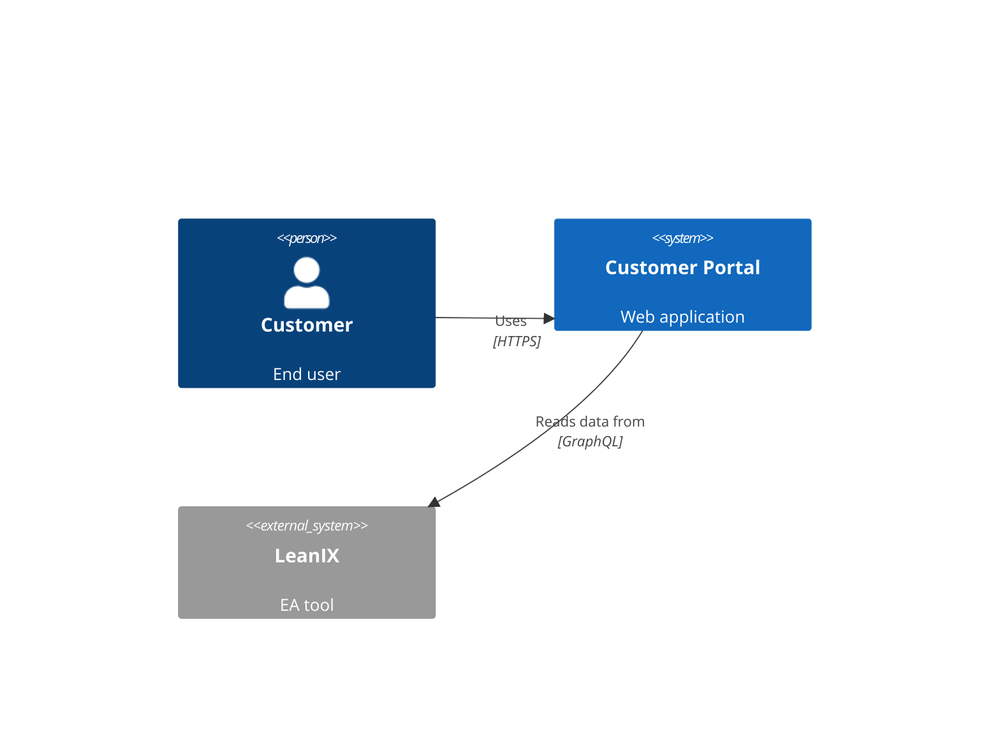

# Production Integration Guide for Super Relativity POC

**Document Version:** 1.0
**Last Updated:** 2026-01-08
**Target Audience:** AI Tools, Developers integrating production LeanIX/Diagram data

---

## Table of Contents

1. [Executive Summary](#executive-summary)
2. [Architecture Overview](#architecture-overview)
3. [Data Source Separation Strategy](#data-source-separation-strategy)
4. [MASTER-PATTERNS v2.0 Relationship System](#master-patterns-v20-relationship-system)
5. [LeanIX Integration Guide](#leanix-integration-guide)
6. [Diagram Parser Integration Guide](#diagram-parser-integration-guide)
7. [Data Format Adaptation Guide](#data-format-adaptation-guide)
8. [Testing and Verification](#testing-and-verification)
9. [Troubleshooting Guide](#troubleshooting-guide)
10. [Extension Points](#extension-points)

---

## Executive Summary

### What This System Does

The Super Relativity POC is an enterprise architecture relationship discovery system that aggregates relationships from multiple data sources into a Neo4j graph database. The system:

- **Separates data by source** to reflect real-world EA data origins
- **Uses MASTER-PATTERNS v2.0** for consistent relationship typing
- **Supports multiple parsers** that write directly to Neo4j
- **Maintains data lineage** through source attribution

### Key Design Decisions

1. **Data Source Separation**: Different relationship types come from different sources in real EA environments
2. **Direct Neo4j Writes**: Parsers write directly to Neo4j, not through a central sync service
3. **Pattern-Based Typing**: All relationships use MASTER-PATTERNS v2.0 types with semantic properties
4. **Idempotent Operations**: All parsers support re-running without duplicates

### Current State (as of 2026-01-08)

- **141 business relationships** from Mock LeanIX (business-level data)
- **34 technical relationships** from Diagram Parser (technical diagrams)
- **All relationships** properly typed with MASTER-PATTERNS v2.0
- **3 sample diagram files** demonstrating expected formats

---

## Architecture Overview

### System Components

```
┌─────────────────────────────────────────────────────────────┐
│                     Data Sources                            │
├──────────────┬──────────────────┬──────────────────────────┤
│   LeanIX     │   Diagrams       │   Code Repositories      │
│  (Business)  │  (Technical)     │  (Implementation)        │
└──────┬───────┴────────┬─────────┴────────┬─────────────────┘
       │                │                  │
       ▼                ▼                  ▼
┌──────────────┐ ┌─────────────┐ ┌────────────────┐
│ Sync Service │ │   Diagram   │ │  Code Parser   │
│  (Port 3001) │ │   Parser    │ │  (Port 3002)   │
│              │ │ (Port 3003) │ │                │
└──────┬───────┘ └──────┬──────┘ └────────┬───────┘
       │                │                  │
       └────────────────┼──────────────────┘
                        ▼
                  ┌──────────┐
                  │  Neo4j   │
                  │Graph DB  │
                  │(Port7687)│
                  └────┬─────┘
                       ▼
                ┌─────────────┐
                │  GraphQL    │
                │     API     │
                │ (Port 4000) │
                └─────────────┘
```

### Data Flow

1. **LeanIX → Sync Service → Neo4j**
   - Business capabilities, applications, components
   - Ownership relationships (OWNS)
   - Business data flows (WORKS_ON at business level)
   - Change relationships (CHANGES)

2. **Diagrams → Diagram Parser → Neo4j**
   - Technical relationships (Component→API, API→DataObject)
   - Component interactions (RELATES, CONTAINS)
   - API exposure (EXPOSES)
   - Technical data flows (WORKS_ON at technical level)

3. **Code → Code Parser → Neo4j**
   - Code-level dependencies
   - Function calls
   - Module imports

---

## Data Source Separation Strategy

### Why Separate by Source?

In real-world enterprise architecture:

- **LeanIX** contains business-level information (what business capabilities exist, which applications own them)
- **Diagrams** contain technical architecture details (how components interact, which APIs expose which services)
- **Code repositories** contain implementation details (actual code dependencies)

### Separation Rules

| Relationship Type | Primary Source | Rationale |
|-------------------|----------------|-----------|
| Application→BusinessCapability (OWNS) | LeanIX | Business ownership tracked in EA tool |
| Application→Component (OWNS) | LeanIX | Component ownership tracked in EA tool |
| Component→BusinessCapability (IMPLEMENTS) | LeanIX | Business mapping tracked in EA tool |
| Component→API (CALLS) | Diagrams | Technical interactions documented in architecture diagrams |
| API→Component (EXPOSES) | Diagrams | API exposure documented in container diagrams |
| API→DataObject (WORKS_ON) | Diagrams | Data access patterns documented in diagrams |
| Component→Component (RELATES, CONTAINS) | Diagrams | Component relationships documented in component diagrams |
| BusinessFunction→BusinessFunction (RELATES) | Diagrams | Business process flows documented in context diagrams |
| BusinessFunction→API (INCLUDES) | Diagrams | Business-to-technical mapping in context diagrams |
| AppChange→* (CHANGES) | LeanIX | Change tracking in EA tool |
| InfraChange→Server (CHANGES) | LeanIX | Infrastructure changes tracked in EA tool |
| Component→Server (INSTALLED_ON) | LeanIX | Deployment tracking in EA tool |

### Source Attribution

Each relationship stored in Neo4j has source attribution:

```cypher
// From LeanIX
{
  description: "...",
  syncedAt: datetime(),
  mode: "pushes",
  rw: "writes"
}

// From Diagrams
{
  description: "...",
  source: "context-diagram",
  diagramFile: "customer-portal-components.md",
  mode: "pushes",
  rw: null
}
```

---

## MASTER-PATTERNS v2.0 Relationship System

### Core Relationship Types

The system uses 11 primary relationship types defined in `MASTER-PATTERNS.md`:

| Type | Pattern # | Description | Example |
|------|-----------|-------------|---------|
| **CALLS** | 1, 2 | Source invokes/requests target | Component→API, Application→API |
| **OWNS** | 1 | Source owns/contains target at business level | Application→Component |
| **EXPOSES** | 4 | Source exposes/serves target | API→Component |
| **WORKS_ON** | 2, 10 | Source reads/writes target data | API→DataObject, Component→DataObject |
| **IMPLEMENTS** | 3 | Source implements target capability | Component→BusinessCapability |
| **INCLUDES** | Pattern 7 | Source includes target | BusinessFunction→API |
| **CHANGES** | 5, 8 | Source modifies target | AppChange→Component, InfraChange→Server |
| **MATERIALIZES** | 6 | Source materializes into target | Requirement→Component |
| **INSTALLED_ON** | - | Source deployed on target | Component→Server |
| **RELATES** | 1, 9, 11 | Generic relationship | Component→Component, BusinessFunction→BusinessFunction |
| **CONTAINS** | 9 | Source contains target (composition) | Component→Component |

### Relationship Properties

Each relationship can have semantic properties:

#### `mode` Property

Indicates data flow direction:

- **`pushes`**: Source sends data to target (e.g., writes, publishes, posts)
- **`pulls`**: Source retrieves data from target (e.g., reads, fetches, queries)
- **`bidirectional`**: Two-way communication
- **`null`**: Not applicable (e.g., OWNS, CONTAINS)

#### `rw` Property

Indicates read/write pattern (used with WORKS_ON):

- **`reads`**: Read-only access
- **`writes`**: Write-only access
- **`read-n-writes`**: Read and write access
- **`null`**: Not applicable

### Pattern Examples

```cypher
// Pattern 1: Component CALLS API (pushes mode)
(comp:Component)-[:CALLS {mode: "pushes", description: "..."}]->(api:API)

// Pattern 2: API WORKS_ON DataObject (reads)
(api:API)-[:WORKS_ON {rw: "reads", description: "..."}]->(data:DataObject)

// Pattern 10: Component WORKS_ON DataObject (read-n-writes)
(comp:Component)-[:WORKS_ON {rw: "read-n-writes", description: "..."}]->(data:DataObject)

// Pattern 9: Component CONTAINS Component
(parent:Component)-[:CONTAINS {description: "..."}]->(child:Component)
```

---

## LeanIX Integration Guide

### Current Mock LeanIX Structure

Location: `/poc-services/mock-leanix/server.js`

The mock LeanIX provides REST endpoints that mimic LeanIX's GraphQL API:

```javascript
// GET /applications - List all applications
// GET /applications/:id - Get specific application
// GET /components - List all components
// GET /businessCapabilities - List all business capabilities
// GET /dataObjects - List all data objects
// GET /relationships - List all relationships
```

### Expected LeanIX Data Format

**Application Entity:**
```json
{
  "id": "APP-123",
  "name": "Customer Portal",
  "type": "Application",
  "description": "Customer-facing portal",
  "owner": "Digital Team",
  "status": "active"
}
```

**Component Entity:**
```json
{
  "id": "COMP-001",
  "name": "Registration Form",
  "type": "Component",
  "technology": "React",
  "application": "APP-123"
}
```

**Relationship Format:**
```json
{
  "from": "APP-123",
  "to": "CAP-001",
  "type": "OWNS",
  "description": "Customer Portal owns Customer Onboarding",
  "mode": null,
  "rw": null
}
```

### Adapting for Real LeanIX API

**Step 1: Update LeanIX Client**

The sync service uses a simple fetch-based client. For real LeanIX:

```javascript
// Current: /poc-services/sync-service/leanix-client.js
async function fetchApplications() {
  const response = await fetch(`${LEANIX_API_URL}/applications`);
  return response.json();
}

// Real LeanIX (GraphQL):
async function fetchApplications() {
  const query = `
    query {
      allFactSheets(factSheetType: Application) {
        edges {
          node {
            id
            name
            description
            ... on Application {
              lifecycle {
                phases {
                  phase
                  startDate
                }
              }
            }
          }
        }
      }
    }
  `;

  const response = await fetch(`${LEANIX_API_URL}/services/pathfinder/v1/graphql`, {
    method: 'POST',
    headers: {
      'Authorization': `Bearer ${LEANIX_TOKEN}`,
      'Content-Type': 'application/json'
    },
    body: JSON.stringify({ query })
  });

  const data = await response.json();
  return data.data.allFactSheets.edges.map(e => e.node);
}
```

**Step 2: Map LeanIX Relations to MASTER-PATTERNS**

LeanIX uses its own relationship types. Map them to MASTER-PATTERNS:

```javascript
// LeanIX relation type → MASTER-PATTERNS type
const LEANIX_TO_MASTER_PATTERNS = {
  'relApplicationToITComponent': 'OWNS',           // Application owns Component
  'relITComponentToBusinessCapability': 'IMPLEMENTS', // Component implements Capability
  'relApplicationToBusinessCapability': 'OWNS',    // Application owns Capability
  'relITComponentToDataObject': 'WORKS_ON',       // Component works on DataObject
  // Add more mappings as discovered
};
```

**Step 3: Handle LeanIX-Specific Fields**

LeanIX provides additional metadata:

```javascript
function transformLeanIXApplication(lxApp) {
  return {
    id: lxApp.id,
    name: lxApp.name,
    description: lxApp.description,
    type: 'Application',
    // LeanIX-specific fields
    lifecycle: lxApp.lifecycle?.phases?.[0]?.phase,
    criticality: lxApp.businessCriticality,
    technicalSuitability: lxApp.technicalSuitability,
    // Store as JSON string in Neo4j
    leanixMetadata: JSON.stringify(lxApp)
  };
}
```

### What to Keep from LeanIX

✅ **Include these relationships:**
- Application→BusinessCapability (OWNS)
- Application→Component (OWNS)
- Component→BusinessCapability (IMPLEMENTS)
- Component→DataObject (WORKS_ON) - only business-level flows
- AppChange→* (CHANGES)
- InfraChange→Server (CHANGES)
- Component→Server (INSTALLED_ON)
- Application→Application (RELATES) - business relationships only

❌ **Exclude these (come from diagrams):**
- Component→Component (RELATES, CONTAINS)
- Component→API (CALLS)
- API→Component (EXPOSES)
- API→DataObject (WORKS_ON)
- BusinessFunction→BusinessFunction (RELATES)
- BusinessFunction→API (INCLUDES)

### Verification Queries

After syncing LeanIX data:

```cypher
// Count entities synced from LeanIX
MATCH (n) WHERE n.syncedAt IS NOT NULL
RETURN labels(n)[0] as entityType, count(*) as count
ORDER BY count DESC;

// Count relationships synced from LeanIX
MATCH ()-[r]->() WHERE r.syncedAt IS NOT NULL
RETURN type(r) as relType, count(*) as count
ORDER BY count DESC;

// Verify OWNS relationships
MATCH (app:Application)-[r:OWNS]->(target)
WHERE r.syncedAt IS NOT NULL
RETURN labels(target)[0] as targetType, count(*) as count;
```

---

## Diagram Parser Integration Guide

### Current Implementation

Location: `/poc-services/diagram-parser/`

**Files:**
- `server.js` - Express server with REST endpoints
- `context-diagram-parser.js` - C4 PlantUML parser

### Supported Diagram Formats

#### C4 PlantUML (Current Implementation)

The parser supports C4 model PlantUML syntax:

**Element Declarations:**
```plantuml
System(id, "name", "description")
System_Ext(id, "name", "description")
Container(id, "name", "technology", "description")
ContainerDb(id, "name", "technology", "description")
Component(id, "name", "technology", "description")
System_Boundary(id, "label") { ... }
```

**Relationship Declarations:**
```plantuml
Rel(source, target, "description", "technology")
Rel_D(source, target, "description")  // Directional hints
Rel_U(source, target, "description")
Rel_L(source, target, "description")
Rel_R(source, target, "description")
```

#### Relationship Type Inference

The parser infers MASTER-PATTERNS types from description keywords:

```javascript
const RELATIONSHIP_PATTERNS = [
  // Call/Invoke operations → CALLS
  { pattern: /call|invoke|request|api|rest|rpc/i, type: 'CALLS', mode: 'pushes' },

  // Expose/Serve operations → EXPOSES
  { pattern: /expose|serve|provide/i, type: 'EXPOSES' },

  // Read and Write operations → WORKS_ON
  { pattern: /read and write|read & write/i, type: 'WORKS_ON', rw: 'read-n-writes' },
  { pattern: /write|send|publish|push|post/i, type: 'WORKS_ON', mode: 'pushes', rw: 'writes' },
  { pattern: /read|fetch|retrieve|get|pull|query/i, type: 'WORKS_ON', mode: 'pulls', rw: 'reads' },

  // Subscribe operations → RELATES
  { pattern: /subscribe|listen|watch/i, type: 'RELATES', mode: 'pulls' },

  // Contains operations → CONTAINS
  { pattern: /contain|include|has/i, type: 'CONTAINS' },

  // Implements operations → IMPLEMENTS
  { pattern: /implement|realize|execute/i, type: 'IMPLEMENTS' },

  // Default fallback → RELATES
  { pattern: /.*/, type: 'RELATES', mode: 'bidirectional' }
];
```

### Sample Diagram Files

Three sample files demonstrate expected formats:

1. **`business-functions-api.md`** - Context diagram showing:
   - BusinessFunction→BusinessFunction RELATES
   - BusinessFunction→API INCLUDES

2. **`customer-portal-components.md`** - Component diagram showing:
   - Component→Component RELATES
   - Component→Component CONTAINS
   - Component→API CALLS

3. **`api-container-diagram.md`** - Container diagram showing:
   - API→Component EXPOSES
   - API→DataObject WORKS_ON

### Adapting for Real Diagrams

#### Expected Format Differences

Real-world diagrams may have:

**1. Different PlantUML Element Names**

```plantuml
# Mock format:
Container(customerAPI, "Customer API", "REST API", "API-001")

# Real format might be:
Container(customerAPI, "Customer API", "REST API")
# Or:
component "Customer API" as customerAPI
# Or:
[Customer API] as customerAPI
```

**Solution:** Update regex patterns in `parseApplications()`:

```javascript
// Add support for component/interface syntax
const componentRegex = /(component|interface)\s+"([^"]+)"\s+as\s+([A-Za-z0-9_]+)/g;
while ((match = componentRegex.exec(plantumlContent)) !== null) {
  const [, type, name, id] = match;
  applications.push({
    id: id.trim(),
    name: name.trim(),
    elementType: type,
    source: 'plantuml-context-diagram'
  });
}

// Add support for bracket syntax
const bracketRegex = /\[([^\]]+)\]\s+as\s+([A-Za-z0-9_]+)/g;
while ((match = bracketRegex.exec(plantumlContent)) !== null) {
  const [, name, id] = match;
  applications.push({
    id: id.trim(),
    name: name.trim(),
    source: 'plantuml-context-diagram'
  });
}
```

**2. Different Relationship Syntax**

```plantuml
# Mock format:
Rel(app1, app2, "calls API", "REST")

# Real format might be:
app1 --> app2 : calls API
# Or:
app1 -right-> app2 : calls API
# Or:
app1 ..> app2 : <<call>>
```

**Solution:** Add more regex patterns in `parseRelationships()`:

```javascript
// Arrow syntax: app1 --> app2 : description
const arrowRegex = /([A-Za-z0-9_]+)\s*(-+>|\.\.>|-\.)(\w+)?\s*([A-Za-z0-9_]+)\s*:\s*([^\n]+)/g;
while ((match = arrowRegex.exec(plantumlContent)) !== null) {
  const [, source, arrow, direction, target, description] = match;
  const relType = inferRelationshipType(description);
  relationships.push({
    source: source.trim(),
    target: target.trim(),
    description: description.trim(),
    relationshipType: relType.type,
    mode: relType.mode,
    rw: relType.rw
  });
}
```

**3. Embedded IDs vs. Inferred IDs**

Mock diagrams have explicit IDs in descriptions:
```plantuml
System(onboarding, "Customer Onboarding", "CAP-001")
```

Real diagrams might not:
```plantuml
System(onboarding, "Customer Onboarding")
```

**Solution:** Generate IDs if not provided:

```javascript
function parseApplications(plantumlContent) {
  const applications = [];
  const idCounter = {};

  // ... existing parsing ...

  // If no explicit ID in description, generate one
  if (!app.id || app.id.length < 3) {
    const prefix = app.elementType || 'SYS';
    idCounter[prefix] = (idCounter[prefix] || 0) + 1;
    app.id = `${prefix}-${String(idCounter[prefix]).padStart(3, '0')}`;
  }

  applications.push(app);
}
```

#### Handling Mermaid Diagrams

If your diagrams use Mermaid instead of PlantUML:

**Mermaid C4 Syntax:**


**Solution:** Create `mermaid-diagram-parser.js`:

```javascript
function parseMermaidC4(content) {
  const applications = [];
  const relationships = [];

  // Parse Person/System/System_Ext declarations
  const personRegex = /Person\(([^,]+),\s*"([^"]+)"(?:,\s*"([^"]+)")?\)/g;
  const systemRegex = /System(?:_Ext)?\(([^,]+),\s*"([^"]+)"(?:,\s*"([^"]+)")?\)/g;

  // Parse Rel() statements
  const relRegex = /Rel\(([^,]+),\s*([^,]+),\s*"([^"]+)"(?:,\s*"([^"]+)")?\)/g;

  // ... similar to PlantUML parser ...
}
```

### Diagram Discovery

The parser scans directories for diagram files:

```javascript
// Current: scans for .md and .puml files
const mdFiles = await glob('**/*.md', { cwd: directoryPath });
const pumlFiles = await glob('**/*.{puml,plantuml}', { cwd: directoryPath });
```

For production, you might need:

```javascript
// Scan multiple directories
const diagramSources = [
  '/path/to/architecture-docs',
  '/path/to/confluence-exports',
  '/path/to/design-docs'
];

for (const source of diagramSources) {
  await parseContextDiagramDirectory(source);
}

// Or watch for changes
const chokidar = require('chokidar');
chokidar.watch('/path/to/diagrams/**/*.{md,puml}')
  .on('change', async (path) => {
    console.log(`Diagram changed: ${path}`);
    const content = await fs.readFile(path, 'utf-8');
    await parseAndStore(content, path);
  });
```

### API Endpoints

The diagram parser exposes:

```bash
# Parse single diagram
POST http://localhost:3003/api/parse/context-diagram
{
  "content": "...",
  "fileName": "example.md"
}

# Parse directory of diagrams
POST http://localhost:3003/api/parse/context-diagrams
{
  "directoryPath": "/sample-diagrams/context-diagrams"
}

# Health check
GET http://localhost:3003/health
```

### Verification Queries

After parsing diagrams:

```cypher
// Count diagram-sourced relationships
MATCH ()-[r]->() WHERE r.diagramFile IS NOT NULL
RETURN type(r) as relType, count(*) as count
ORDER BY count DESC;

// List all diagram files parsed
MATCH ()-[r]->() WHERE r.diagramFile IS NOT NULL
RETURN DISTINCT r.diagramFile, count(*) as relationshipCount
ORDER BY relationshipCount DESC;

// Find Component→API relationships
MATCH (c:Component)-[r:CALLS]->(a:API)
WHERE r.diagramFile IS NOT NULL
RETURN c.id, c.name, a.id, a.name, r.diagramFile;
```

---

## Data Format Adaptation Guide

### Common Adaptations Needed

#### 1. ID Format Differences

**Mock Format:**
```
APP-123, COMP-001, CAP-005
```

**Real Format might be:**
```
# UUID format
550e8400-e29b-41d4-a716-446655440000

# LeanIX format
8a6f9c7d-3b2e-4a1f-9d8e-7c6b5a4f3e2d

# Custom format
CustomerPortal_v2_Component_001
```

**Solution - ID Normalization:**

```javascript
function normalizeId(rawId, entityType) {
  // If already in standard format, return as-is
  if (/^[A-Z]{2,4}-\d{3}$/.test(rawId)) {
    return rawId;
  }

  // If UUID, create short ID
  if (/^[0-9a-f]{8}-[0-9a-f]{4}-[0-9a-f]{4}-[0-9a-f]{4}-[0-9a-f]{12}$/i.test(rawId)) {
    // Store both: normalized ID and original UUID
    return {
      id: `${entityType}-${rawId.substring(0, 8)}`,
      originalId: rawId
    };
  }

  // For other formats, sanitize and prefix
  const sanitized = rawId.replace(/[^a-zA-Z0-9]/g, '_');
  return `${entityType}-${sanitized}`;
}

// Store in Neo4j with both IDs
MERGE (a:Application {id: $id})
SET a.originalId = $originalId,
    a.name = $name
```

#### 2. Entity Type Mapping

**Mock Types:**
```
Application, Component, BusinessCapability, DataObject, API
```

**Real LeanIX Types:**
```
Application, ITComponent, BusinessCapability, DataObject, Interface, Process
```

**Solution - Type Mapping:**

```javascript
const LEANIX_TYPE_MAPPING = {
  'Application': 'Application',
  'ITComponent': 'Component',
  'BusinessCapability': 'BusinessCapability',
  'DataObject': 'DataObject',
  'Interface': 'API',
  'Process': 'BusinessFunction',
  'Provider': 'Application',  // External provider
  'UserGroup': 'UserGroup'
};

function normalizeLeanIXEntity(entity) {
  const mappedType = LEANIX_TYPE_MAPPING[entity.type] || entity.type;

  return {
    id: entity.id,
    name: entity.name,
    type: mappedType,
    originalType: entity.type,
    ...entity
  };
}
```

#### 3. Relationship Description Variations

**Mock Descriptions (structured):**
```
"Customer Portal owns Customer Onboarding"
"Registration Form calls Customer API"
```

**Real Descriptions might be:**
```
"Provides customer onboarding functionality"
"Integration with customer data service"
"Dependency on authentication service"
```

**Solution - Enhanced Pattern Matching:**

```javascript
// Add more sophisticated patterns
const RELATIONSHIP_PATTERNS = [
  // Integration patterns
  {
    pattern: /integrat(e|ion|ed)\s+with/i,
    type: 'CALLS',
    mode: 'bidirectional'
  },

  // Dependency patterns
  {
    pattern: /depend(s|ency)\s+on/i,
    type: 'CALLS',
    mode: 'pulls'
  },

  // Provides patterns
  {
    pattern: /provide(s)?\s+.*\s+to/i,
    type: 'EXPOSES',
    mode: 'pushes'
  },

  // Uses patterns
  {
    pattern: /use(s|d)?\s+/i,
    type: 'CALLS',
    mode: 'pulls'
  },

  // ... existing patterns ...
];

// Add context-aware inference
function inferRelationshipType(description, sourceType, targetType) {
  // Use source/target types to improve inference
  if (sourceType === 'Component' && targetType === 'API') {
    // Component to API is almost always CALLS
    return { type: 'CALLS', mode: 'pushes', rw: null };
  }

  if (sourceType === 'API' && targetType === 'DataObject') {
    // API to DataObject is WORKS_ON
    // Try to infer read/write from description
    if (/read|query|fetch|get/i.test(description)) {
      return { type: 'WORKS_ON', mode: 'pulls', rw: 'reads' };
    } else if (/write|update|insert|delete/i.test(description)) {
      return { type: 'WORKS_ON', mode: 'pushes', rw: 'writes' };
    } else {
      return { type: 'WORKS_ON', mode: null, rw: 'read-n-writes' };
    }
  }

  // Fall back to pattern matching
  for (const { pattern, type, mode, rw } of RELATIONSHIP_PATTERNS) {
    if (pattern.test(description)) {
      return { type, mode, rw };
    }
  }

  return { type: 'RELATES', mode: 'bidirectional', rw: null };
}
```

#### 4. Missing Metadata

Real data might be missing fields the mock data has.

**Solution - Defensive Parsing:**

```javascript
function safeExtract(obj, path, defaultValue = null) {
  const keys = path.split('.');
  let value = obj;

  for (const key of keys) {
    if (value === null || value === undefined) {
      return defaultValue;
    }
    value = value[key];
  }

  return value !== undefined ? value : defaultValue;
}

// Use in parser
const application = {
  id: safeExtract(lxData, 'id', generateId()),
  name: safeExtract(lxData, 'name', 'Unknown'),
  description: safeExtract(lxData, 'description', ''),
  owner: safeExtract(lxData, 'responsible.email', null),
  lifecycle: safeExtract(lxData, 'lifecycle.phases.0.phase', null)
};
```

### Data Quality Checks

Add validation before storing:

```javascript
function validateEntity(entity) {
  const errors = [];

  if (!entity.id || entity.id.length < 3) {
    errors.push('Invalid or missing ID');
  }

  if (!entity.name || entity.name.trim().length === 0) {
    errors.push('Missing name');
  }

  if (!entity.type) {
    errors.push('Missing type');
  }

  return {
    valid: errors.length === 0,
    errors
  };
}

function validateRelationship(rel) {
  const errors = [];

  if (!rel.from || !rel.to) {
    errors.push('Missing source or target');
  }

  if (!rel.type || !VALID_RELATIONSHIP_TYPES.includes(rel.type)) {
    errors.push(`Invalid relationship type: ${rel.type}`);
  }

  if (rel.mode && !['pushes', 'pulls', 'bidirectional'].includes(rel.mode)) {
    errors.push(`Invalid mode: ${rel.mode}`);
  }

  if (rel.rw && !['reads', 'writes', 'read-n-writes'].includes(rel.rw)) {
    errors.push(`Invalid rw: ${rel.rw}`);
  }

  return {
    valid: errors.length === 0,
    errors
  };
}

// Use in sync/parse operations
const entityValidation = validateEntity(entity);
if (!entityValidation.valid) {
  console.warn(`Invalid entity: ${entity.id}`, entityValidation.errors);
  // Decide: skip, fix, or report
}
```

---

## Testing and Verification

### Pre-Deployment Checklist

Before running against production data:

1. **Test with sample data** ✓ (already done)
2. **Verify ID formats match** (check one real entity)
3. **Test relationship type inference** (check sample relationships)
4. **Validate data completeness** (check for missing required fields)
5. **Test idempotency** (run sync twice, verify no duplicates)
6. **Check performance** (measure time for 1000 entities)

### Verification Queries

#### Entity Count Verification

```cypher
// Count all entities by type
MATCH (n)
RETURN labels(n)[0] as entityType, count(*) as count
ORDER BY count DESC;

// Compare with source system
// LeanIX UI: Total Applications
// Neo4j:
MATCH (a:Application) WHERE a.syncedAt IS NOT NULL
RETURN count(a) as applicationCount;
```

#### Relationship Count Verification

```cypher
// Count all relationships by type
MATCH ()-[r]->()
RETURN type(r) as relType, count(*) as count
ORDER BY count DESC;

// Count by source
MATCH ()-[r]->()
RETURN
  CASE
    WHEN r.syncedAt IS NOT NULL THEN 'LeanIX'
    WHEN r.diagramFile IS NOT NULL THEN 'Diagrams'
    ELSE 'Other'
  END as source,
  count(*) as count;
```

#### Data Quality Checks

```cypher
// Find entities without names
MATCH (n)
WHERE n.name IS NULL OR n.name = ''
RETURN labels(n)[0] as type, n.id, count(*) as count;

// Find duplicate IDs
MATCH (n)
WITH n.id as id, labels(n)[0] as type, count(*) as count
WHERE count > 1
RETURN type, id, count
ORDER BY count DESC;

// Find orphaned relationships (source or target missing)
MATCH (a)-[r]->(b)
WHERE a.id IS NULL OR b.id IS NULL
RETURN type(r), count(*);

// Find relationships with invalid properties
MATCH ()-[r]->()
WHERE r.mode IS NOT NULL
  AND NOT r.mode IN ['pushes', 'pulls', 'bidirectional']
RETURN type(r), r.mode, count(*);
```

#### Relationship Pattern Validation

```cypher
// Verify OWNS relationships have correct source types
MATCH (source)-[r:OWNS]->(target)
WHERE NOT labels(source)[0] IN ['Application', 'BusinessCapability']
RETURN labels(source)[0] as invalidSource, count(*);

// Verify CALLS relationships make sense
MATCH (source)-[r:CALLS]->(target)
WHERE NOT labels(target)[0] IN ['API', 'Component', 'Application']
RETURN labels(source)[0] as sourceType,
       labels(target)[0] as targetType,
       count(*);

// Verify WORKS_ON has rw property
MATCH ()-[r:WORKS_ON]->()
WHERE r.rw IS NULL
RETURN count(*) as missingRwCount;
```

### Sample Data Comparison

After initial sync, compare counts:

```bash
# Count from LeanIX
curl -s http://localhost:8080/applications | jq '.count'
curl -s http://localhost:8080/components | jq '.count'
curl -s http://localhost:8080/relationships | jq '.count'

# Count from Neo4j
docker exec super-relativity-neo4j cypher-shell -u neo4j -p super-relativity-2025 \
  "MATCH (a:Application) WHERE a.syncedAt IS NOT NULL RETURN count(a)"

docker exec super-relativity-neo4j cypher-shell -u neo4j -p super-relativity-2025 \
  "MATCH (c:Component) WHERE c.syncedAt IS NOT NULL RETURN count(c)"

docker exec super-relativity-neo4j cypher-shell -u neo4j -p super-relativity-2025 \
  "MATCH ()-[r]->() WHERE r.syncedAt IS NOT NULL RETURN count(r)"
```

### Performance Benchmarks

Monitor sync performance:

```javascript
// Add to sync-service/server.js
const syncStart = Date.now();
const stats = {
  entitiesSynced: 0,
  relationshipsSynced: 0,
  errors: 0
};

// ... sync logic ...

const syncDuration = Date.now() - syncStart;
console.log(`Sync completed in ${syncDuration}ms`);
console.log(`Entities: ${stats.entitiesSynced}`);
console.log(`Relationships: ${stats.relationshipsSynced}`);
console.log(`Throughput: ${(stats.entitiesSynced / (syncDuration / 1000)).toFixed(2)} entities/sec`);
```

Expected performance (baseline):
- **< 1000 entities**: < 10 seconds
- **1000-10000 entities**: 10-60 seconds
- **> 10000 entities**: Consider batching

### Test Scenarios

#### Scenario 1: Idempotency Test

```bash
# Run sync twice
curl -X POST http://localhost:3001/api/sync/trigger
sleep 10

# Count entities
ENTITIES_1=$(docker exec super-relativity-neo4j cypher-shell -u neo4j -p super-relativity-2025 \
  "MATCH (n) RETURN count(n)" --format plain | tail -1)

# Run sync again
curl -X POST http://localhost:3001/api/sync/trigger
sleep 10

# Count entities again
ENTITIES_2=$(docker exec super-relativity-neo4j cypher-shell -u neo4j -p super-relativity-2025 \
  "MATCH (n) RETURN count(n)" --format plain | tail -1)

# Compare
if [ "$ENTITIES_1" = "$ENTITIES_2" ]; then
  echo "✓ Idempotency test PASSED"
else
  echo "✗ Idempotency test FAILED: $ENTITIES_1 vs $ENTITIES_2"
fi
```

#### Scenario 2: Data Lineage Test

```cypher
// Verify all entities have source attribution
MATCH (n)
WHERE n.syncedAt IS NULL
  AND n.diagramFile IS NULL
  AND n.source IS NULL
RETURN labels(n)[0] as type, n.id, n.name
LIMIT 10;

// Should return 0 results
```

#### Scenario 3: Relationship Consistency Test

```cypher
// Find relationships where source or target doesn't exist
MATCH (a)-[r]->(b)
WHERE NOT exists((a)) OR NOT exists((b))
RETURN type(r), count(*);

// Should return 0 results
```

---

## Troubleshooting Guide

### Common Issues

#### Issue 1: Relationships Not Appearing

**Symptoms:**
```cypher
MATCH ()-[r:CALLS]->()
WHERE r.diagramFile IS NOT NULL
RETURN count(r);
// Returns 0
```

**Diagnosis:**

1. Check if diagrams were parsed:
```cypher
MATCH (d:ContextDiagram)
RETURN d.fileName, d.relationshipCount;
```

2. Check parser logs:
```bash
docker-compose logs diagram-parser --tail 50
```

3. Check relationship inference:
```bash
# Test inference locally
node -e "
const parser = require('./poc-services/diagram-parser/context-diagram-parser');
const result = parser.inferRelationshipType('calls API');
console.log(result);
"
```

**Solutions:**

- If diagrams not parsed: Check file format, ensure `@startuml` blocks exist
- If inference wrong: Update RELATIONSHIP_PATTERNS in context-diagram-parser.js
- If Neo4j write failed: Check Neo4j connection, permissions

#### Issue 2: Duplicate Entities

**Symptoms:**
```cypher
MATCH (n)
WITH n.id as id, count(*) as count
WHERE count > 1
RETURN id, count;
// Returns duplicates
```

**Diagnosis:**

Check entity creation logic:
```javascript
// Should use MERGE, not CREATE
MERGE (a:Application {id: $id})  // ✓ Correct
CREATE (a:Application {id: $id})  // ✗ Wrong
```

**Solutions:**

1. Delete duplicates:
```cypher
MATCH (n)
WITH n.id as id, collect(n) as nodes
WHERE size(nodes) > 1
FOREACH (n IN tail(nodes) | DELETE n);
```

2. Fix sync logic to use MERGE
3. Run idempotency test

#### Issue 3: Missing Relationship Properties

**Symptoms:**
```cypher
MATCH ()-[r:WORKS_ON]->()
WHERE r.rw IS NULL
RETURN count(r);
// Returns > 0
```

**Diagnosis:**

Check inference logic:
```javascript
// Pattern should set rw property
{
  pattern: /read|fetch/i,
  type: 'WORKS_ON',
  mode: 'pulls',
  rw: 'reads'  // ← Make sure this is set
}
```

**Solutions:**

1. Update patterns to include rw
2. Re-parse diagrams
3. Update existing relationships:
```cypher
MATCH ()-[r:WORKS_ON]->()
WHERE r.rw IS NULL
  AND r.description =~ '(?i).*(read|fetch|query).*'
SET r.rw = 'reads', r.mode = 'pulls';

MATCH ()-[r:WORKS_ON]->()
WHERE r.rw IS NULL
  AND r.description =~ '(?i).*(write|update|insert).*'
SET r.rw = 'writes', r.mode = 'pushes';
```

#### Issue 4: LeanIX Sync Fails

**Symptoms:**
```bash
curl -X POST http://localhost:3001/api/sync/trigger
# Returns error or timeout
```

**Diagnosis:**

1. Check LeanIX API connectivity:
```bash
curl -H "Authorization: Bearer $TOKEN" \
  https://your-instance.leanix.net/services/pathfinder/v1/graphql \
  -d '{"query": "{ me { email } }"}'
```

2. Check sync service logs:
```bash
docker-compose logs sync-service --tail 100
```

3. Test with small dataset:
```javascript
// In sync-service, limit query
const query = `
  query {
    allFactSheets(first: 10, factSheetType: Application) {
      edges { node { id name } }
    }
  }
`;
```

**Solutions:**

- If auth fails: Verify API token, check expiration
- If query fails: Verify GraphQL syntax, check LeanIX API version
- If timeout: Reduce batch size, add pagination
- If rate limited: Add retry logic with exponential backoff

#### Issue 5: Diagram Parser Can't Find Files

**Symptoms:**
```bash
curl -X POST http://localhost:3003/api/parse/context-diagrams \
  -d '{"directoryPath": "/diagrams"}'
# Returns: "parsed": 0
```

**Diagnosis:**

1. Check if path is mounted:
```bash
docker exec super-relativity-diagram-parser ls /diagrams
```

2. Check file permissions:
```bash
ls -la /path/to/diagrams
```

3. Check glob patterns:
```javascript
const mdFiles = await glob('**/*.md', { cwd: directoryPath });
console.log('Found MD files:', mdFiles);
```

**Solutions:**

1. Update docker-compose.yml to mount directory:
```yaml
volumes:
  - /path/to/your/diagrams:/diagrams:ro
```

2. Restart diagram-parser:
```bash
docker-compose restart diagram-parser
```

3. Verify mount:
```bash
docker exec super-relativity-diagram-parser ls -la /diagrams
```

### Logging and Debugging

Enable verbose logging:

```javascript
// In sync-service/server.js
const DEBUG = process.env.DEBUG === 'true';

if (DEBUG) {
  console.log('Fetched entity:', JSON.stringify(entity, null, 2));
  console.log('Transformed to:', JSON.stringify(transformed, null, 2));
  console.log('Neo4j query:', query);
  console.log('Neo4j params:', params);
}
```

Run with debugging:
```bash
docker-compose up -d
docker-compose logs -f sync-service
```

### Health Checks

Add comprehensive health checks:

```javascript
// sync-service/server.js
app.get('/health', async (req, res) => {
  const health = {
    status: 'healthy',
    timestamp: new Date().toISOString(),
    services: {}
  };

  // Check LeanIX connectivity
  try {
    const response = await fetch(`${LEANIX_API_URL}/health`);
    health.services.leanix = response.ok ? 'up' : 'down';
  } catch (error) {
    health.services.leanix = 'down';
    health.status = 'degraded';
  }

  // Check Neo4j connectivity
  try {
    await neo4jDriver.verifyConnectivity();
    health.services.neo4j = 'up';
  } catch (error) {
    health.services.neo4j = 'down';
    health.status = 'unhealthy';
  }

  res.json(health);
});
```

---

## Extension Points

### Adding New Data Sources

To add a new data source (e.g., ServiceNow, Jira, GitHub):

1. **Create new parser service:**

```bash
cd poc-services
cp -r diagram-parser servicenow-parser
cd servicenow-parser
```

2. **Update parser logic:**

```javascript
// servicenow-parser/server.js
async function fetchFromServiceNow() {
  const response = await fetch(`${SERVICENOW_URL}/api/now/table/cmdb_ci_service`, {
    headers: {
      'Authorization': `Basic ${SERVICENOW_TOKEN}`,
      'Accept': 'application/json'
    }
  });

  const data = await response.json();
  return data.result;
}

async function transformServiceNowCI(ci) {
  return {
    id: ci.sys_id,
    name: ci.name,
    type: 'Component',
    description: ci.short_description,
    source: 'servicenow',
    syncedAt: new Date()
  };
}

async function storeInNeo4j(session, entity) {
  await session.run(
    `
    MERGE (n:${entity.type} {id: $id})
    SET n.name = $name,
        n.description = $description,
        n.source = $source,
        n.syncedAt = datetime()
    `,
    entity
  );
}
```

3. **Add to docker-compose.yml:**

```yaml
servicenow-parser:
  build:
    context: ./poc-services/servicenow-parser
  container_name: super-relativity-servicenow-parser
  ports:
    - "3004:3004"
  environment:
    - SERVICENOW_URL=${SERVICENOW_URL}
    - SERVICENOW_TOKEN=${SERVICENOW_TOKEN}
    - NEO4J_URI=bolt://neo4j:7687
  depends_on:
    - neo4j
  networks:
    - super-relativity
```

4. **Test the new parser:**

```bash
docker-compose up -d servicenow-parser
curl -X POST http://localhost:3004/api/sync
```

### Adding New Relationship Types

If you discover a new relationship pattern:

1. **Add to MASTER-PATTERNS.md:**

```markdown
## Pattern 12: Component MONITORS DataObject

**Relationship Type:** `MONITORS`

**Description:** A Component monitors metrics, health, or performance of a DataObject.

**Direction:** Component → DataObject

**Properties:**
- `mode`: "pulls" (monitoring pulls data)
- `frequency`: Monitoring interval (e.g., "1m", "5m", "1h")

**Example:**
```cypher
(dashboard:Component)-[:MONITORS {mode: "pulls", frequency: "1m"}]->(database:DataObject)
```
```

2. **Add to parser patterns:**

```javascript
// context-diagram-parser.js
const RELATIONSHIP_PATTERNS = [
  // ... existing patterns ...

  // Monitoring operations → MONITORS
  {
    pattern: /monitor|observe|watch|track/i,
    type: 'MONITORS',
    mode: 'pulls'
  }
];
```

3. **Add validation:**

```javascript
const VALID_RELATIONSHIP_TYPES = [
  'CALLS', 'OWNS', 'EXPOSES', 'WORKS_ON', 'IMPLEMENTS',
  'INCLUDES', 'CHANGES', 'MATERIALIZES', 'INSTALLED_ON',
  'RELATES', 'CONTAINS',
  'MONITORS'  // New type
];
```

### Adding Entity Types

To add new entity types (e.g., Database, Queue, Microservice):

1. **Define in Neo4j schema:**

```cypher
// neo4j-init/01-schema-only.cypher
CREATE CONSTRAINT constraint_database_id IF NOT EXISTS
FOR (d:Database) REQUIRE d.id IS UNIQUE;

CREATE INDEX index_database_name IF NOT EXISTS
FOR (d:Database) ON (d.name);
```

2. **Update parsers to recognize type:**

```javascript
// Type mapping
const LEANIX_TYPE_MAPPING = {
  // ... existing mappings ...
  'TechnicalStack': 'Database',
  'MessageQueue': 'Queue'
};
```

3. **Add sample data:**

```javascript
// mock-leanix/server.js
const databases = [
  {
    id: 'DB-001',
    name: 'CustomerDB',
    type: 'Database',
    technology: 'PostgreSQL',
    size: '500GB'
  }
];
```

4. **Add relationships:**

```javascript
// Component works on Database
{
  from: 'COMP-001',
  to: 'DB-001',
  type: 'WORKS_ON',
  rw: 'read-n-writes'
}
```

### GraphQL Schema Extensions

To expose new fields in GraphQL API:

1. **Update schema:**

```graphql
# graphql-api/schema.graphql
type Application {
  id: ID!
  name: String!
  description: String
  owner: String
  lifecycle: String  # New field
  criticality: String  # New field

  components: [Component!]!
  capabilities: [BusinessCapability!]!
}
```

2. **Update resolvers:**

```javascript
// graphql-api/resolvers.js
const resolvers = {
  Application: {
    lifecycle: (parent) => parent.lifecycle,
    criticality: (parent) => parent.criticality,

    components: async (parent, args, context) => {
      const result = await context.neo4jSession.run(
        `
        MATCH (app:Application {id: $id})-[:OWNS]->(comp:Component)
        RETURN comp
        `,
        { id: parent.id }
      );
      return result.records.map(r => r.get('comp').properties);
    }
  }
};
```

---

## Appendix: Quick Reference

### File Locations

| Component | Path | Purpose |
|-----------|------|---------|
| Mock LeanIX | `/poc-services/mock-leanix/server.js` | Business data source |
| Sync Service | `/poc-services/sync-service/server.js` | LeanIX→Neo4j sync |
| Diagram Parser | `/poc-services/diagram-parser/` | Diagram→Neo4j parser |
| Context Parser | `/poc-services/diagram-parser/context-diagram-parser.js` | PlantUML parser logic |
| GraphQL API | `/poc-services/graphql-api/server.js` | Query interface |
| Neo4j Schema | `/poc-data/neo4j-init/01-schema-only.cypher` | Database schema |
| Sample Data | `/poc-data/neo4j-init/02-sample-data.cypher` | Sample entities |
| Sample Diagrams | `/poc-data/sample-diagrams/context-diagrams/` | Example diagrams |
| Master Patterns | `/poc-data/neo4j-init/MASTER-PATTERNS.md` | Relationship type definitions |

### Service Ports

| Service | Port | URL |
|---------|------|-----|
| Neo4j Browser | 7474 | http://localhost:7474 |
| Neo4j Bolt | 7687 | bolt://localhost:7687 |
| Mock LeanIX | 8080 | http://localhost:8080 |
| Sync Service | 3001 | http://localhost:3001 |
| Code Parser | 3002 | http://localhost:3002 |
| Diagram Parser | 3003 | http://localhost:3003 |
| GraphQL API | 4000 | http://localhost:4000 |

### Key Commands

```bash
# Start all services
docker-compose up -d

# Rebuild specific service
docker-compose build mock-leanix
docker-compose restart mock-leanix

# Trigger LeanIX sync
curl -X POST http://localhost:3001/api/sync/trigger

# Parse diagrams
curl -X POST http://localhost:3003/api/parse/context-diagrams \
  -H "Content-Type: application/json" \
  -d '{"directoryPath": "/sample-diagrams/context-diagrams"}'

# View logs
docker-compose logs -f sync-service
docker-compose logs diagram-parser --tail 50

# Neo4j queries
docker exec super-relativity-neo4j cypher-shell \
  -u neo4j -p super-relativity-2025 \
  "MATCH (n) RETURN labels(n)[0], count(*)"

# Clear all data
docker exec super-relativity-neo4j cypher-shell \
  -u neo4j -p super-relativity-2025 \
  "MATCH (n) DETACH DELETE n"
```

### Critical Cypher Queries

```cypher
-- Count entities by source
MATCH (n)
RETURN
  CASE
    WHEN n.syncedAt IS NOT NULL THEN 'LeanIX'
    WHEN n.diagramFile IS NOT NULL THEN 'Diagrams'
    ELSE 'Other'
  END as source,
  labels(n)[0] as type,
  count(*) as count
ORDER BY source, count DESC;

-- Count relationships by source and type
MATCH ()-[r]->()
RETURN
  CASE
    WHEN r.syncedAt IS NOT NULL THEN 'LeanIX'
    WHEN r.diagramFile IS NOT NULL THEN 'Diagrams'
    ELSE 'Other'
  END as source,
  type(r) as relType,
  count(*) as count
ORDER BY source, count DESC;

-- Find application dependencies
MATCH (app:Application {id: 'APP-123'})-[r*1..2]-(related)
RETURN DISTINCT
  labels(related)[0] as relatedType,
  related.name as relatedName,
  type(r[0]) as relationshipType;

-- Validate MASTER-PATTERNS compliance
MATCH ()-[r]->()
WHERE r.mode IS NOT NULL
  AND NOT r.mode IN ['pushes', 'pulls', 'bidirectional']
RETURN type(r), r.mode, count(*) as violations;
```

---

## Contact and Support

For questions or issues with this integration:

1. **Review this guide** - Most questions are answered here
2. **Check logs** - `docker-compose logs [service-name]`
3. **Verify data** - Run verification queries
4. **Test incrementally** - Start with small datasets

---

**END OF INTEGRATION GUIDE**

*This guide represents the state of the Super Relativity POC as of 2026-01-08. All code, patterns, and procedures are working and tested with mock data. Adapt as needed for production data sources.*
